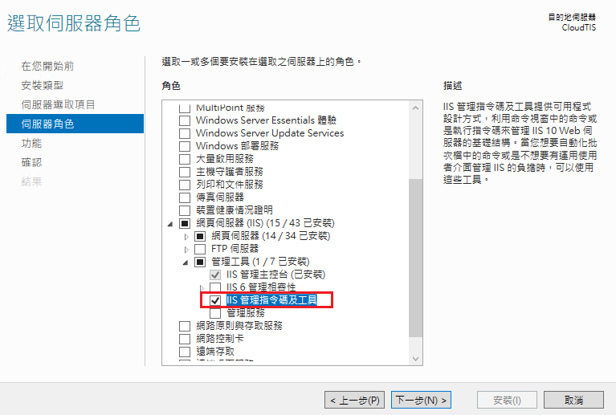
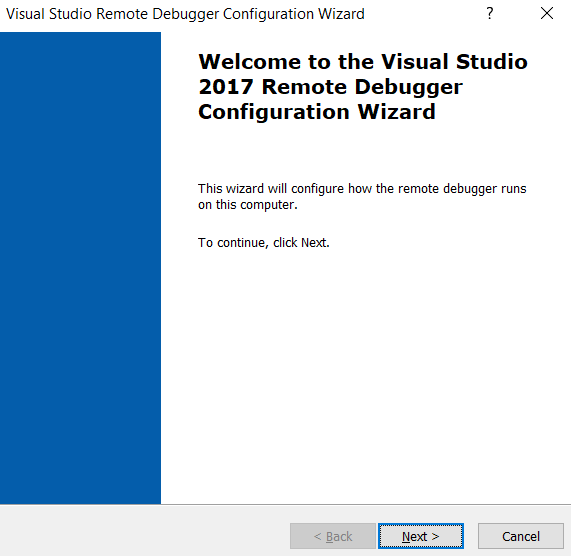
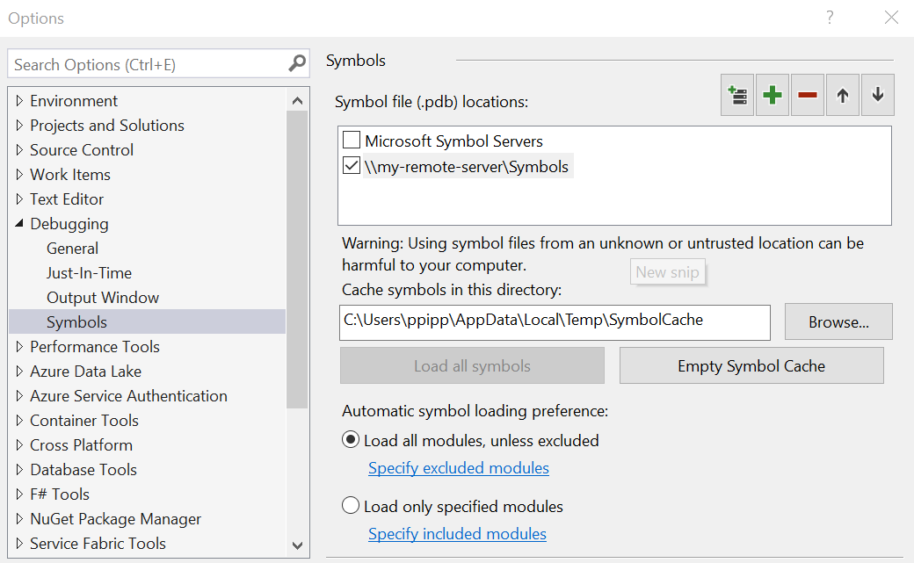

## Environment

- Windows Server 2016
- IIS 8
- Visual Studio 2017 

## Requirement


### Install IIS Management Scripts and Tools




### Install remote tools (For Visual Studio 2017)

[Download](https://visualstudio.microsoft.com/downloads/?q=remote+tools#remote-tools-for-visual-studio-2017)


## Remote Debugger Configuration

Search `Remote Debugger Configuration Wizard`() or `rdbgwiz` to open the **Remote Debugger Configuration** 




Enable the bellow option to run the Remote Debugger as a service named "Visual Studio 2017 Remote Debugger".


> However you have to enable the service manually later.
> 
> 


Or leave it unchecked to run the Remote Debugger as APP.


Finally, select the target network(s) for firewall.


> Remote Debugger uses port 4022 in default.


## Open Remote Debugger

### Run as service

```
$ net start msvsmon150
The Visual Studio 2017 Remote Debugger service is starting.
The Visual Studio 2017 Remote Debugger service was started successfully.
```

To stop the service,

```
$ net stop msvsmon150
``` 

### Run as app

Search `Remote Debugger` and run it as administrator.


Notice that it use `4022` as the default port.


## Publish notes for supporting Remore debugging

The web application is remote-debuggable when the symbol files (*.pdb) are also published to the remote web server.
To do so, make sure the **Debugging information** is set to 


| Type | Description |
|:----:|:------------|
| Full | Enables attaching a debugger to the running program. |
| Portable | Produces cross-platform, portable symbol file. (dotnet core only) |

> Reference: [Advanced Build Settings Dialog Box (C#)](https://docs.microsoft.com/en-us/visualstudio/ide/reference/advanced-build-settings-dialog-box-csharp?view=vs-2017#output)


## Symbol file sharing

There are two options for sharing the PDB files from remote:

1. [Symbol server](https://docs.microsoft.com/en-us/windows-hardware/drivers/debugger/symbol-stores-and-symbol-servers)
2. Share folder

Take "Share folder" which is located as `\\my-remote-server\Symbols` for example, 
In Visual Studio, go to [Debug] -> [Options...] -> [Symbols],
and then add the share folder to **[Symbol file (.pdb) locations]**:




### Attach Process by Visual Studio

Back to our development environment which had installed Visual Studio 2017.
Open **[Debug]** -> **[Attach to Process...]** (Ctrl+Alt+P) 

> Reattach to the same process you previously attached to by using **[Debug]** -> **[Reattach to Process...]** (Shift+Alt+P)


- Connection type: `<remote_server>:4022`
- Enable **[Show processes from all users]**
- Select the target process (Reference: [Find the name of the ASP.NET process](https://docs.microsoft.com/en-us/visualstudio/debugger/how-to-find-the-name-of-the-aspnet-process))


| Title | Description |
|:-----:|:------------|
| w3wp.exe | IIS 6.0 and later |
| aspnet_wp.exe | Earlier versions of IIS |
| iisexpress.exe | IISExpress |
| dotnet.exe | ASP.NET Core |
| inetinfo.exe | Older ASP applications running in-process |


If there are multiple processes running, to distinguish them from each other,

1. If the sites were assigned different IIS Application Pool, we can tell them by the User Name column as following.
2. On the Web server, open the Task Manager and check the value of the Command line as below. Then we can get the PID of the target process.


