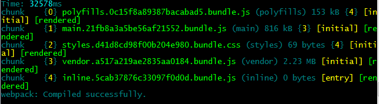
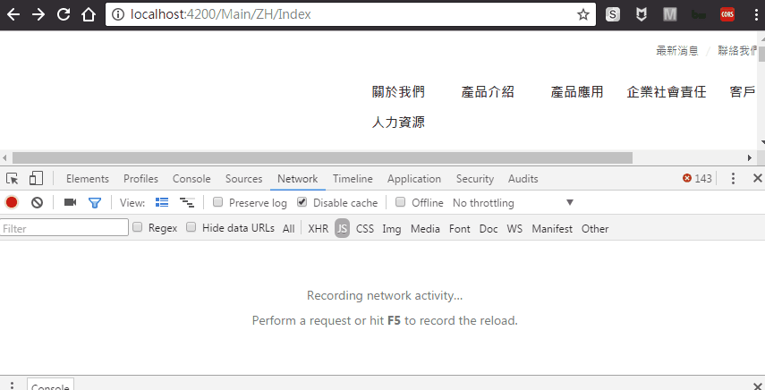

## Introduction

We will learn how to apply [lazy loading](https://angular.io/docs/ts/latest/guide/router.html) and [preloading](https://angular.io/docs/ts/latest/guide/router.html#!) on Angular modules, so that our application will have less startup time and better UX.

> *Lazy loading* :
> The split module is loaded on demand.

> *Preloading* :
>The split module is loaded on background (asynchronously).


## Split modules

First of all, we have to think about the architecture of `modules` and `components`. This is essential and important cus the lazy-loading or preloading modules must have no relation between each other!

Let’s create a simple example here. We have a website which could be split into:

1. Main content for normal users
2. CMS (Content Management) for advanced user
3. Share components/class/service for other modules


We will make MainModule and CmsModule lazy-loading.

### Original architecture


* app.module.ts 

```
import { MainModule } from './modules/main/main.module';
import { CmsModule } from './modules/cms/cms.module';
import { ShareModule } from './modules/share/share.module';

@NgModule({
    declarations: [
      AppComponent
    ],
    imports: [
      BrowserModule,
      FormsModule,
      HttpModule,
      ShareModule,
      MainModule,
      CmsModule,
      AppRouteModule
    ],
    providers: [],
    bootstrap: [AppComponent]
})
export class AppModule { }
```

* main-routing.module.ts

```
import { NgModule } from '@angular/core';
import { Routes, RouterModule } from '@angular/router';
import { NewsComponent } from './components/news/news.component';
import { AboutComponent } from './components/about/about.component';
import { IndexComponent } from './components/index/index.component';
import { MainComponent } from './main.component';


const routes: Routes = [{
    path: 'Main', component: MainComponent, children: [
        {
            path: 'ZH', children: [
              { path: 'Index', component: IndexComponent },
              { path: 'About', component: AboutComponent },
              { path: 'News', component: NewsComponent }
            ]
        }];
}];

@NgModule({
    imports: [RouterModule.forChild(routes)],
    exports: [RouterModule],
    providers: []
})
export class MainRoutingModule { }
```

* main.module.ts

Main module will do nothing with lazy loading, just don't forget to inject the routing module.

```
import { MainRoutingModule } from './main-routing.module';

@NgModule({
    imports: [
      FormsModule,
      HttpModule,
      CommonModule,
      MainRoutingModule
    ],
    declarations: [
      MainComponent,
      MainHeaderComponent,
      MainFooterComponent,
      IndexComponent
    ]
})
export class MainModule { }
```


I will skip the CMS module codes here. 
Now use `ng serve --prod`  to start the application, and take a look at the http requests on the browser.

You will find that all the modules(*.js) was loaded when entering the website and when you switch to another module, there won't be any js file loaded from server.


## Lazy Loading

### Remove every dependency on Main/CMS module from AppModule

* app.module.ts

Remove `MainModule` and `CmsModule` from `AppModule`.

```
import { ShareModule } from './modules/share/share.module';

@NgModule({
    declarations: [
      AppComponent
    ],
    imports: [
      BrowserModule,
      FormsModule,
      HttpModule,
      ShareModule,
      AppRouteModule
    ],
    providers: [],
    bootstrap: [AppComponent]
})
export class AppModule { }
```

### Enable Lazy loading on AppRoutingModule

* app-routing.module.ts

```
import { NgModule, Component } from '@angular/core';
import { Routes, RouterModule, PreloadAllModules } from '@angular/router';
import { MainComponent } from './../modules/main/main.component';

const routes: Routes = [
  {
      path: 'Main', component: MainComponent,
      loadChildren: '../modules/main/main.module#MainModule'
  },
   {
       path: 'Cms',                                     
       loadChildren: '../modules/cms/cms.module#CmsModule'
   }
];

@NgModule({
    imports: [RouterModule.forRoot(routes, {
        enableTracing: false
    })],
    exports: [RouterModule],
    providers: []
})
export class AppRouteModule { }
```


Also we have to remove the extra routing level on `MainRouteModule` and `CmsRouteModule`.

* main-routing.module.ts

```
const routes: Routes = [{
    
    path: 'ZH', children: [
        { path: 'Index', component: IndexComponent },
        { path: 'About', component: AboutComponent },
        { path: 'News', component: NewsComponent }
    ]
    
}];

//...
```

### Demo

Okay, the lazy loading is done, let's restart the application by
`ng serve --prod --aot`
and take a look on the http requests again. This time while you switch from the `MainModule` to `CmsModule`, a js file will be loaded.


#### No Lazy loading



Requests for JS...


#### Lazy loading


Requests for JS after applying lazy loading.


The following demo shows the timing of loading `0.XXX.chunk.js` and `1.XXX.chunk.js`.


## Preloading

We are going to support preloading for all modules.

* app-routing.module.ts

```
//...
import { Routes, RouterModule, PreloadAllModules } from '@angular/router';

const routes: Routes = [
  {
      path: 'Main', component: MainComponent,
      loadChildren: '../modules/main/main.module#MainModule'
  },
   {
       path: 'Cms',
       loadChildren: '../modules/cms/cms.module#CmsModule'
   },
  fallbackRoute
];

@NgModule({
    imports: [RouterModule.forRoot(routes, {
        enableTracing: false,
        preloadingStrategy: PreloadAllModules
    })],
    exports: [RouterModule],
    providers: []
})
export class AppRouteModule { }
```


### Demo

Let’s go to one of the `MainModule`'s routes, we will see that the `MainModule`'s JS package loaded before rendering webpage, however the `CmsModule`'s JS package will be loaded asynchronously while the webpage is rendering.


Here is a demo for monitoring the loading order of the JS packages.




## Summary

The question is when we need a Lazy loading or a Preloading strategy?
If the user only view some sections(modules) of the website, Lazy loading will be excellent.
On the other hand, if the user has great possibility to browse all sections of the website, then Preloading will be sweet and helpful.


## Reference

1. [Angular Doc: ROUTING & NAVIGATION](https://angular.io/docs/ts/latest/guide/router.html)

