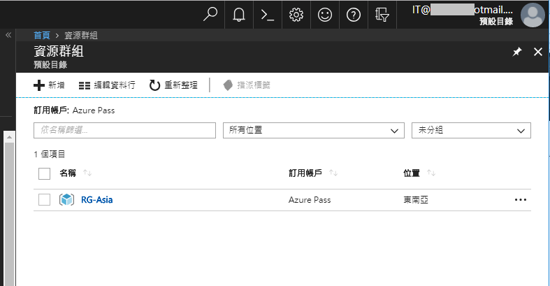

# Resource Group 資源群組

在 Azure 中，資源群組是用來為資源分組的邏輯容器。 在 Azure 中部署的每項資源，都必須部署到單一資源群組中。
參考更多[說明](https://docs.microsoft.com/zh-tw/azure/architecture/cloud-adoption-guide/adoption-intro/resource-group)。

## 建立資源群組
 
在`資源群組`中，點選`新增`

設定資源群組名稱和位置~

我這邊設定了兩個資源群組；點選`資源群組名稱`以進入底下的功能選單。

## 設定IAM權限

選擇`存取控制(IAM)`->`新增`

加入先前步驟的Azure AD user，需指定`角色`、`指派對象`。

角色清單：

> 可參考[Microsoft document](https://docs.microsoft.com/zh-tw/azure/role-based-access-control/built-in-roles)以取得更多角色的權限說明。 

我將兩個資源群組都加入Admin這個Azure AD的`擁有者`權限，因此當我切換使用Admin時，將可以看到並直接管理這兩個RG。

至於另一個Azure AD user: IT，則因只有`RG-Asia`這個資源群組的`參與者`權限...

因此登入後無法再加入或移除權限。

