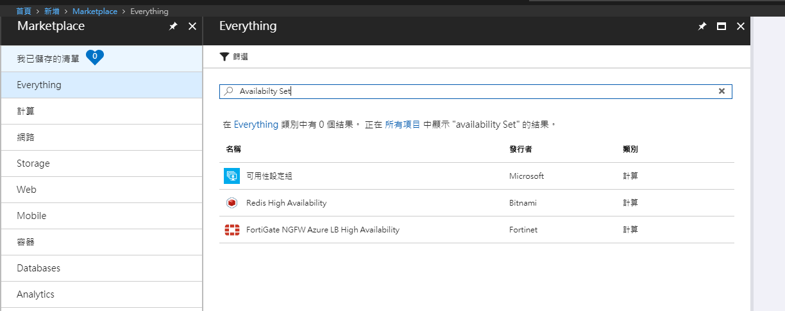
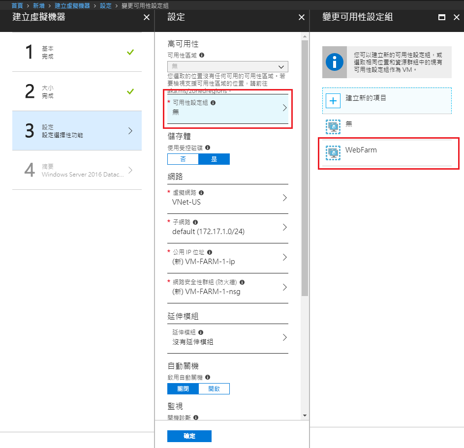

# Availability Set

## 建立可用性群組

在`新增資源`中，搜尋：`Availability Set`，點選並進入新增畫面。

> 可用性群組中需設定 **容錯網域(Fault Domains)** 和 **更新網域(Update Domains)** 的個數。
> 可參考Mircosoft document: [管理 Azure 中 Windows 虛擬機器的可用性](https://docs.microsoft.com/zh-tw/azure/virtual-machines/windows/manage-availability)
> PS. 上課時老師用機櫃來比喻FD，插槽比喻UD的方式；對照文件會比較容易理解。(如下圖)

 
圖片來源：Mircosoft document: [管理 Azure 中 Windows 虛擬機器的可用性](https://docs.microsoft.com/zh-tw/azure/virtual-machines/windows/manage-availability)

因此我們在建立`可用性設定組`時，以預設值：FD=2, UD=5為主。

建立好`可用性設定組`後。 我們後續要開始設定兩台VM的負載平衡。
但因只有在建立VM時才能設定高可用性：`可用性設定組`； 因此我們重新建立兩台在相同`資源群組`和相同地區的VM。

兩台VM如下的VM-FARM-1, VM-FARM-2。

