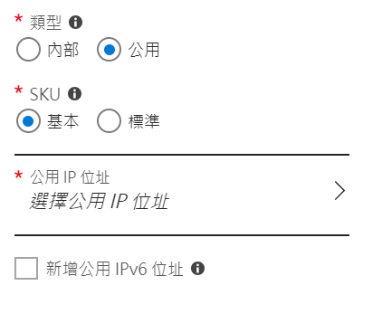
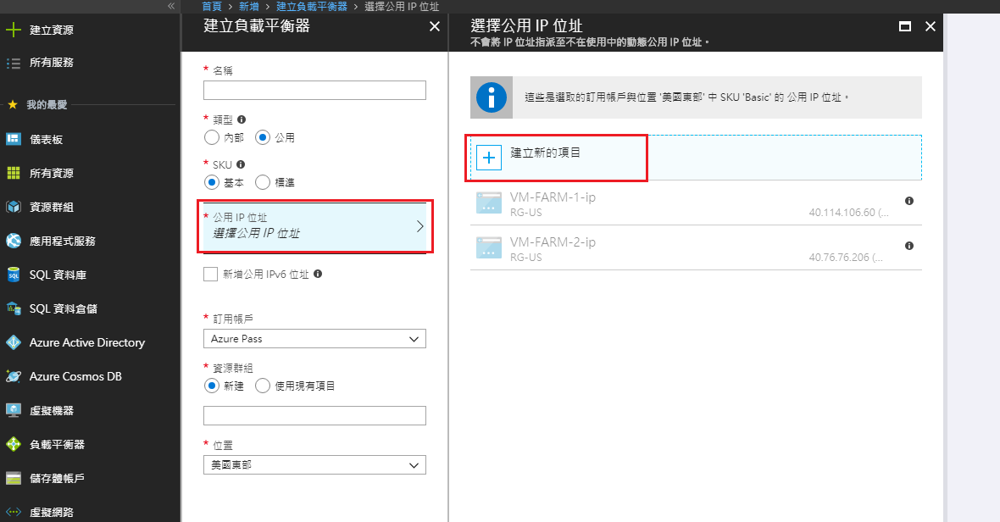
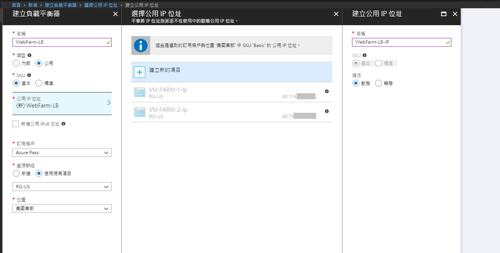
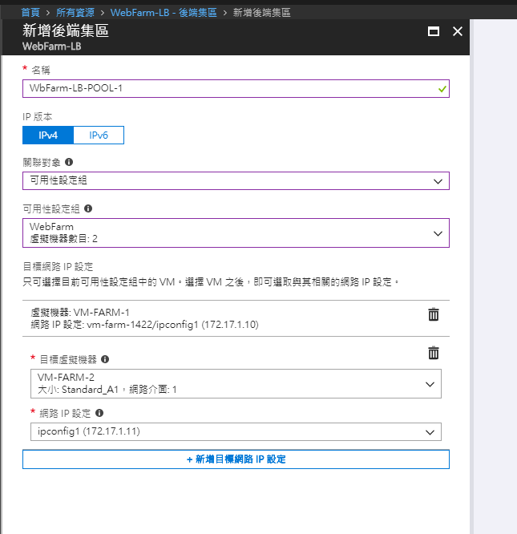
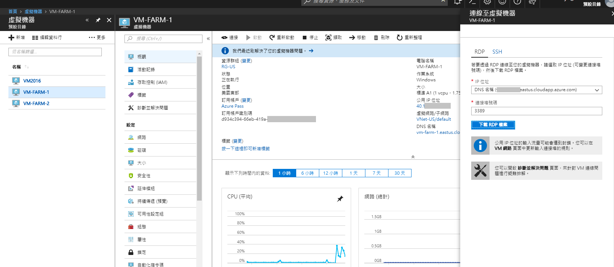

# Load Balancer

## 建立負載平衡器

打開`建立資源`->`網路`->`負載平衡器`

於建立畫面選擇：

1. 內部或公用

   內部：平衡內部虛擬網路的流量

   

   公用：平衡對外的流量

   

   此範例以公用為主，並建立一組新的`公用IP位址`。
   
   
   
   
   
2. 資源群組

完成後按下`建立`：

所有資源多了我們上面建立的資源。

接下來我們至少要完成負載平衡器的以下設定來啟用它：

* 後端集區 Backend Pool
* 健康狀態探查 Health Probe
* 負載平衡規則 Load balance rules

## 設定負載平衡器

### 後端集區

這邊的欄位看起來很複雜，可是設定起來很直覺。
選擇我們先前建立的`可用性設定組`和裡面的`虛擬機器`及`IP組態`即可!
因為我要做Load balance，所以至少加入兩台VM。

## 健康狀態探查

可選用[Http](https://docs.microsoft.com/zh-tw/azure/load-balancer/load-balancer-custom-probe-overview#http-custom-probe)或[TCP](https://docs.microsoft.com/zh-tw/azure/load-balancer/load-balancer-custom-probe-overview#tcp-custom-probe)的方式。

一般來說若要探查AP或服務，建議使用Http方式。 TCP探查無法得知個體的服務是否已掛掉。

## 

### 啟用VM的IIS服務

