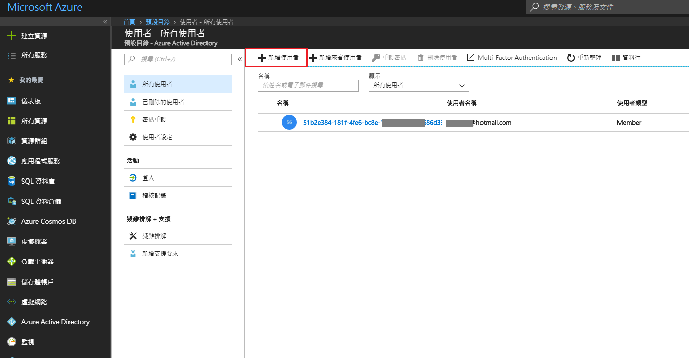
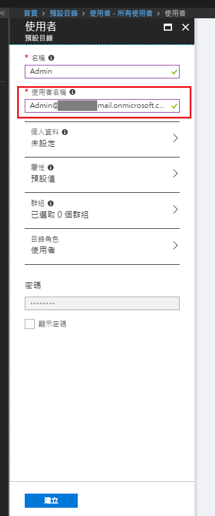
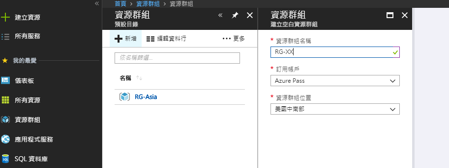
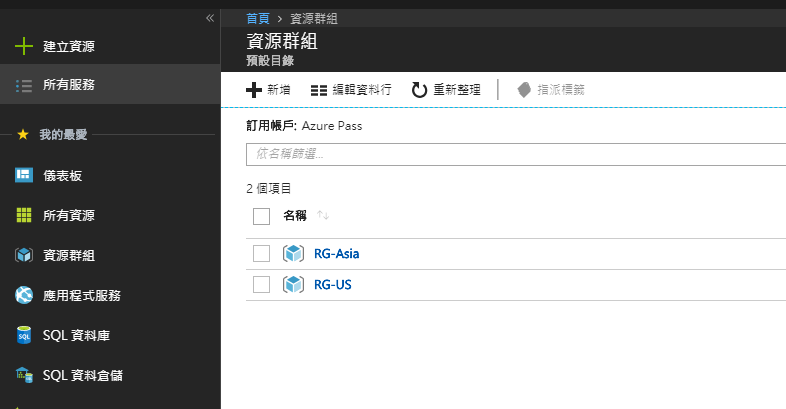
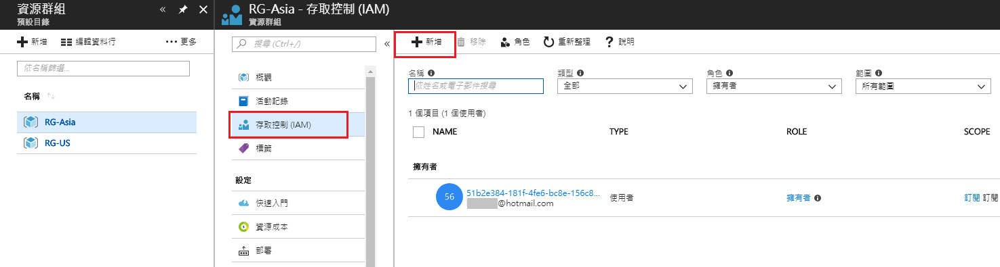
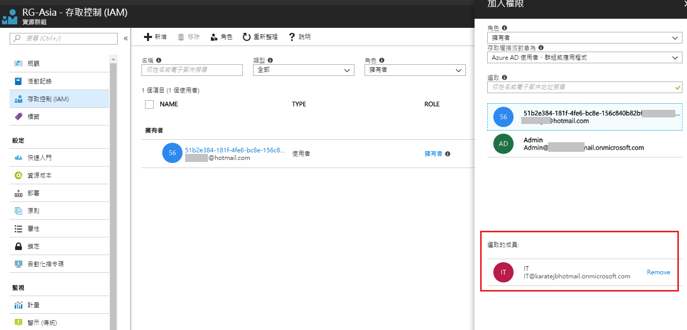
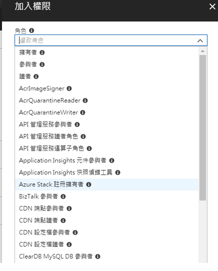
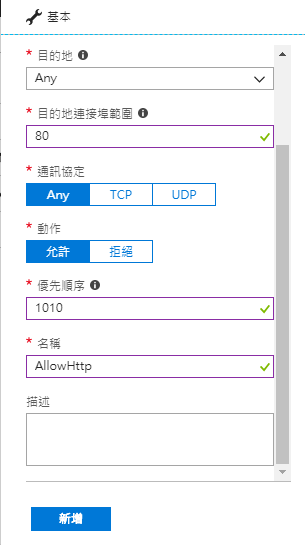

# Microsoft Azure 基礎建置與應用實戰二日營

## Install

1. Azure 儲存體的AzCpoy命令列工具
2. Power Shell

 


## Create new Azure AD user

Go to `Azure Active Directory` and copy the **domain name** of Azure AD.
For example, "xxxx.onmicrosoft.com".

 


在 `Azure Active Directory` -> `使用者`，點選`新增使用者`。

 


`名稱`可自訂，至於`使用者名稱`則為登入的帳號，建議使用`名稱@{AD Domain name}`的規則。
例如：Admin@xxxx.onmicrosoft.com

 


## Resource Group

在 Azure 中，資源群組是用來為資源分組的邏輯容器。 在 Azure 中部署的每項資源，都必須部署到單一資源群組中。
參考更多[說明](https://docs.microsoft.com/zh-tw/azure/architecture/cloud-adoption-guide/adoption-intro/resource-group)。


### Create Resource Group
 
在`資源群組`中，點選`新增`


設定資源群組名稱和位置~




我這邊設定了兩個資源群組；點選`資源群組名稱`以進入底下的功能選單。




### Set IAM (Permission)

選擇`存取控制(IAM)`->`新增`




加入先前步驟的Azure AD user，需指定`角色`、`指派對象`。




角色清單：



> 可參考[Microsoft document](https://docs.microsoft.com/zh-tw/azure/role-based-access-control/built-in-roles)以取得更多角色的權限說明。 


我將兩個資源群組都加入Admin這個Azure AD的`擁有者`權限，因此當我切換使用Admin時，將可以看到並直接管理這兩個RG。


至於另一個Azure AD user: IT，則因只有`RG-Asia`這個資源群組的`參與者`權限...


因此登入後無法再加入或移除權限。


## 訂用帳戶的委派管理

由`所有服務`->`訂用帳戶`，選擇要管理的訂用帳戶。


> 1. 帳戶管理員：指有Microsoft Account及Azure訂用
> 2. 服務管理員：預設是帳戶管理員，但可由帳戶管理員變更
> 3. 其他委派管理

我們在訂用帳戶內直接利用IAM加入一個`擁有者`權限的Azure AD User。


這時候切換Boss帳號後，就可以看到該USER已擁有該訂用。


## Create Storage Account 

```
net use Z: \\stor052826.file.core.windows.net\share /u:AZURE\stor052826 tkD2tlImQ1ty5OQ51GulaabcS1fV6PRvopPB3j7JoQz0ZpbLcKT1mrzhKwU6trFO4Hlcqx86Y4uRtOXlw/ZVBg==
```

`\\stor052826.file.core.windows.net\share` : Azure storage uri
`/u:AZURE\stor052826 tkD2tlImQ1ty5OQ51GulaabcS1fV6PRvopPB3j7JoQz0ZpbLcKT1mrzhKwU6trFO4Hlcqx86Y4uRtOXlw/ZVBg==`: Chage user/pwd


## Create Virtal network


## Set Firewall's input rule

為了在每一台VM都可以連入PORT 80，必須在每一台VM設定連入規則。
在`虛擬機器`下，點選`網路安全性群組`。

e


選擇`輸入安全性規則`，打開PORT 80




