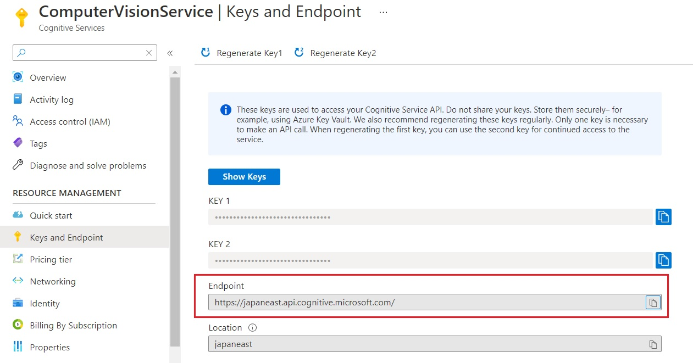
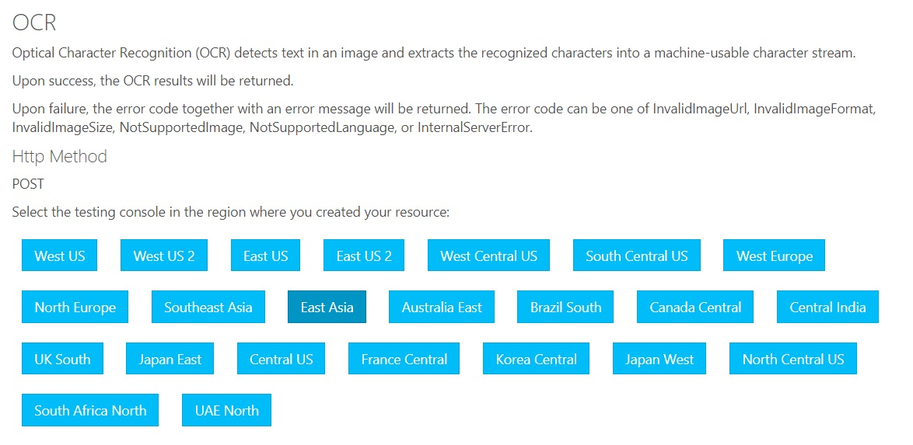
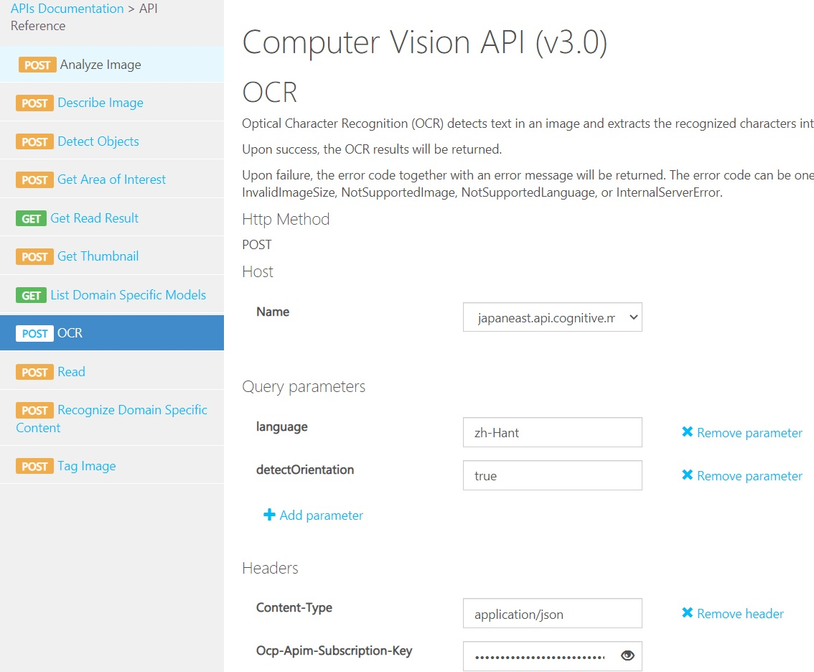

# Create Resource Group

```s
$ az group create --location japan --name EventHub [--subscription]
```

> To see available locations, use 
> 
> `az account list-locations --output table`
> or 
> `az account list-locations --query [].[displayName,name]`

# Create a Cognitive Service Account

```s
$ az cognitiveservices account create \
--kind ComputerVision \
--name ComputerVisionService \
--sku S1 \
--resource-group EventHub \
--location japaneast
```

## List Cognitive Service Account(s)

```s
$ az cognitiveservices account list
```

Or by specified account name and resource group,

```s
$ az cognitiveservices account show \
--name ComputerVisionService \
--resource-group EventHub
```


# Get the keys

To get the list of keys that we can use to do RESTful API calls,

```s
$ az coginitiveservices account keys list \
--name ComputerVisionService \
--resource-group EventHub

{                                            
  "key1": "xxxxxxxxxxxxxxxxxx",
  "key2": "yyyyyyyyyyyyyyyyyy" 
}                                            
```


Now we save the value of `key1` to a variable like this (in bash),

```s
$ export key=$(az coginitiveservices account keys list \
--name ComputerVisionService \
--resource-group EventHub \
--query key1 -o tsv)


$ echo $key
xxxxxxxxxxxxxxxxxxxxx
```


# Computer Vision API

> Reference
>
> - [API Document](https://westcentralus.dev.cognitive.microsoft.com/docs/services/computer-vision-v3-1-ga)


The endpoint is 
```
https//{region}.api.cognitive.microsoft.com/
```

You can find it on Azure Portal as well.




# API: OCR, READ

In this tutorial, I will focus on how to use OCR (Optical Character Recognition) by Computer Vision API.
There are two kinds of OCR APIs:

- [OCR](https://japaneast.dev.cognitive.microsoft.com/docs/services/computer-vision-v3-ga/operations/56f91f2e778daf14a499f20d)
- [READ/Get READ Result](https://westcentralus.dev.cognitive.microsoft.com/docs/services/5d98695995feb7853f67d6a6/operations/5d986960601faab4bf452005)

> The OCR API uses an older recognition model, supports only images, and executes synchronously, returning immediately with the detected text. But supports way more languages.
> The Read API uses an updated recognition model, takes an image or PDF document as the input and extracts text asynchronously. But supports less languages.
> See [What is the difference between OCR API and Read API](https://docs.microsoft.com/en-us/answers/questions/128958/what-is-the-difference-between-ocr-api-and-read-ap.html)


## OCR API

The HttpPost API (v3.0) of **OCR**:

```s
https://{endpoint}/vision/v3.0/ocr[?language][&detectOrientation]
```


### Request headers

| Parameter | Type | Description |
|:----------|:----:|:------------|
| Content-Type | string | The value can be `application/json` or `application/octet-stream` |
| Ocp-Apim-Subscription-Key | Subscription key to access the API |

### Request parameters

| Parameter | Type | Is Required | Description |
|:----------|:----:|:------------|:------------|
| language | string | Optional | The BCP-47 language code of the text to be detected in the image. Default: `unk` |
| detectOrientation | boolean | Optional | Whether detect the text orientation and correct it in the image.  |


### Request body

The API supports
- raw image binary
- image URL


| Requirment | Description |
|:-----------|:------------|
| Formats | `JPEG`/`PNG`/`GIF`/`BMP` |
| File size | Must be less than 4MB |
| Image dimentsions | Must be between 50 x 50 and 4200 x 4200 px. The image cannot be larger than 10 megapixels. |


| Content Type | Http Body sample |
|:------------:|:-----------------|
| `appplication/json` | `{"url":"http://example.com/image.jpg"}` |
| `application/octet-stream` | `[Binary image data]` |


### Test the API

We can test the APU thru [Testing Console](https://westcentralus.dev.cognitive.microsoft.com/docs/services/computer-vision-v3-ga/operations/56f91f2e778daf14a499f20d) by clicking the **region** that you resource located. 






Or use curl:

```s
curl -X POST "https://japaneast.api.cognitive.microsoft.com/vision/v3.0/ocr?language=zh-Hant&detectOrientation=true" \
-H "Ocp-Apim-Subscription-Key: $key" \
-H "Content-Type: application/json" \
-d "{'url' : 'https://raw.githubusercontent.com/KarateJB/JB-eBooks/master/Cloud/Azure/ComputerVision/assets/ocr_demo.jpg'}" 
```


The response will be JSON, e.q.


```json
{
  "language": "zh-Hant",
  "textAngle": 0.0,
  "orientation": "Up",
  "regions": [{
    "boundingBox": "30,25,90,229",
    "lines": [{
      "boundingBox": "30,25,90,13",
      "words": [{
        "boundingBox": "30,25,90,13",
        "text": "2021-04-01"
      }]
    }]
  }]
}
```

> `regions`: An array of objects, where each object represents a region of recognized text.<br />
> `lines`: An array of objects, where each object represents a line of recognized text.<br />
> `words`: An array of objects, where each object represents a recognized word.<br />
> 
> For more details of each keys, see [Cognitive Service APIs Reference](https://westcentralus.dev.cognitive.microsoft.com/docs/services/computer-vision-v3-ga/operations/56f91f2e778daf14a499f20d)


## Read/Get Read Result API

The [READ](https://westcentralus.dev.cognitive.microsoft.com/docs/services/computer-vision-v3-ga/operations/5d986960601faab4bf452005) and [Get Read Result](https://westcentralus.dev.cognitive.microsoft.com/docs/services/computer-vision-v3-ga/operations/5d9869604be85dee480c8750) are for asynchronous calls.


### Read

The HttpPost API (v3.0) of **Read**:

```s
https://{endpoint}/vision/v3.0/read/analyze[?language]
```

#### Request headers

| Parameter | Type | Description |
|:----------|:----:|:------------|
| Content-Type | string | The value can be `application/json` or `application/octet-stream` |
| Ocp-Apim-Subscription-Key | Subscription key to access the API |

### Request parameters

| Parameter | Type | Is Required | Description |
|:----------|:----:|:------------|:------------|
| language | string | Optional | The BCP-47 language code of the text to be detected in the image. Only English (`en`), Dutch (`nl`), French (`fr`), German (`de`), Italian (`it`), Portuguese (`pt`), and Spanish (`es`) are supported. |


### Request body

I list some of the requirements from [document](https://westcentralus.dev.cognitive.microsoft.com/docs/services/computer-vision-v3-ga/operations/5d986960601faab4bf452005).

| Requirment | Description |
|:-----------|:------------|
| Formats | JPEG, PNG, BMP, PDF and TIFF|
| File size | Image file size must be less than 50 MB (4 MB for the free tier) |
| Image/File dimentsions | The image/document page dimensions must be at least 50 x 50 pixels and at most 10000 x 10000 pixels |


| Content Type | Http Body sample |
|:------------:|:-----------------|
| `appplication/json` | `{"url":"http://example.com/image.jpg"}` |
| `application/octet-stream` | `[Binary image data]` |


### Get Read Result

The HttpGet API (v3.0) of **Get Read Result**:

```s
https://{endpoint}/vision/v3.0/read/analyzeResults/{operationId}
```

#### Request headers

| Parameter | Type | Description |
|:----------|:----:|:------------|
| Ocp-Apim-Subscription-Key | Subscription key to access the API |


### Request parameters

| Parameter | Type | Is Required | Description |
|:----------|:----:|:------------|:------------|
| operationId | string | Required | Id of the Read operation, contained in the Read operation's 'Operation-Location' response header. |


### Request body

N/A


### Test the APIs

We can test the APU thru Testing Console, or use curl.


Firsr **Read** the image,

```s
curl -i -X POST "https://japaneast.api.cognitive.microsoft.com/vision/v3.0/read/analyze?language=en" \
-H "Ocp-Apim-Subscription-Key: $key" \
-H "Content-Type: application/json" \
-d "{'url' : 'https://github.com/KarateJB/JB-eBooks/blob/master/Cloud/Azure/ComputerVision/assets/read_demo.png?raw=true'}" 
```

The response's header has the **Operation-Location** that contains the **Operation Id**: ``

```
Operation-Location: https://japaneast.api.cognitive.microsoft.com/vision/v3.0/read/analyzeResults/6ef19bec-99a0-4dc5-b5c2-xxxxxxxxxxxx
x-envoy-upstream-service-time: 813
CSP-Billing-Usage: CognitiveServices.ComputerVision.Transaction=1
Date: Mon, 12 Apr 2021 06:46:32 GMT
Content-Length: 0
```


Now we can get the result by calling the **Get Read Result** API:


```s 
curl -X GET "https://japaneast.api.cognitive.microsoft.com/vision/v3.0/read/analyzeResults/6ef19bec-99a0-4dc5-b5c2-xxxxxxxxxxxx" \
-H "Ocp-Apim-Subscription-Key: $key"
```

Which will response the result, e.q.

```json
  "status": "succeeded",
  "createdDateTime": "2021-04-12T06:46:33Z",
  "lastUpdatedDateTime": "2021-04-12T06:46:34Z",
  "analyzeResult": {
    "version": "3.0.0",
    "readResults": [{
      "page": 1,
      "angle": 0,
      "width": 717,
      "height": 361,
      "unit": "pixel",
      "language": "en",
      "lines": [{
        "boundingBox": [14, 8, 107, 8, 107, 26, 14, 26],
        "text": "2021-04-01",
        "words": [{
          "boundingBox": [15, 9, 107, 9, 107, 26, 14, 27],
          "text": "2021-04-01",
          "confidence": 0.981
        }]
      }]
    }]
  }
}
```


# Reference

- [Azure Cognitive Services](https://azure.microsoft.com/en-us/services/cognitive-services/)
- [Cognitive Services - API Document](https://japaneast.dev.cognitive.microsoft.com/docs/services/computer-vision-v3-ga)
- [Computer vision service](https://chrisnoring.gitbooks.io/road-to-azure/content/computer-vision-service.html)


