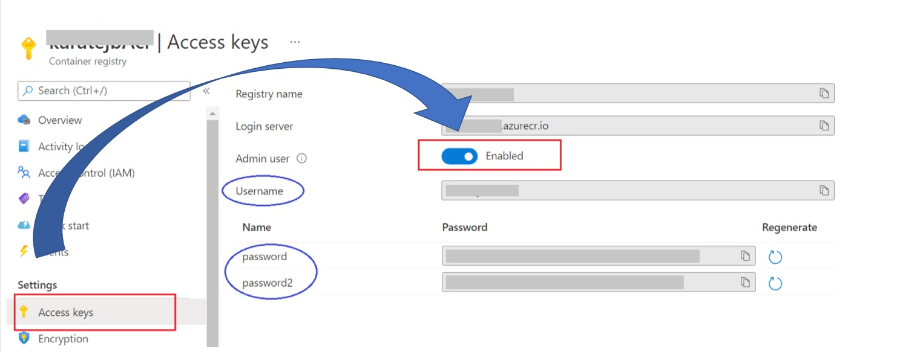

# Azure Container Registry

## Create a resource group

```s
$ az account list-locations
$ az group create --name <resource-group-name> --location japaneast
```


## Create a container registry

```s
$ az acr create --resource-group <resource-group-name> \
  --name xxxxAcr --sku Basic
```


## Push/Pull images

### Login

Before pushing or pulling image, we have to login by `az login` or `az acr login`.

For [az acr login], first we have to enable the Access Keys as following,



```s
$ az acr login --name <registry_name>
Username: {the Username in Access Keys configuration}
Password: {password or password2 in Access Keys configuration}
Login Succeeded
```

We can push/pull image to ACR by 

```s
$ docker pull karatejb/ansible-control-node
$ docker tag karatejb/ansible-control-node xxxx.azurecr.io/ansible-control-node:latest
$ docker push karatejbacr.azurecr.io/ansible-control-node:latest
```

To see repositories:

> See [az acr repository](https://docs.microsoft.com/en-us/cli/azure/acr/repository)

```s
$ az acr repository list --name <registry_name> -o table
$ az acr repository show
$ az acr repository show --name <registry_name> --image ansible-control-node:latest
{
  "changeableAttributes": {
    "deleteEnabled": true,
    "listEnabled": true,
    "readEnabled": true,
    "writeEnabled": true
  },
  "createdTime": "2021-05-12T06:51:43.0797786Z",
  "digest": "sha256:18f625db6522a065ffb96bb5409cb726e13432e81dc203b50344479cfe7ce2ea",
  "lastUpdateTime": "2021-05-12T06:51:43.0797786Z",
  "name": "latest",
  "signed": false
}
$ az acr repository show --name <registry_name> --repository ansible-control-node
{
  "changeableAttributes": {
    "deleteEnabled": true,
    "listEnabled": true,
    "readEnabled": true,
    "teleportEnabled": false,
    "writeEnabled": true
  },
  "createdTime": "2021-05-12T06:51:42.9338459Z",
  "imageName": "ansible-control-node",
  "lastUpdateTime": "2021-05-12T06:51:43.0329184Z",
  "manifestCount": 1,
  "registry": "xxxx.azurecr.io",
  "tagCount": 1
}
```


## Delete Repository/Image

```s
$ az acr repository delete --name <registry_name> --image ansible-control-node:latest
$ az acr repository delete --name <registry_name> --repository ansible-control-node
{
  "manifestsDeleted": [
    "sha256:18f625db6522a065ffb96bb5409cb726e13432e81dc203b50344479cfe7ce2ea"
  ],
  "tagsDeleted": [
    "0.0.1",
    "latest"
  ]
}
```
