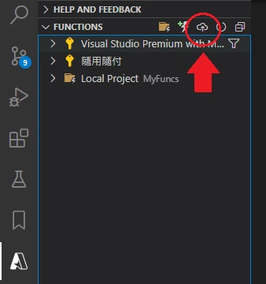
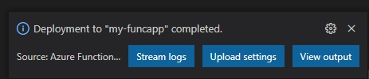
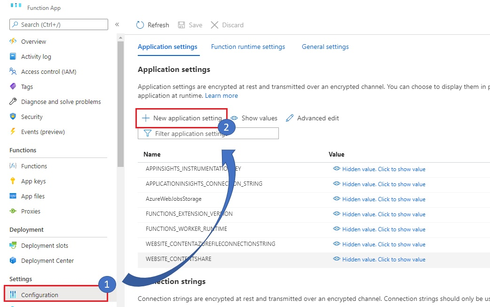
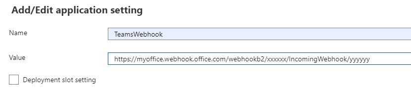
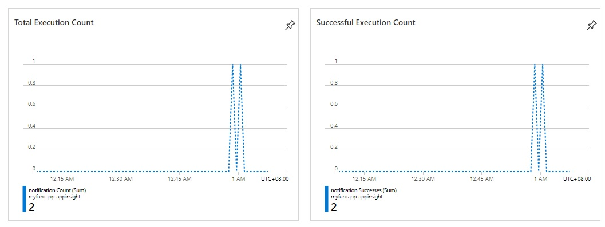
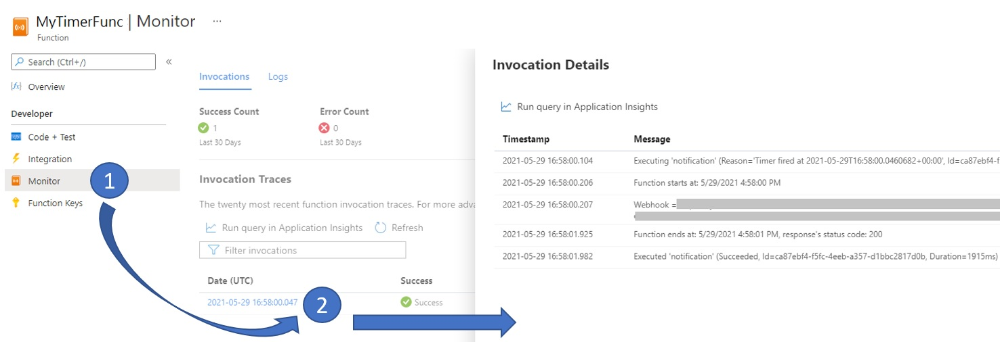

# Timer Trigger

This is an example of creating a Azure Function that runs on a schedule by [Timer Trigger Template](https://docs.microsoft.com/en-us/azure/azure-functions/functions-create-scheduled-function).


## Toolkits

We can use one of the following tool/IDEs to implement, debug and publish.

- [Visual Studio](https://docs.microsoft.com/en-us/azure/azure-functions/functions-develop-vs)
- [VS Code](https://docs.microsoft.com/en-us/azure/azure-functions/functions-develop-vs-code)
- [Azure Function Core Tools](https://docs.microsoft.com/en-us/azure/azure-functions/functions-run-local)


I will use VS Code and implement with dotnet in this tutorial. Here are the requirements:

1. Since a Function App needs to run with a storage account that supports `Blob`, `Queue`, `Table storage`. (See [Storage account requirements](https://docs.microsoft.com/en-us/azure/azure-functions/storage-considerations#storage-account-requirements)). We will need [Storage Emulator](https://docs.microsoft.com/en-us/azure/storage/common/storage-use-emulator) to run Function App locally.
2. Install extensions:
   - [C# extension](https://marketplace.visualstudio.com/items?itemName=ms-dotnettools.csharp)
   - [Azure Functions extension](https://marketplace.visualstudio.com/items?itemName=ms-azuretools.vscode-azurefunctions)


## Azure Portal: Create Function App


Follow the steps to create the Function App in Auzre.


## Implement Timer Trigger

This sample will trigger a daily request to a [Microsoft Teams webhook](https://docs.microsoft.com/en-us/microsoftteams/platform/webhooks-and-connectors/how-to/add-incoming-webhook).

### Initialize workspace

```s
$ mkdir MyFuncs
$ code ./MyFuncs
```


### Create Function project by template

After opening VS Code, click the [Azure] icon -> [Create Function...]


Then fill out the spec as following:

| Option | Choose |
|:-------|:-------|
| Select a language | C# |
| Select a .NET runtime | .NET Core 3 LTS |
| Select a template for your project's first function | Timer trigger |
| Provide a function name | MyTimerFunc |
| Provide a namespace | MyTimerFuncs |
| Enter a cron expression to specify the schedule | `0 */2 * * * *` (We can update the frquency before publishing to Azure.) |
| Select a storage account to debug ... | Use local emulator |


The project files will be created as following,


### Local Settings

We can put our applicaion configurations or connection strings into [local setting file](https://docs.microsoft.com/en-us/azure/azure-functions/functions-run-local?tabs=windows%2Ccsharp%2Cbash#local-settings-file): `local.settings.json`, for running and debugging Function locally.

Lets put the Microsoft Teams's webhook url into `local.settings.json`:

- local.settings.json

```json
{
  "IsEncrypted": false,
  "Values": {
    "AzureWebJobsStorage": "UseDevelopmentStorage=true",
    "FUNCTIONS_WORKER_RUNTIME": "dotnet",
    "TeamsWebhook": "https://myoffice.webhook.office.com/webhookb2/xxxxxx/IncomingWebhook/yyyyyy"
  }
}
```

### Implement Sending Message

First create a `Message` class:

- Message.cs

```csharp
using Newtonsoft.Json;

namespace MyTimerFuncs
{
    public class Message
    {
        [JsonProperty("title")]
        public string Title {get; set;}

        [JsonProperty("text")]
        public string Text { get; set; }
    }
}
```


Then update our Function's entry method like below.

- MyTimerFunc.cs

```csharp
namespace MyTimerFuncs
{
    public static class MyTimerFunc
    {
        private const string CRON_SCHEDULE = "0 */2 * * * *";

        [FunctionName("MyTimerFunc")]
        public static async Task RunAsync([TimerTrigger(CRON_SCHEDULE)]TimerInfo myTimer, ILogger log)
        {
            // Get webhook url
            var webhookUrl = new Uri(Environment.GetEnvironmentVariable("TeamsWebhook"));

            log.LogInformation($"Function starts at: {DateTime.Now}");

            using(var httpClient = new HttpClient())
            {
                httpClient.DefaultRequestHeaders.Accept.Add(new System.Net.Http.Headers.MediaTypeWithQualityHeaderValue("application/json"));

                var msg = new Message { Title = "Star Wars",  Text = "The force is with you." };

                var content = new StringContent(JsonConvert.SerializeObject(msg));
                content.Headers.ContentType = new MediaTypeHeaderValue("application/json");
                var response = await httpClient.PostAsync(webhookUrl, content);

                log.LogInformation($"Function ends at: {DateTime.Now}, response's status code: {(int)response.StatusCode}");
            }
        }
}
```

> Remember to update the `CRON_SCHEDULE` value before publishing.


### Run locally

1. Start Microsoft Azure Storage Emulator
2. In VSCode, press F5 to run and debug the Function.


## Publish

### VSCode

Click [Deploy to Function App...] as following,




| Option | Choose |
|:-------|:-------|
| Select subscription | Your subscription |
| Select Function App in Azure | The one we created in the previous step, that is `my-funcapp` |


Once the publishing is completed, we will see the following message on VSCode.




### Azure

We have to set the webhook url to Function App's Configuration.





Remeber to save the changes!


### Monitoring

We can see the overview and application logs in Azure Portal.






