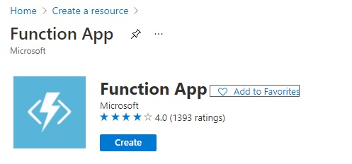
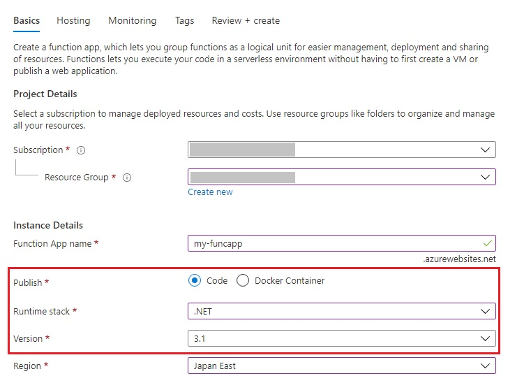
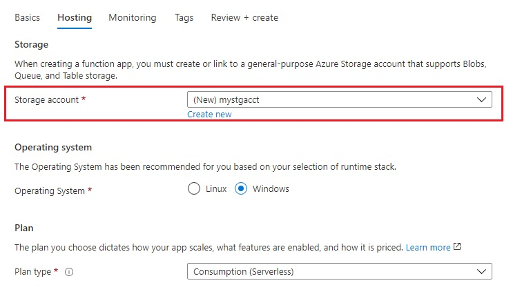
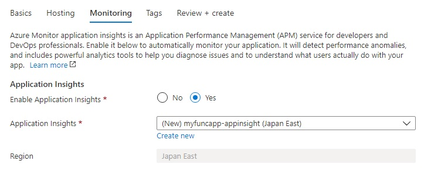
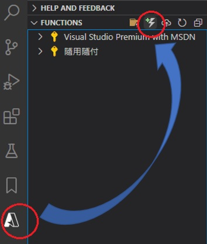
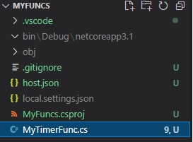

# Timer Trigger

This is an example of creating a Azure Function that runs on a schedule by [Timer Trigger Template](https://docs.microsoft.com/en-us/azure/azure-functions/functions-create-scheduled-function).


## Toolkits

We can use one of the following tool/IDEs to implement, debug and publish.

- [Visual Studio](https://docs.microsoft.com/en-us/azure/azure-functions/functions-develop-vs)
- [VS Code](https://docs.microsoft.com/en-us/azure/azure-functions/functions-develop-vs-code)
- [Azure Function Core Tools](https://docs.microsoft.com/en-us/azure/azure-functions/functions-run-local)


I will use VS Code and implement with dotnet in this tutorial. Here are the requirements:

1. Since a Function App needs to run with a storage account that supports `Blob`, `Queue`, `Table storage`. (See [Storage account requirements](https://docs.microsoft.com/en-us/azure/azure-functions/storage-considerations#storage-account-requirements)). We will need [Storage Emulator](https://docs.microsoft.com/en-us/azure/storage/common/storage-use-emulator) to run Function App locally.
2. Install extensions:
   - [C# extension](https://marketplace.visualstudio.com/items?itemName=ms-dotnettools.csharp)
   - [Azure Functions extension](https://marketplace.visualstudio.com/items?itemName=ms-azuretools.vscode-azurefunctions)


## Azure Portal: Create Function App


Follow the steps to create the Function App in Auzre.










## Implement Timer Trigger

This sample will trigger a daily request to a [Microsoft Teams webhook](https://docs.microsoft.com/en-us/microsoftteams/platform/webhooks-and-connectors/how-to/add-incoming-webhook).

### Initialize workspace

```s
$ mkdir MyFuncs
$ code ./MyFuncs
```


### Create Function

After opening VS Code, click the **Azure** icon -> **Create Function...**,



Then fill out the spec as following:

| Option | Choose |
|:-------|:------:|
| Select a language | C# |
| Select a .NET runtime | .NET Core 3 LTS |
| Select a template for your project's first function | Timer trigger |
| Provide a function name | MyTimerFunc |
| Provide a namespace | MyTimerFuncs |
| Enter a cron expression to specify the schedule | `0 */2 * * * *` (We can update the frquency before publishing to Azure.) |
| Select a storage account to debug ... | Use local emulator |


The project files will be created:




