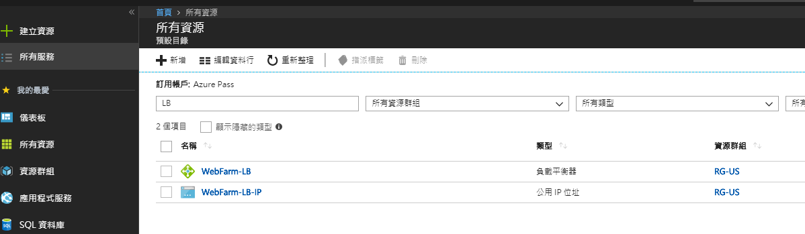
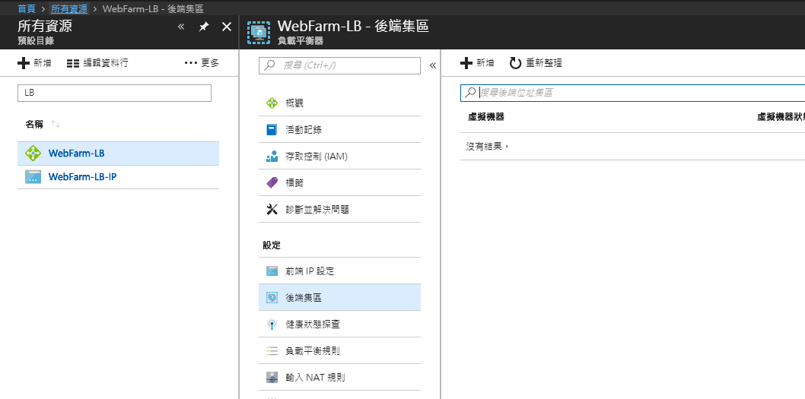
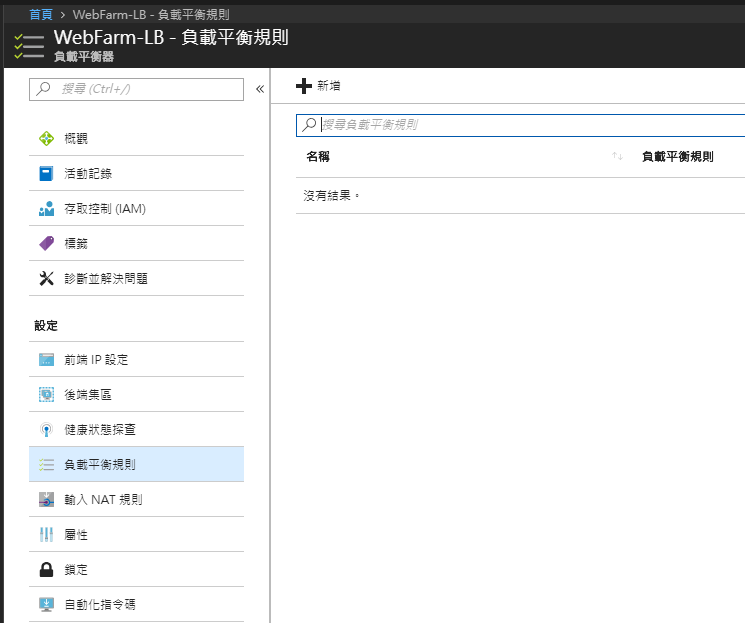
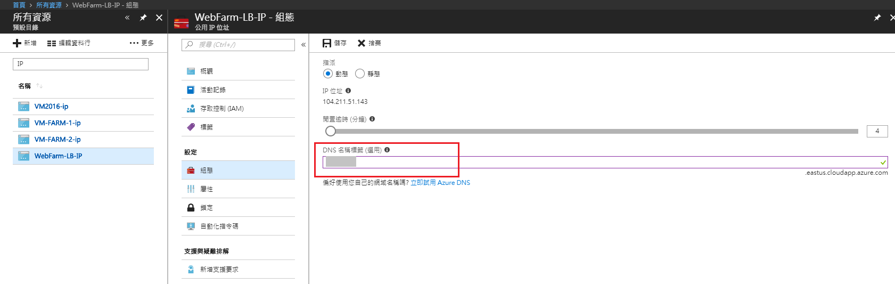
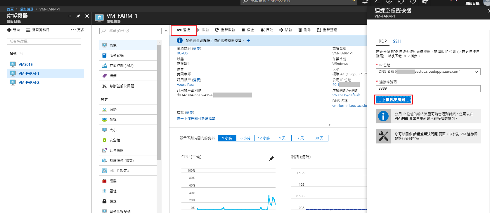
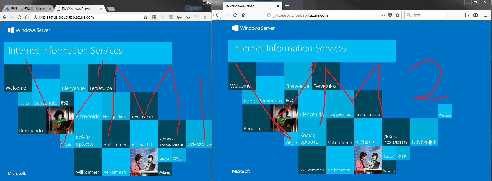

# Load Balancer

## 建立負載平衡器


打開`建立資源`->`網路`->`負載平衡器`


於建立畫面選擇：

1. 內部或公用

   內部：平衡內部虛擬網路的流量

   

   公用：平衡對外的流量

   


   此範例以公用為主，並建立一組新的`公用IP位址`。
   
   
   
   
   
2. 資源群組


完成後按下`建立`：


所有資源多了我們上面建立的資源。




接下來我們至少要完成負載平衡器的以下設定來啟用它：

* 後端集區 Backend Pool
* 健康狀態探查 Health Probe
* 負載平衡規則 Load balance rules


## 設定負載平衡器

### 後端集區



這邊的欄位看起來很複雜，可是設定起來很直覺。
選擇我們先前建立的`可用性設定組`和裡面的`虛擬機器`及`IP組態`即可!
因為我要做Load balance，所以至少加入兩台VM。


## 健康狀態探查


可選用[Http](https://docs.microsoft.com/zh-tw/azure/load-balancer/load-balancer-custom-probe-overview#http-custom-probe)或[TCP](https://docs.microsoft.com/zh-tw/azure/load-balancer/load-balancer-custom-probe-overview#tcp-custom-probe)的方式。

一般來說若要探查AP或服務，建議使用Http方式。 TCP探查無法得知個體的服務是否已掛掉。


## 負載平衡規則




主要是設定通訊協定及PORT，另外我們也要提供一組前端IP位址的設定名稱。
而閒置逾時則表示連線Keep-alive的時間。


## 設定DNS名稱

打開Load Balancer對應的`公用IP位址`，並設定一個唯一的名稱吧。(方便我們等下測試用)




----

完成以上Load Balancer的設定之後，我們回過頭來設定VM。

如果尚未打開PORT 80的話，請參考[06. Virtual Machine]的`設定網路安全性群組`。


## 啟用VM的IIS服務

接下來我們要啟用在可用性群組的兩台VM上的IIS。
遠端連接的方式為：選擇虛擬機器後，至`概觀`->`連接`->`下載RDP檔案`



下載後直接打開這個.rdp檔以開啟遠端桌面連線視窗，登打ID/PWD後進入Windows server開IIS服務，或利用以下PowerShell指令：

```
Install-WindowsFeature Web-Server -IncludeManagementTools
```

> 更多在Windows Server安裝IIS的資訊，可以參考Microsoft document: [Installing IIS 8.5 on Windows Server 2012 R2](https://docs.microsoft.com/zh-tw/iis/install/installing-iis-85/installing-iis-85-on-windows-server-2012-r2)

----

## 測試負載平衡器




