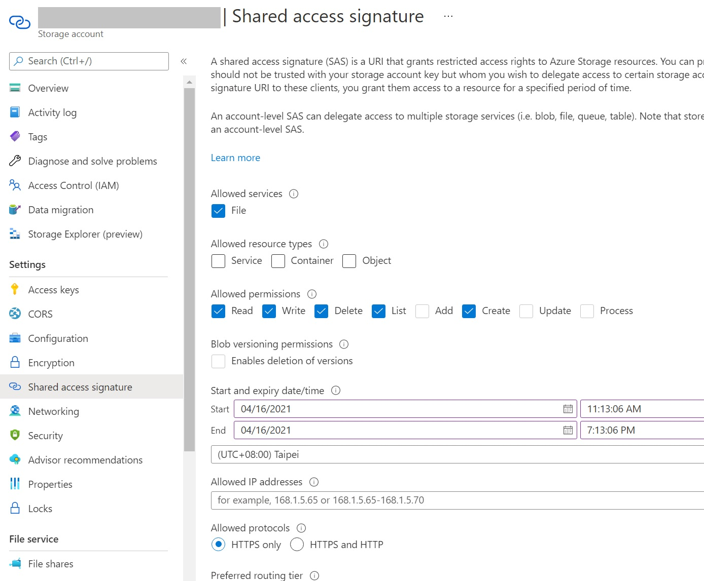

# Storage Account

```s
$ az group create --location japan --name EventHub [--subscription]
```

> To see available locations, use 
> 
> `az account list-locations --output table`
> or 
> `az account list-locations --query [].[displayName,name]`


# File Storage

## Create a Storage Account

```s
$ az storage account create \
     --name <account_name> \
     --resource-group <resource group> \
     --location japaneast \
     --sku Premium_LRS \
     --kind FileStorage
```


To delete it,

```s
$ az storage account delete \
     --name <storage_account> \
     --resource-group <resource_group>
```


## Add a File Share

```s
$ az storage share-rm create \
     --resource-group <resource_group>
     --storage-account <storage_account_name>
     --name <file_share_name>
     --quota 1024 \
     --output none
```

PS. The quota must be between 100 and 102400 GiB.


To change the tier of File Share,

```s
$ az storage share-rm update \
     --resource-group <resource_group> \
     --storage-account <storage_account> \
     --name <file_share_name> \
     --access-tier "Cool"
```


## Get Access Key


```s
$ az storage account keys list \
     --resource-group <resource_group> \
     --account-name <storage_account>
```


Save the key to variable,

```s
export storageAccountKey=$(az storage account keys list \
    --resource-group <resource_group> \
    --account-name <storage_account> \
    --query "[0].value" | tr -d '"')
```


## Upload file to File Share

### (Optional) Create a directory

```s
$ az storage directory create \
     --account-name <storage_account> \
     --account-key $key \
     --share-name <file_share_name> \
     --name "myDirectory" \
```

### Upload a file

```s
$ az storage file upload \
   --account-name <storage_account> \
   --account-key $key \
   --share-name <file_share_name> \
   --path "myDirectory/User.gif" \
   --source "~/My Documents/My Pictures/User.gif"
```


## Access file by SAS(Shared access signature)

> See [Grant limited access to Azure Storage resources using shared access signatures (SAS)](https://docs.microsoft.com/en-us/azure/storage/common/storage-sas-overview)



```s
$ az storage container generate-sas \
    --account-name <storage-account> \
    --name <container> \
    --permissions acdlrw \
    --expiry <date-time> \
    --auth-mode login \
    --as-user
```


