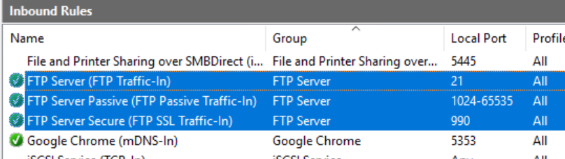

# Trandsfer Files

## FTP Server

We can set a FTP server on GCE instance to transfer files between local and servers.

> Instance run as Linux server can use SCP to transfer files.


### Enable FTP server

1. Go to **[Server Manager]** → **[Add roles and features]**, and then install **FTP Server** as below,


2. Create a FTP server on IIS with port 21.


3. Check the Firewall's inbound/outbound rules.




4. Create Firewall rule on GCP

```
$ gcloud compute firewall-rules create default-allow-ftp --allow tcp:21 --source-ranges 0.0.0.0/0
$ gcloud compute firewall-rules create default-allow-passive-ftp --allow tcp:49152-65535 --source-ranges 0.0.0.0/0
```


## Options

1. 
