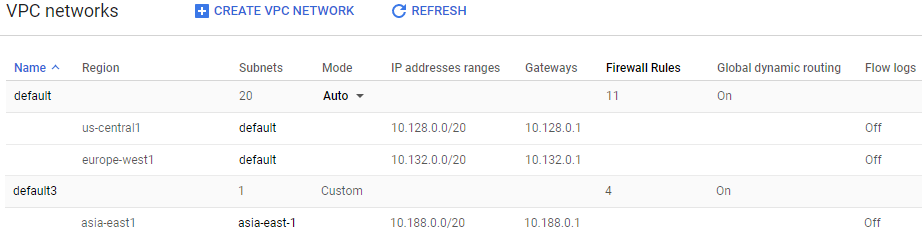
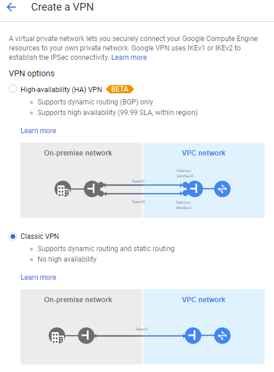
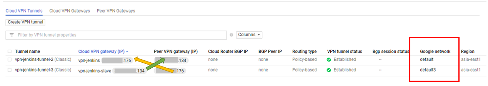

# Use GCP: VPN connections between 2 networks

There are 2 networks (10.140.0.0/20 and 10.188.0.0/20) on GCP, and we would like to create connections between them.

Here is how to connect the networks thru VPN.

## Reserver 2 static IPs for 2 VPN services

- VPN IP for `default` network: x.x.x.176
- VPN IP for `default3` network: x.x.x.134

## Create 2 VPNs for both networks

### Types

- [HA VPN (High-availability Cloud VPN)](https://cloud.google.com/vpn/docs/concepts/overview#ha-vpn)
- [Classic VPN](https://cloud.google.com/vpn/docs/concepts/overview#classic-vpn)

### Classic VPN

#### Google Compute Engine VPN gateway

Notice that the region must be as same as the target GCE instances.

On the [IP address], select the reserved static IP at previous step.

#### Tunnels

- Remote peer IP address: 

  THE OTHER VPN's IP.

- IKE version: IKEv2

- IKE pre-shared key:
  
  Create a preshared key and paste it to 2 tunnels' setting.
  (Make sure that 2 VPN use the same preshared key!!)

- Local subnetworks:

  Select local sub-network.

- Local IP ranges

  The IP range for selected local sub-network or append more IPs here.

#### Results

**Cloud VPN Gateways**

**Cloud VPN tunnels**

The [VPN tunnel status] will show **Established** if 2 VPNs connect like  following,

Now we can ping successfully for resouces(VM) on the other network.

# Reference

- [How to connect Google Cloud Platform networks via VPN](https://medium.com/google-cloud/how-to-connect-google-cloud-platform-networks-via-vpn-622e47d510ba)
