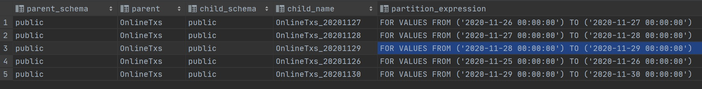
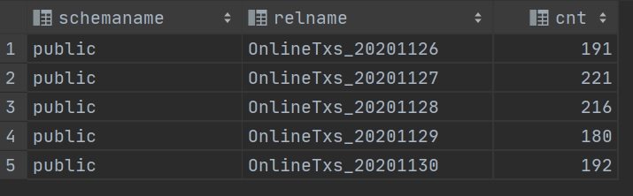

> This is a simple tutorial for creating partition tables

## Create a demo table

Lets create a table first. We will use `[CreateOn]` as the value for partitioning.

```sql
CREATE TABLE "OnlineTxs"
(
    "Id"       serial NOT NULL,
    "CardNo"   varchar(19) NOT NULL,
    "Amt"      decimal(10, 0) NOT NULL,
    "CreateOn" timestamp NOT NULL
) PARTITION BY RANGE ("CreateOn"); -- Add more columns for partitioning
```

## Create Partitions

We will create the following partition tables with different boundaries.

```sql
CREATE TABLE "OnlineTxs_20201126" PARTITION OF "OnlineTxs"
    FOR VALUES FROM ('2020-11-25') TO ('2020-11-26');

CREATE TABLE "OnlineTxs_20201127" PARTITION OF "OnlineTxs"
    FOR VALUES FROM ('2020-11-26') TO ('2020-11-27');

CREATE TABLE "OnlineTxs_20201128" PARTITION OF "OnlineTxs"
    FOR VALUES FROM ('2020-11-27') TO ('2020-11-28');

CREATE TABLE "OnlineTxs_20201129" PARTITION OF "OnlineTxs"
    FOR VALUES FROM ('2020-11-28') TO ('2020-11-29');

 CREATE TABLE "OnlineTxs_20201130" PARTITION OF "OnlineTxs"
    FOR VALUES FROM ('2020-11-29') TO ('2020-11-30');   
```


The records will be stored in this way by the boundaries,

| Partition table name | Range |
|:-----------------:|:------|
| OnlineTxs_20201126 | >= 2020-11-25 00:00:00 &  < 2020-11-26 00:00:00  |
| OnlineTxs_20201127 | >= 2020-11-26 00:00:00 &  < 2020-11-27 00:00:00  |
| OnlineTxs_20201128 | >= 2020-11-27 00:00:00 &  < 2020-11-28 00:00:00  |
| OnlineTxs_20201129 | >= 2020-11-28 00:00:00 &  < 2020-11-29 00:00:00  |
| OnlineTxs_20201130 | >= 2020-11-29 00:00:00 &  < 2020-11-30 00:00:00  |


Verify the partitions we just made by the following SQL.

```sql
SELECT
    nmsp_parent.nspname AS parent_schema,
    parent.relname      AS parent,
    nmsp_child.nspname  AS child_schema,
    child.relname       AS child_name,
    pg_get_expr(child.relpartbound, child.oid, true) as partition_expression
FROM pg_inherits
    JOIN pg_class AS parent            ON pg_inherits.inhparent = parent.oid
    JOIN pg_class AS child             ON pg_inherits.inhrelid   = child.oid
    JOIN pg_namespace AS nmsp_parent   ON nmsp_parent.oid  = parent.relnamespace
    JOIN pg_namespace AS nmsp_child    ON nmsp_child.oid   = child.relnamespace
WHERE parent.relname='OnlineTxs';
```




## (Optional) Create the Primary Key and Index

```sql
ALTER TABLE public."OnlineTxs" ADD PRIMARY KEY ("Id", "CreateOn");

CREATE INDEX IX_OnlineTxs_CreateOn ON public."OnlineTxs"
(
    "CreateOn" ASC
);
```


## Test the partition table with data

We can use the following SQL to generate some data into the table.

```sql
-- Get a random integer between low and high (low <= the random interger <= high)
CREATE OR REPLACE FUNCTION fn_random_int(low INT, high INT) 
   RETURNS INT AS
$$
BEGIN
   RETURN floor(random()* (high-low + 1) + low);
END;
$$ language 'plpgsql' STRICT;

-- Create mock data
do $loop$
declare r INT;
begin
for r in 1..1000 loop
    INSERT INTO public."OnlineTxs"("CardNo","Amt","CreateOn")
    SELECT
    '123456****789' AS "CardNo",
    fn_random_int(100,9999) AS "Amt",
    '2020-11-29'::timestamp + fn_random_int(0,4) * interval '-1' day as "CreateOn";
    -- NOW() + fn_random_int(0,4) * interval '-1' day as "CreateOn";
end loop;
end;
$loop$;
```


Verify the records by the following SQL,

```sql
-- First do VACUUM ANALYZE
VACUUM ANALYZE

-- Check count from "pg_stat_user_tabls"
SELECT schemaname, relname, n_live_tup as Cnt
FROM pg_stat_user_tables
WHERE relname LIKE '%OnlineTxs%'
ORDER BY relname;

-- Or check count from "pg_inherits"
SELECT
    nmsp_parent.nspname AS parent_schema,
    parent.relname      AS parent,
    nmsp_child.nspname  AS child_schema,
    child.relname       AS child_name,
    pg_get_expr(child.relpartbound, child.oid, true) as partition_expression,
    SUM(child.reltuples)    AS cnt
FROM pg_inherits
     JOIN pg_class AS parent            ON pg_inherits.inhparent = parent.oid
     JOIN pg_class AS child             ON pg_inherits.inhrelid   = child.oid
     JOIN pg_namespace AS nmsp_parent   ON nmsp_parent.oid  = parent.relnamespace
     JOIN pg_namespace AS nmsp_child    ON nmsp_child.oid   = child.relnamespace
WHERE parent.relname='OnlineTxs'
GROUP BY parent_schema, parent, child_schema, child_name, partition_expression
```




## Move on more actions

### Truncate a Partition

Truncating by Partition is much faster than doing deletion. Here is how to truncate a Partition table.

```sql
TRUNCATE "OnlineTxs_20201126"; 
```

### Remove a Partition and its data

```sql
DROP TABLE "OnlineTxs_20201126";
```

### Detach a Partition as a table

```sql
ALTER TABLE public."OnlineTxs" DETACH PARTITION "OnlineTxs_20201127";
```

### Attach a detachd partition table

```sql
ALTER TABLE "OnlineTxs" ATTACH PARTITION "OnlineTxs_20201126"
FOR VALUES FROM ('2020-11-25') TO ('2020-11-26');
```

