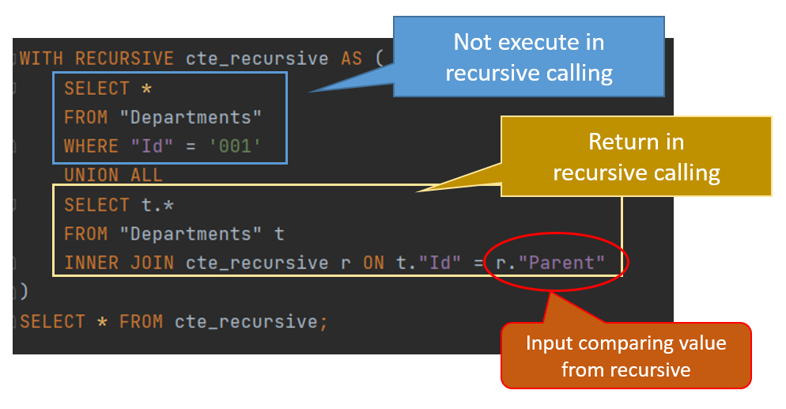
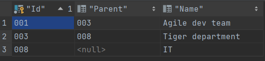

# Recursive CTE

Assume that we have a table which include hierarchy data like this,


| Id | Name | Parent |
|:------:|:----:|:---------:|
| 001 | Agile dev team | 003 |
| 002 | DevOps team | 003|
| 003 | Tiger department | 008 |
| 008 | IT | NULL |


and we would like to know the Agile dev team’s organizational hierarchy: 

`Agile dev team / Tiger department / IT`


Here is a sample for using [CTE(Common table expression)](https://www.postgresql.org/docs/9.1/queries-with.html) and **Recursive modifier** to solve the problem.


### Recursive CTE

```sql
WITH RECURSIVE cte_recursive AS (
        SELECT *
        FROM "Departments"
        WHERE "Id" = '001'
        UNION ALL
        SELECT t.*
        FROM "Departments" t
        INNER JOIN cte_recursive r ON t."Id" = r."Parent"
)
SELECT * FROM cte_recursive;
```




The CTE results in:




### Function (Optional)


And we can create a function for advanced usage.

```sql
CREATE OR REPLACE FUNCTION public.find_hirearchy_departmemts(id text) RETURNS SETOF "Departments" AS $function$
BEGIN
    RETURN QUERY
    WITH RECURSIVE cte_recursive AS (
        SELECT *
        FROM "Departments"
        WHERE "Id" = id
        UNION ALL
        SELECT t.*
        FROM "Departments" t
        INNER JOIN cte_recursive r ON t."Id" = r."Parent"    
)
    SELECT * FROM cte_recursive;
END;
$function$ LANGUAGE plpgsql;
```


## Reference

- [WITH Queries (Common Table Expressions)](https://www.postgresql.org/docs/9.1/queries-with.html)
- [PostgreSQL CTE](https://www.postgresqltutorial.com/postgresql-cte/)
