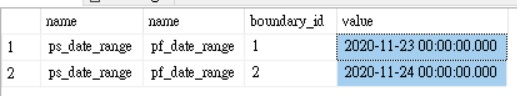
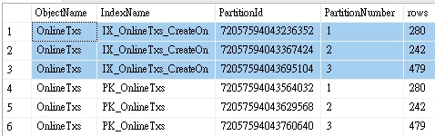
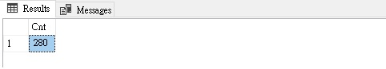

> This is a simple tutorial for creating partitions on an existing table.

## Create a demo table

Lets create a table first. We will use `[CreateOn]` as the the value for partitions.

```sql
CREATE TABLE [dbo].[OnlineTxs]
(
    [Id]       [numeric](18, 0) IDENTITY (1,1) NOT NULL,
    [CardNo]   [varchar](19)                   NOT NULL,
    [Amt]      [decimal](10, 0)                NOT NULL,
    [CreateOn] [datetime]                      NOT NULL,
    CONSTRAINT [PK_OnlineTxs] PRIMARY KEY NONCLUSTERED
    (
        [Id] ASC
    ) WITH (PAD_INDEX = OFF, STATISTICS_NORECOMPUTE = OFF, IGNORE_DUP_KEY = OFF, ALLOW_ROW_LOCKS = ON, ALLOW_PAGE_LOCKS = ON) ON [PRIMARY]
)
```

## Create Partition Function and Scheme

Use **Date** as the partition boundary of the Partition Function.

```sql
CREATE PARTITION FUNCTION pf_date_range (datetime)
AS RANGE RIGHT
FOR VALUES ('2020/11/23','2020/11/24')
-- FOR VALUES (CONVERT(VARCHAR(10), dateadd(day,-1, GETDATE()), 111)) -- Yesterday
GO

CREATE PARTITION SCHEME ps_date_range
    AS PARTITION pf_date_range ALL TO ([PRIMARY])
GO
```

Verify the partitions we just made by the following SQL.

```sql
SELECT ps.name,pf.name,boundary_id,value
FROM sys.partition_schemes ps
INNER JOIN sys.partition_functions pf ON pf.function_id=ps.function_id
INNER JOIN sys.partition_range_values prf ON pf.function_id=prf.function_id
```



The records will be stored like this,

| Partition number | Range                                          |
| :--------------: | :--------------------------------------------- |
|        1         | < 2020-11-23 00:00:00                          |
|        2         | >= 2020-11-23 00:00:00 & < 2020-11-24 00:00:00 |
|        3         | >= 2020-11-24 00:00:00                         |


## Create the none-clustered constraint and create clustered index

Furthermore, we have to recreate the constraint, the primary key must

- Includes the Partition Boundary column: `[CreateOn]`
- None-clustered
- Be added on the Partition Function

And create a clustered index for the Partition Boundary column: `[CreateOn]`.

```sql
ALTER TABLE [dbo].[OnlineTxs] DROP CONSTRAINT [PK_OnlineTxs]
GO

ALTER TABLE [dbo].[OnlineTxs]
    ADD CONSTRAINT [PK_OnlineTxs] PRIMARY KEY NONCLUSTERED ([Id] ASC, [CreateOn])
	ON ps_date_range([CreateOn]);
GO

-- Create cluster index
CREATE CLUSTERED INDEX [IX_OnlineTxs_createon] ON [dbo].[OnlineTxs] ([CreateOn])
WITH (STATISTICS_NORECOMPUTE = OFF, IGNORE_DUP_KEY = OFF, ALLOW_ROW_LOCKS = ON, ALLOW_PAGE_LOCKS = ON)
ON ps_date_range([CreateOn])
GO
```

## Test the partition table with data

We can use the following SQL to generate some data into the table.

```sql
-- Create a function to get a random integer
CREATE FUNCTION fn_random_int (@guid uniqueidentifier, @low INT, @high INT)
RETURNS INT
AS
BEGIN
  DECLARE @rand INT;
  SELECT @rand = ABS(CHECKSUM(@guid) % (@high - @low - 1)) + @low
  RETURN @rand;
END


-- Create mock data
DECLARE @seq int = 0
WHILE @seq < 1000
BEGIN
    SET @seq = @seq + 1

    INSERT INTO [dbo].[OnlineTxs]([CardNo],[Amt],[CreateOn])
    SELECT 
    '123456****789' AS [CardNo],
    dbo.fn_random_int(NEWID(),100,9999) AS [Amt],
    DATEADD(day, -1 * dbo.fn_random_int(NEWID(),0,4), GETDATE()) AS [CreateOn]
END
```

Check the records by summarizing by **Partition Number**,

```sql
SELECT o.name AS [ObjectName],i.name AS [IndexName], partition_id AS [PartitionId], partition_number AS [PartitionNumber], [rows]
FROM sys.partitions p
INNER JOIN sys.objects o ON o.object_id=p.object_id
INNER JOIN sys.indexes i ON i.object_id=p.object_id and p.index_id=i.index_id
WHERE o.name LIKE '%OnlineTxs%'
ORDER BY [IndexName], [PartitionNumber]
```



Or list/count the records by **Partition Number**,

```sql
DECLARE @partition_number INT = 1;
SELECT COUNT(*) AS Cnt FROM [dbo].[OnlineTxs]
WHERE $PARTITION.pf_date_range([CreateOn]) = @partition_number;
```




## Move on more actions

### How to truncate by Partition

Truncating by Partition is much faster then doing deletion.
Here is how to truncate rows in millionseconds by Partition Number.

```sql
DECLARE @partition_numer INT = 1;
TRUNCATE TABLE [dbo].[OnlineTxs] WITH (PARTITIONS(@partition_number));
```


### How to create new Partition

Alter the Partition Function to have more Partitions,

```sql
ALTER PARTITION SCHEME ps_date_range NEXT USED [PRIMARY];
ALTER PARTITION FUNCTION pf_date_range() SPLIT RANGE ('2020/11/25');
```


### How to remove the Partition

```sql
ALTER PARTITION FUNCTION pf_date_range() MERGE RANGE(CONVERT(DATETIME, '2020-11-23'));
```

Notice that the paramter for `RANGE()` must be **DATETIME**.


### Remove Partition Scheme and Function

```sql
DROP PARTITION SCHEME ps_date_range;
DROP PARTITION FUNCTION pf_date_range;
```
