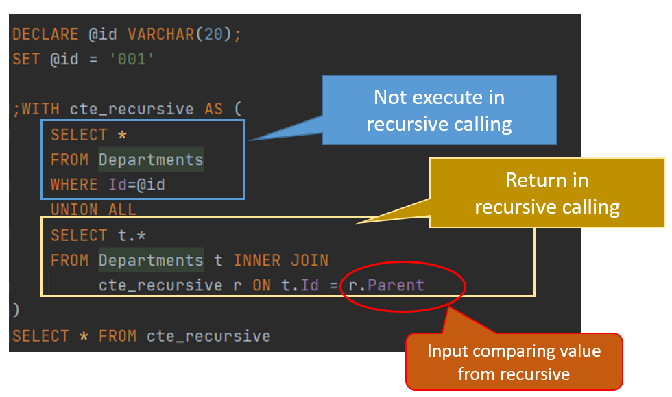
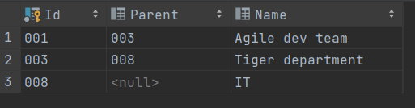

Assume that we have a table which include hierarchy data like this,


| OrgSeq | Name | TopOrgSeq |
|:------:|:----:|:---------:|
| 001 | Agile dev team | 003 |
| 002 | DevOps team | 003|
| 003 | Tiger department | 008 |
| 008 | IT | NULL |
| 009 | Sales | NULL |


and we would like to know the Agile dev team’s organizational hierarchy: 

`Agile dev team / Tiger department / IT`


Here is a sample for using [CTE(Common table expression)](https://technet.microsoft.com/en-us/library/ms190766(v=sql.105).aspx) to solve the problem.


### CTE

```sql
DECLARE @OrgSeq VARCHAR(20);
SET @OrgSeq = '001'

;WITH Recursives AS (
        SELECT *
        FROM HrDepartments
        WHERE OrgSeq=@OrgSeq
        UNION ALL
        SELECT t.*
        FROM HrDepartments t INNER JOIN
        Recursives r ON r.TopOrgSeq = t.OrgSeq
)

SELECT * FROM Recursives r
```




### Function (Optional)


And we can create a function for advanced usage.

```sql
CREATE FUNCTION GetDeptRecursive
(
    @OrgSeq VARCHAR(20)
)
returns table
as return
    WITH Recursives AS (
        SELECT *
        FROM HrDepartments
        WHERE Version='01' AND OrgSeq=@OrgSeq
        UNION ALL
        SELECT t.*
        FROM HrDepartments t INNER JOIN
        Recursives r ON r.TopOrgSeq = t.OrgSeq
		WHERE t.Version='01'
)

SELECT  * FROM Recursives r
```

### Results



