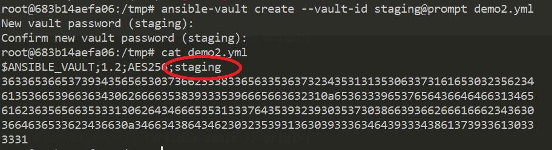
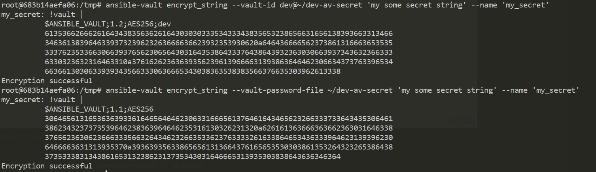
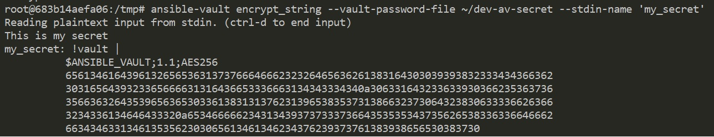

# Ansible Vault


## Vault password

### Password source

The vault password can be set thru:

1. Prompt, ie. key in on the fly
2. File path

### Multiple Vault Passwords

A vault ID is the identifier for one or more vault secrets.

Use vault ID as following,

#### Prompt

```s
--vault-id <label>@prompt
```

#### File path

Assume that we put the secret to ~/dev-av-secret

```s
$ echo "xxxxx" >> ~/dev-av-secret
```


Then we can use the password file like this, 

```s
--vault-password-file ~/dev-av-secret
```


To set a label,

```s
--vault-id <label>@~/dev-av-secret
```


## File level

### Create new file and encrypt

The following command will first ask a vault password and than open the editor to edit the file.

```s
$ ansible-vault create foo.yml 
```


Create encrypted file with vault-id,

```s
$ ansible-vault create --vault-id dev@~/dev-av-secret demo.yml
```


Or by prompt,

```s
$ ansile-vault create --vault-id staging@prompt demo2.yml
```




### Edit encrypted file

```s
$ ansible-vault edit foo.yml
```

It will ask you for the vault password before editing the file.
Or we can use the password from file,

```s
$ ansible-vault edit --vault-id dev@~/dev-av-secret demo.yml
```


### View encrypted file(s)

```s
$ ansible-vault view demo.yml [demo2.yml ...]
```

Or use the password file,

```s
$ ansible-vault view --vault-id dev@~/dev-av-secret demo.yml [demo3.yml ...]
```


### Change the vault password of file(s)

```s
$ ansible-vault rekey foo.yml [foo2.yml ...]
```

It will ask for both the old and new vault passwords.
Or we can use the password files,

```s
$ ansible-vault rekey --vault-id dev@~/dev-av-secret --new-vault-id prod@~/prod-av-secret demo.yml
Rekey successful
```


### Encrypt existing file(s)

```s
$ ansible-vault encrypt demo.yml [demo2.yml ...]
```

Or encrypt the file by password file,

```s
$ ansible-vault encrypt --vault-id dev/dev-av-secret demo.yml demo2.yml
```


### Decrypt encrypted file(s)

```s
$ ansible-vault decrypt demo.yml [demo2.yml ...]
```

Or decrypt by password file,

```s
$ ansible-vault decrypt --vault-id dev@~/dev-av-secret demo.yml
```


## Variable level

### Encrypt string as a variable

```s
$ ansible-vault encrypt_string --vault-id dev@~/dev-av-secret 'my some secret string' --name 'my_secret'
```

Or

```s
$ ansible-vault encrypt_string --vault-password-file dev@~/dev-av-secret 'my some secret string' --name 'my_secret'
```




Also we can encrypt something from stdin, e.q.

```s
$ ansible-vault encrypt_string --vault-id dev@a_password_file --stdin-name 'my_secret'
```




