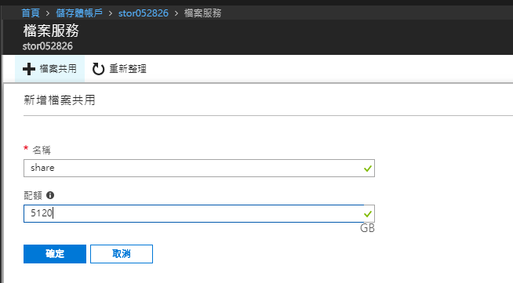

# Storage Account 儲存體帳戶

> ### Storage可提供的四種服務
> 1. Blobs(Azure Blobs): 適用於文字和二進位資料且可大幅調整的物件存放區。(Page: 8TB、Block: 4.75TB、Append: 約200GB)
> 2. 資料表(Azure Tables): 以無結構描述方式儲存結構化資料的 NoSQL 存放區(Key/Value)。
> 3. 佇列(Azure Queues): 可在應用程式元件之間做為非同步交換的訊息存放區。
> 4. 檔案(Azure Files): Azure 檔案服務：雲端或內部部署的受控檔案共用，提供 [SMB](https://msdn.microsoft.com/zh-tw/library/hh831795(v=ws.11).aspx) 3.0/2.1 之共用資料夾。
>
> 更多細節可參考[Azure 儲存體服務](https://docs.microsoft.com/zh-tw/azure/storage/common/storage-introduction#azure-storage-services)

## 建立儲存體帳戶

至`儲存體帳戶`，點選`新增`。

1. 帳戶種類
   - Storage(傳統)
   - Storage(一般用途 v1)、 StorageV2(一般用途 v2) 、Blob儲存體

   > 可參考[Azure 儲存體帳戶選項](https://docs.microsoft.com/zh-tw/azure/storage/common/storage-account-options)

   ### Storage(傳統)

   

   

   ### Storage(一般用途 v1)

   

   
   
   
   ### Storage(一般用途 v2)

   

   
   
   ### Blob儲存體

   

   
    
   
2. 複寫
   
   | 種類 |  規格 | 參考說明  |
   |:-----------------------:|:-----|:----:|
   | LRS 本機備援 | 同一地區 3 個複本 | [Microsoft Document](https://docs.microsoft.com/zh-tw/azure/storage/common/storage-redundancy-lrs) |
   | ZRS 區域備援 | 主地區 3 個複本，次要地區 3 個唯讀複本 | [Microsoft Document](https://docs.microsoft.com/zh-tw/azure/storage/common/storage-redundancy-zrs) |
   | GRS 異地備援 | 主要地區 3 個複本,次要地區 3 個複本 | [Microsoft Document](https://docs.microsoft.com/zh-tw/azure/storage/common/storage-redundancy-grs) |
   | RA-GRS 讀取權限異地備援 | 主地區 3 個複本，次要地區 3 個唯讀複本 | [Microsoft Document](https://docs.microsoft.com/zh-tw/azure/storage/common/storage-redundancy-grs#read-access-geo-redundant-storage) |
   
   > 可參考[Azure 儲存體簡介-複寫](https://docs.microsoft.com/zh-tw/azure/storage/common/storage-introduction#replication)

3. 效能

   - 標準
   - 進階
     使用SSD，較高的[IOPS](https://en.wikipedia.org/wiki/IOPS)Throughput，
     但選了此選項後，複寫將只能選擇`LRS 本機備援`。

     

     且服務只有支援Blobs。
     
     

4. 存取層
   
   | 存取層 |  定義 |  描述 |
   |:-----:|:----:|:----|
   | Cold | [非經常性存取層](https://docs.microsoft.com/zh-tw/azure/storage/blobs/storage-blob-storage-tiers#cool-access-tier) | 經常性存取儲存層的儲存成本會高於非經常性存取和封存儲存層，但存取成本最低。 |
   | Hoy  | [經常性存取層](https://docs.microsoft.com/zh-tw/azure/storage/blobs/storage-blob-storage-tiers#hot-access-tier) | 相較於經常性存取儲存層，非經常性儲存層具有較低的儲存成本和較高的存取成本。 |

 
5. 需要安全傳輸(HTTPS)

6. 資源群組: 可選擇已建立的Resource Group或新建一個新的。
   

## 建立儲存體服務：檔案(共用)

在儲存體帳戶清單中，點選要管理的儲存體帳戶。

並選擇`檔案`：

點選`檔案共用`，

輸入自訂名稱和大小(最大為5120GB)

完成檔案共用設定後，點選該檔案共用明稱，並點選`連接`。

### 建立本機遠端磁碟機

> 支援之作業細統請參考[這邊](https://docs.microsoft.com/zh-tw/azure/storage/files/storage-how-to-use-files-windows)

利用右方之連線方式，移至本機機器建立一個Local磁碟機。

結果如下：

