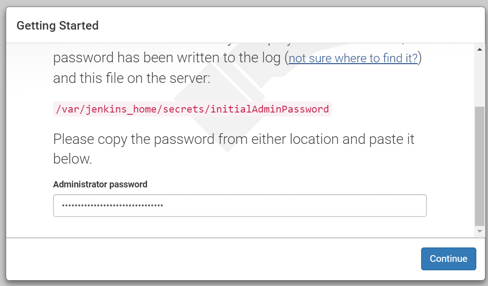
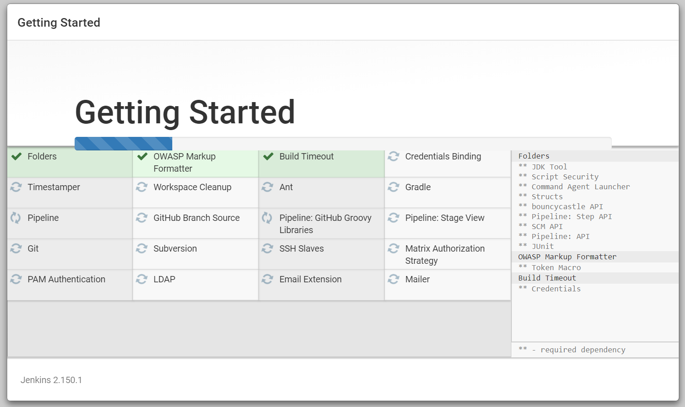

# Get started


## Start a Jenkins container


```
$ mkdir jenkins_home
```

> You need to ensure that the directory `<path>/jenkins` is own by UID 1000.
> The UID is defined in the [dockerfile](https://github.com/jenkinsci/docker/blob/master/Dockerfile)
> Reference: [谈谈 Docker Volume 之权限管理（一）](https://yq.aliyun.com/articles/53990)


```
$ chown 1000 jenkins_home
$ docker pull jenkins/jenkins:lts-slim
$ docker run -d -v $(pwd)/jenkins_home:/var/jenkins_home -p 8080:8080 -p 50000:50000 --name <my_jenkins_name> jenkins/jenkins:lts-slim
```

> We will get the following error logs if we did not set the right permission for the data volume.

```
touch: cannot touch '/var/jenkins_home/copy_reference_file.log': Permission denied
Can not write to /var/jenkins_home/copy_reference_file.log. Wrong volume permissions?
```


For the Docker-for-Windows users, this is the successful work around:

```
$ docker run -u 0 -d -v /jenkins_home:/var/jenkins_home -p 8080:8080 -p 50000:50000 --name jb-jenkins jenkins/jenkins:lts-slim
```

## Unlock Jenkins

To unlock Jenkins, get the following password and paste it to Jenkins (http://localhost:8080)

```
$ docker exec -it my-jenkins cat /var/jenkins_home/secrets/initialAdminPassword
```



PS. You can also find the password in docker logs.

## Initialize

Install the suggest plugins and create First Admin User.




