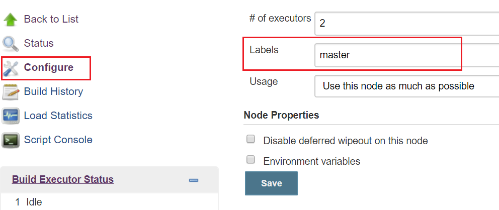
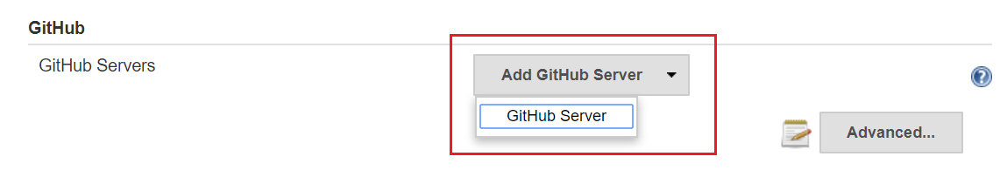
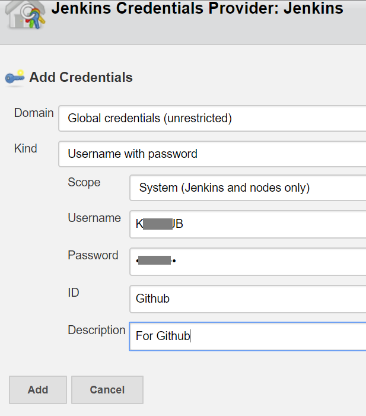
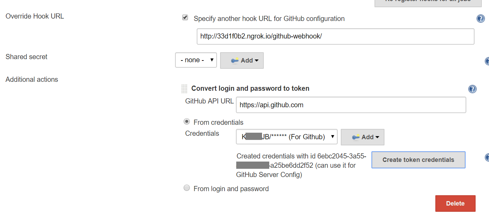
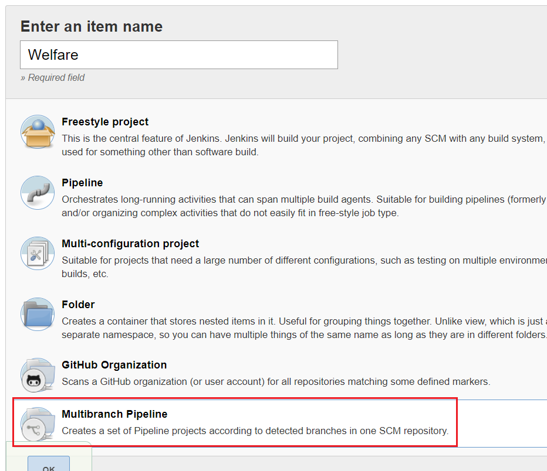
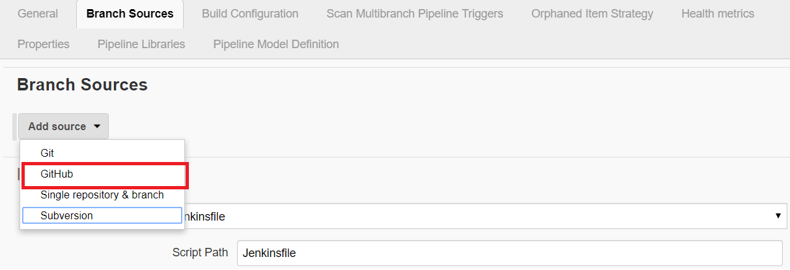
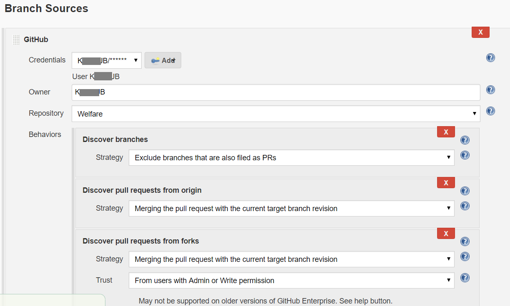
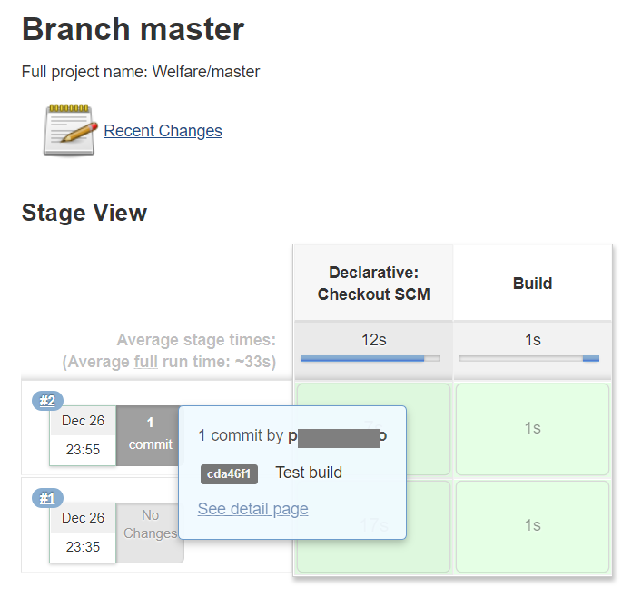

# Integrate Github webhook


## Jenkins settings

### Set node's label

Go to **[Manage Jenkins]**->**[Manage Nodes]**, click `master`.

Set a label: `master` in **[Configure]**.




### Github plugin settings

Go to **[Manage Jenkins]**->**[Manage Plugins]** and check if the [Github plugin](https://wiki.jenkins.io/display/JENKINS/Github+Plugin) have been installed

In [Manage Jenkins]->[Configure System], add a Github server.




Check the option: **[Specify another hook URL for GitHub configuration]**, if you want to give specified hook url. 

Then use the credential or a Github id/pwd to **Create token credentials**.





COPY THE TOKEN which will be later used in Github webhook settings.

> Notice after you create a token, there will be a Personal-access-tokens record created on Github in **[Settings]**->**[Developer settings]**->**[Persal access tokens]** 
> 


Save the changes.


## Github settings


Go to your Github repository's **[Settings]**->**[Webhooks]** and fill out 

1. Payload url: For example, `http://jb.com/github-webhook/`
2. Secret: The token we just copied on Jenkins's Github plugin


## Create pipeline

Back to Jenkins, create a new pipeline by clicking **[New Item]** and select **[Multibranch Pipeline]**.




At **[Branch Sources]**, select **[Add source]**->**[GitHub]** and set the credential and repository.






> If you already have Jenkinsfile on the target repository, Jenkins will start a build after scanning the repository.


## Jenkins file

Lets create a Jenkins file to trigger a build in [pollSCM](https://jenkins.io/doc/book/pipeline/syntax/#triggers) mode, for example,

- Jenkinsfile

```
pipeline {
    agent {
        label 'master'
    }
    triggers {
        pollSCM 'H/1 * * * *'
    }
    stages {
        stage('Build') {
            steps {
                sh 'echo "Merry Christmas"'
                sh 'echo "Happy New Year"'
            }
        }
    }
}
```

Now pushing codes to master branch will trigger the build.

```
$ git add .
$ git commit -m "Test build"
$ git push
```



Console outputs:

```
Checking out Revision cda46f1862eedf359a3d06290feefe4ef004cb3e (master)
 > git config core.sparsecheckout # timeout=10
 > git checkout -f cda46f1862eedf359a3d06290feefe4ef004cb3e
Commit message: "Test build"
 > git rev-list --no-walk f2da500cbe6fa44abb641e8409766af8d52d1fbb # timeout=10
[Pipeline] }
[Pipeline] // stage
[Pipeline] withEnv
[Pipeline] {
[Pipeline] stage
[Pipeline] { (Build)
[Pipeline] sh
+ echo Merry Christmas
Merry Christmas
[Pipeline] sh
+ echo Happy New Year
Happy New Year
[Pipeline] }
[Pipeline] // stage
[Pipeline] }
[Pipeline] // withEnv
[Pipeline] }
[Pipeline] // node
[Pipeline] End of Pipeline

GitHub has been notified of this commit’s build result

Finished: SUCCESS
```


