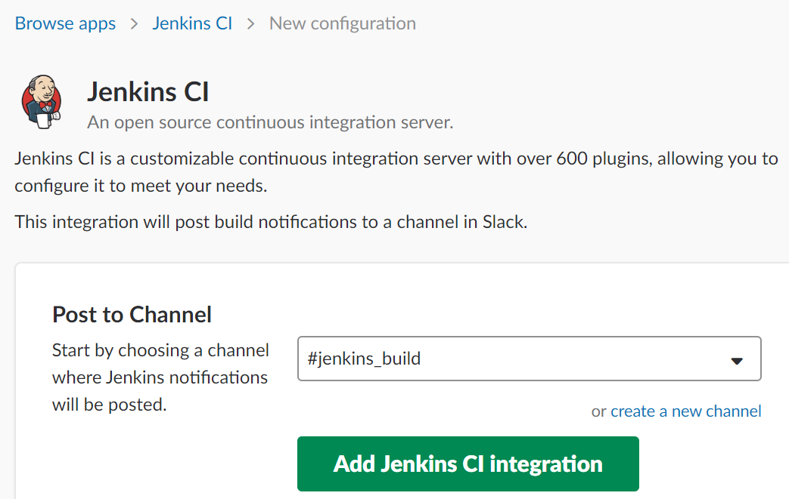
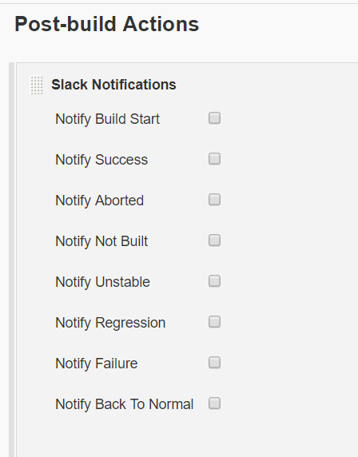
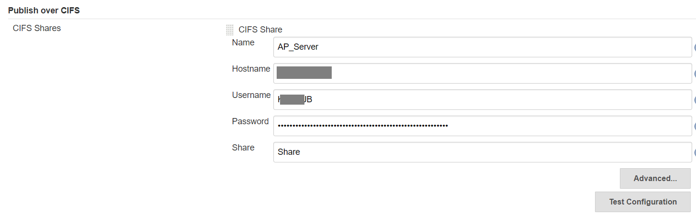
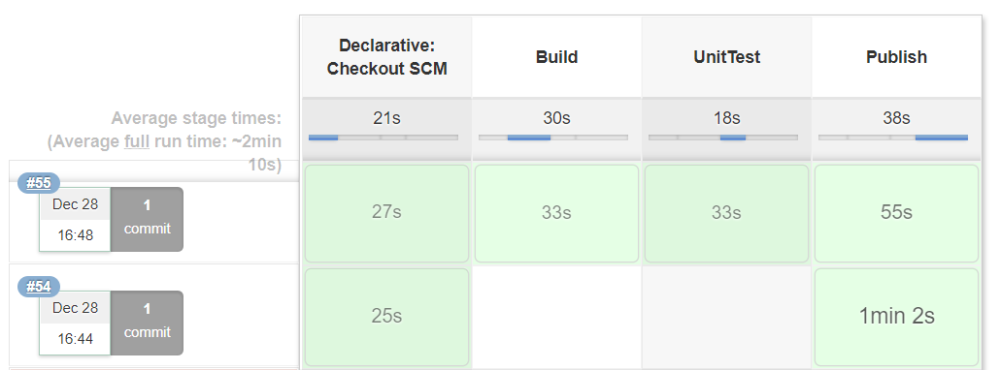
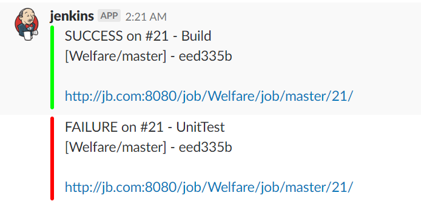
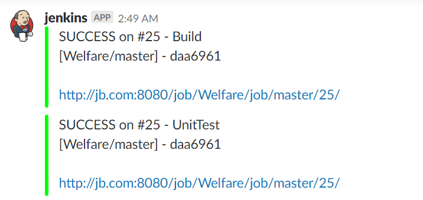
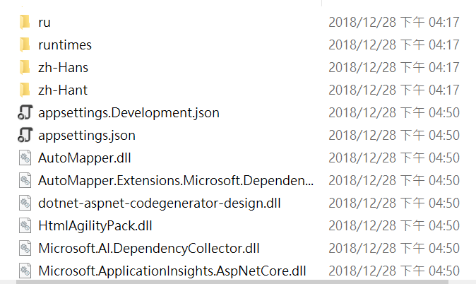

# Build .NET Core project

## Jenkins: Install plugins

We will need these plugins in this go thru:

1. [Script Security Plugin](https://wiki.jenkins.io/display/JENKINS/Script+Security+Plugin)
2. [MSTest](https://plugins.jenkins.io/mstest)
3. [Slack Notification](https://plugins.jenkins.io/slack)
4. [Publish over CIFS](https://plugins.jenkins.io/publish-over-cifs)
5. [Workspace Cleanup Plugin](http://wiki.jenkins-ci.org/display/JENKINS/Workspace+Cleanup+Plugin)

> This MSTest plugin converts MSTest TRX test reports into JUnit XML reports so it can be integrated with Jenkin's JUnit features, such as visualized **Test Result**.


## Slack notification

> The official document: [jenkinsci/slack-plugin](https://github.com/jenkinsci/slack-plugin)


Of course we need a Slack channel on a workspace.
Click [here to configure the Jenkins integration](https://my.slack.com/services/new/jenkins-ci).



After you click **[Add Jenkins CI integration]**, follow the step-by-step setup instructions to complete the **Global Slack Notifier Settings** (which locates at **[Manage Jenkins]**->**[Configure System]**).


Then in your can add it as a Post-build action in a FreeStyle Project.




Or use it in the Jenkinsfile as the later sample.


## Install .NET Core SDK on build server

> [.NET Core download page](https://dotnet.microsoft.com/download)

Check your OS by,

```
$ cat /etc/issue.net
Debian GNU/Linux 9
```

For example, to install .NET Core on [Debian 9](https://dotnet.microsoft.com/download/linux-package-manager/debian9/sdk-current)

```
$ wget -qO- https://packages.microsoft.com/keys/microsoft.asc | gpg --dearmor > microsoft.asc.gpg
$ sudo mv microsoft.asc.gpg /etc/apt/trusted.gpg.d/
$ wget -q https://packages.microsoft.com/config/debian/9/prod.list
$ sudo mv prod.list /etc/apt/sources.list.d/microsoft-prod.list
$ sudo chown root:root /etc/apt/trusted.gpg.d/microsoft.asc.gpg
$ sudo chown root:root /etc/apt/sources.list.d/microsoft-prod.list
$ sudo apt-get install apt-transport-https
$ sudo apt-get update
$ sudo apt-get install dotnet-sdk-2.2
```


## (Optional)Publish over CIFS

To copy the publish artifacts to remote Windows Server's share folder, 
go to **[Manage Jenkins]**->**[Configure System]** and find the **Publish over CIFS** section, complete the share folder's information.




## Jenkins file sample

[KarateJB/Jenkinsfiles/.NET Core](https://github.com/KarateJB/Jenkinsfiles/blob/master/.NET%20Core/Jenkinsfile)


Build results:




The build messages are as following,

(Failed on Unit test)



(Success)




And if you enable **Publish over CIFS**, the artifacts will be on the share folder like below,



