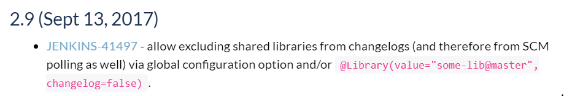

# Enable global library

Here are the steps for enabling global pipeline library(s).
So that we can use the global functions on the Jenkinsfile at any pipeline.

PS. The following example is on Jenkins and GitHub.


## Create a new repository for global library

The official recommend project structure is as follwoing,


Here is my sample code's structure in [GitHub](https://GitHub.com/KarateJB/JB.Jenkins.ShareLibrary),

| src
| vars
  |- notifyBuild.groovy  
| resources


- vars/notifyBuild.groovy

```groovy
def call(String extraMsg='') {
  echo "Notify by global function"
}
```

> Notice that the function must named: `call`.


## Set Global Pipline Libraries options

Go to **[Manage Jenkins]** -> **[Configure System]** on Jenkins.

At **[Global Pipline Libraries]**, press **Add**.


Then fill out 

1. **Library Name**: This name will be used in Jenkinsfile later. In this example, it is named: `ShareLibrary`
2. **Default version**: The target branch name
3. **Retrieval method**: choose "Modern SCM"
5. **Source Code Management**: choose "GitHub" and set `Credentials`, `Owner`, `Repository`


>　We can add one more Global Pipeline Libraries by pressing **Add** again.


## Update Jenkinsfile

At the last step, we will update our Jenkinsfile to use the Gloabal function from **ShareLibrary** in the target repository.

```jenkinsfile
@Library("ShareLibrary")_

pipeline {
    agent {
        label 'master'
    }
    stages {
        stage('Build') {
            steps {
               
            }
            post {
				always {
                    script {
                        notifyBuild()
					}
                }
			}
        }
    }
}
```

By importing the Global pipeline library: **ShareLibrary**, we can use global function: `notifyBuild()`.

For importing mutiple libraries, 

```jenkinsfile
@Library("ShareLibrary1")
@Library("ShareLibrary2")
@Library("ShareLibrary3")_
```

## Use another branch of Shared Library

While including Jenkins Shared Library, the Jenkinsfile will use the default version/branch which is set in option: **Default version** which is located at **[Manage Jenkins]** -> **[Configure System]** -> **[Global Pipeline Libraries]**.

If we would like to use certain branch of Jenkins Shared Library, overwrite the **Default version** by 

```
@Library("sharedlibrary@<branch_name>")_
```

For example, use the branch `new-features` by `@Library("sharedlibrary@new-features")_`


## Changes on Shared Library will trigger pipelines run

If a project's Jenkinsfile includes Shared Library, it's pipeline will be triggered automatically by any change of the Shared Library.

Lets say, if I push some commits on the `new-features` branch of Jenkins Shared Library, all the project pipelines will be triggered when their Jenkinsfile include that branch of Jenkins Shared Library.

> Reference issues
> - [Global Pipeline Libraries triggers the 'poll SCM' of jobs](https://issues.jenkins-ci.org/browse/JENKINS-39615)
> - [Poll SCM and Timer triggers include "Changes" for a Pipeline for any/all Shared Libraries](https://issues.jenkins-ci.org/browse/JENKINS-41497?focusedCommentId=313573&page=com.atlassian.jira.plugin.system.issuetabpanels%3Acomment-tabpanel#comment-313573) 
> - [Jenkins Pipeline - global pipeline library updates show up in job's list of recent changes, how to prevent this?](https://stackoverflow.com/a/46748508) 


Most time we dont want to run other project pipelines if the changes are not on them.
Here is the solution to enable/disable this feature(or bug?).


### Install plugin: Pipeline: Shared Groovy Libraries (>=2.9)

The release note of [Pipeline: Shared Groovy Libraries](https://plugins.jenkins.io/workflow-cps-global-lib) 2.9: 



Notice that some dependencies(plugins) must be installed manually.


### Global Pipeline Libraries settings

Go to **[Manage Jenkins]** -> **[Configure System]** -> **[Global Pipeline Libraries]** and update the global settings as following,


(1) UNCHECK **Include @Library changes in job recent changes**

The option determines whether the changes of Shared Library will be included into the check of Poll SCM or not.

This setting can be overwrite in Jenkinsfile: 

```
@Library(value="sharedlibrary", changelog=false)_
```

Which true/false indicates enable/disable **Include @Library changes in job recent changes**.


(2) In settings block: **Behaviors**, add **Ignore on push notifications**.

> Important!! If `changelog` parameter is modified in Jenkinsfile or the Global Pipeline Libraries's setting is updated, RESTART the Jenkins to make it effecive!


## Reference

- [Extending with Shared Libraries](https://jenkins.io/doc/book/pipeline/shared-libraries/)

