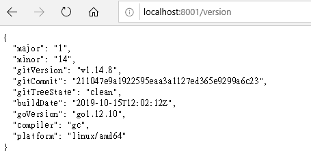
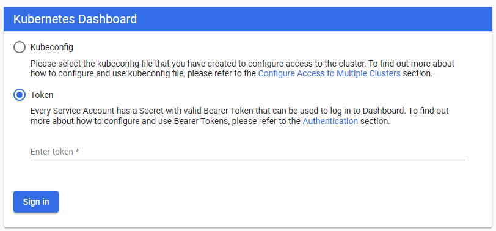
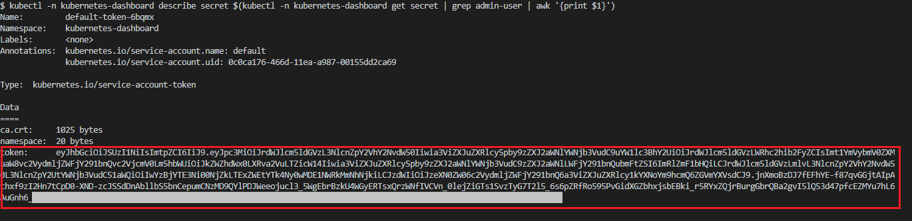
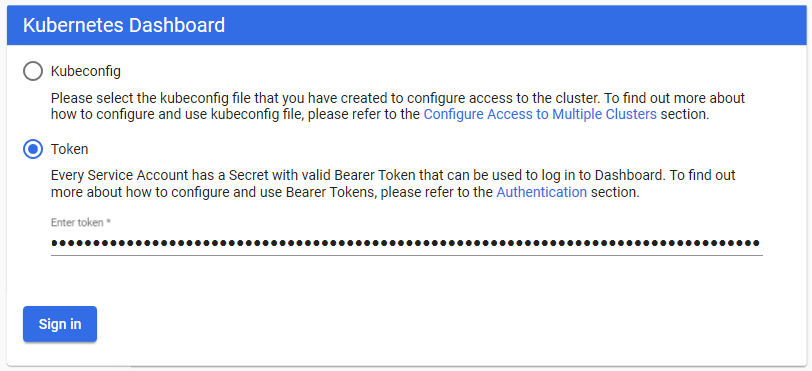

# Get started

## Basic command 

- Show Server/Client version

```
$ kubectl version
```

- Get nodes

```
$ kubectl get nodes
```

- Get namespaces

```
$ kubectl get namespaces
```

e.q.
```
$ kubectl get namespaces
NAME                   STATUS   AGE
default                Active   16h
docker                 Active   16h
kube-node-lease        Active   16h
kube-public            Active   16h
kube-system            Active   16h
kubernetes-dashboard   Active   15h
```

- Show pods of a namespace

```
$ kubectl get --namespace <namespace> pods
```

ex.
```
$ kubectl get --namespace kube-system pods
```

e.q.
```
$ kubectl get --namespace kube-system pods
NAME                                     READY   STATUS    RESTARTS   AGE
coredns-6dcc67dcbc-vkjw5                 1/1     Running   1          16h
coredns-6dcc67dcbc-x2pwl                 1/1     Running   1          16h
etcd-docker-desktop                      1/1     Running   1          16h
kube-apiserver-docker-desktop            1/1     Running   1          16h
kube-controller-manager-docker-desktop   1/1     Running   1          16h
kube-proxy-z7k7z                         1/1     Running   1          16h
kube-scheduler-docker-desktop            1/1     Running   1          16h
```

- Show information (node/IP/containers/volumes/...) of a pod

```
$ kubectl describe --namespace kube-system pods kube-apiserver-docker-desktop
```

The above command will show that the pod `kube-apiserver-docker-desktop` has one container: `kube-apiserver`

> The namespace will be `default` if not given


- Show logs from container of a pod

```
$ kubectl logs --namespace <name_space> <pod name> --container[-c] <container_name> 
```

ex.
```
$ kubectl logs --namespace kube-system kube-apiserver-docker-desktop -c kube-apiserver
```


To show all logs from all containers in a pod

```
$ kubectl logs --namespace <namespace> <pod>
```


- Execute command on pod/container

```
$ kubectl exec --namespace <namespace> <pod> [-c <container_name>] -- <command>
```

ex.
```
$ kubectl exec --namespace kube-system kube-apiserver-docker-desktop -c kube-apiserver -- uname -a
$ kubectl exec --namespace kube-system kube-apiserver-docker-desktop -- uname -a
```


## Kubernetes Dashboard

> See 
> * [Kubernetes Dashboard Github](https://github.com/kubernetes/dashboard)
> * [Kubernetes Dashboard Documentation](https://github.com/kubernetes/dashboard/blob/master/docs/README.md)


### Install

```
$ kubectl apply -f https://raw.githubusercontent.com/kubernetes/dashboard/v2.0.0-rc3/aio/deploy/recommended.yaml
```

- Check if the deployment ready

```
$ kubectl get deployments --namespace kubernetes-dashboard
```

Which is expected to show something like,

```
NAME                        READY   UP-TO-DATE   AVAILABLE   AGE
dashboard-metrics-scraper   1/1     1            1           16h
kubernetes-dashboard        1/1     1            1           16h
```


- Run it

```
$ kubectl proxy

Starting to serve on 127.0.0.1:8001
```

Then we can see Server version on **http://localhost:8001/version**




You can access it thru: **http://localhost:8001/api/v1/namespaces/kubernetes-dashboard/services/https:kubernetes-dashboard:/proxy/**

Which will shows as following,




### Create Authentication Token (RBAC)

We can use the following command to get the token to login.

* Bash

```
$ kubectl -n kubernetes-dashboard describe secret $(kubectl -n kubernetes-dashboard get secret | grep admin-user | awk '{print $1}')
```

* Powershell

```
$ kubectl -n kubernetes-dashboard describe secret $(kubectl -n kubernetes-dashboard get secret | sls admin-user | ForEach-Object { $_ -Split '\s+' } | Select -First 1)
```


Now copy the token and use it to login to Kubernetes Dashboard.






## Trouble shooting

### Docker Desktop (Windows)

#### Kubernetes fails to start

Delete the following directories and restart Docker, this should regenerate client certs for you, which include vm.docker.internal.

```
C:\ProgramData\DockerDesktop\pki
C:\Users\yourUserName\AppData\Local\Docker\pki
```
