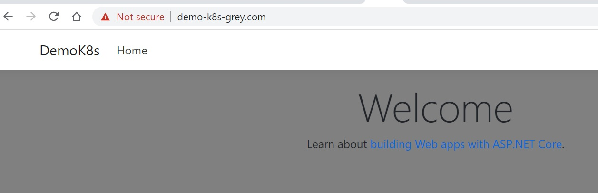
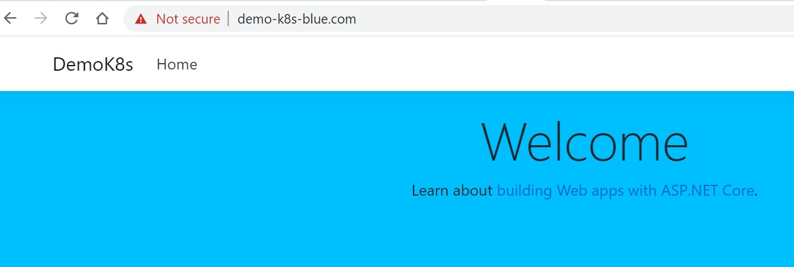
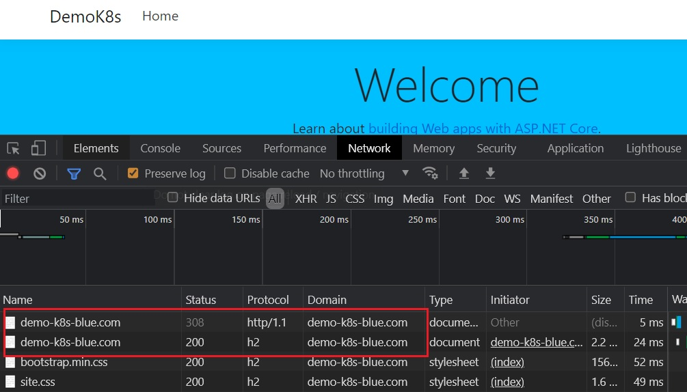

# Basic

***
## Before we get started

The sample docker images are 
- [karatejb@demo-k8s](https://hub.docker.com/repository/docker/karatejb/demo-k8s)
- [karatejb@demo-k8s-web](https://hub.docker.com/repository/docker/karatejb/demo-k8s-web)


You can build the same image to your repositories in Docker Hub by the following command.

```s
$ cd "99.Samples/aspnet5"
$ docker build -t <Docker_ID>/demo-k8s:latest -f docker/dockerfile .
$ docker push <Docker_ID>/demo-k8s:latest
```

```s
$ cd "99.Samples/angular"
$ docker build -t <Docker_ID>/demo-k8s-web:latest -f docker/dockerfile .
$ docker push <Docker_ID>/demo-k8s-web:latest
```


### Sample code/manifest

The sample code/file are located at [99.Samples\aspnet5\kubernetes\Basic](../99.Samples/aspnet5/kubernetes/Basic)


***
## Namespace

### Create Namespace

```s
$ kubectl create namespace demo-k8s
```

Or use a yaml file.

```s
$ kubectl create -f namespace.yml
namespace/demo-k8s created
```

- namespace.yml

```yaml
apiVersion: v1
kind: Namespace
metadata:
  name: demo-k8s
```

### Delete namespace

```s
$ kubecrl delete namespace demo-k8s
namespace/demo-k8s deleted
```


***
## Pods

> Pods are the smallest deployable units in Kubernetes.
> See [official document](https://kubernetes.io/docs/concepts/workloads/pods/).


### Manifest sample

```yaml
apiVersion: v1
kind: Pod
metadata:
  name: demo-k8s-pod
  labels:
    app: demo-k8s
spec:
  containers:
    - name: kubernetes-idsrv-backend
      image: karatejb/idsrv4-backend
      ports:
        - containerPort: 5000
        - containerPort: 5001
```


To create a pod: `demo-k8s-pod`:

```s
$ kubectl apply -f kubernetes-idsrv.ymal
$ kubectl get pods --namespace demo-k8s
$ kubectl get pods -o wide | grep demo-k8s-pod

$ kubectl port-forward kubernetes-idsrv-pod 5001:5001
```

To delete a pod,

```s
$ kubectl delete pods kubernetes-idsrv-pod
```

### Use Port Forwarding to access the AP in a cluster

```s
$ kubectl port-forward demo-k8s-pod 80:5000 443:5001 --namespace demo-k8s
```

We can assign the IP as well:

```s
$ kubectl port-forward --address 192.168.xxx.xxx demo-k8s-pod 80:5000 443:5001 --namespace demo-k8s
```


***
## Service

> An abstract way to expose an application running on a set of Pods as a network service.
> See [official document](https://kubernetes.io/docs/concepts/services-networking/service/).


### Manifest sample

```yaml
apiVersion: v1
kind: Service
metadata:
  name: demo-k8s-service # The name of the service
spec:
  selector:
    app: demo-k8s # The lable of pods
  type: NodePort
  ports:
    - name: http-port
      protocol: TCP
      port: 5000 # The port of service to expose
      targetPort: 5000 # The port that service will send requests to, that your pod will be listening on.
      nodePort: 30500 # The port mapped to node
    - name: https-port
      protocol: TCP
      port: 5001
      targetPort: 5001
      nodePort: 30501
```

### port vs targetPort vs nodePort

> Reference: [Using Kubernetes Port, TargetPort, and NodePort](https://www.bmc.com/blogs/kubernetes-port-targetport-nodeport/)

| Type | Description |
|:-----|:------------|
| Port | Exposes the Kubernetes service on the specified port within the cluster. Other pods within the cluster can communicate with this server on the specified port. |
| TargetPort | It is the port on which the service will send requests to, that your pod will be listening on. Your application in the container will need to be listening on this port also. |
| NodePort | It exposes a service externally to the cluster by means of the target nodes IP address and the NodePort. NodePort is the default setting if the port field is not specified. |


### Create Service

```s
$ kubectl create -f service.yaml --namespace demo-k8s
$ kubectl get services --namespace demo-k8s
$ kubectl get services -o wide | grep demo-k8s-service
$ kubectl describe service demo-k8s-service
Name:                     demo-k8s-service
Namespace:                demo-k8s
Labels:                   <none>
Annotations:              <none>
Selector:                 app=demo-k8s
Type:                     NodePort
IP:                       10.103.20.41
LoadBalancer Ingress:     localhost
Port:                     http-port  5000/TCP
TargetPort:               5000/TCP
NodePort:                 http-port  30500/TCP
Endpoints:                10.1.7.241:5000
Port:                     https-port  5001/TCP
TargetPort:               5001/TCP
NodePort:                 https-port  30501/TCP
Endpoints:                10.1.7.241:5001
Session Affinity:         None
External Traffic Policy:  Cluster
Events:                   <none>
```


### Delete Service

```s
$ kubectl delete services demo-k8s-service
```


***
## Deployments

> A Deployment provides declarative updates for Pods and ReplicaSets.
> See [official document](https://kubernetes.io/docs/concepts/workloads/controllers/deployment/).


### Manifest sample

```yaml
apiVersion: apps/v1
kind: Deployment
metadata:
  name: demo-k8s-deployment # The name of Deployment
spec:
  replicas: 3 # The number of 
  template:
    metadata:
      labels:
        app: demo-k8s
    spec:
      containers:
        - name: demok8s
          image: karatejb/demo-k8s:latest # The Docker image
          ports:
            - containerPort: 5000
            - containerPort: 5001
  selector:
    matchLabels:
      app: demo-k8s
```


### Create Deployment

```s
$ kubectl create -f kubernetes-idsrv-deployment.yaml --namespace demo-k8s
deployment.apps/demo-k8s-deployment created

$ kubectl get deployment demo-k8s-deployment --namespace demo-k8s
NAME                  READY   UP-TO-DATE   AVAILABLE   AGE
demo-k8s-deployment   3/3     3            3           2m5s

$ kubectl get pods --namespace demo-k8s
NAME                                   READY   STATUS    RESTARTS   AGE
demo-k8s-deployment-7f8947b854-jcbfd   1/1     Running   0          42s
demo-k8s-deployment-7f8947b854-qwbvw   1/1     Running   0          42s
demo-k8s-deployment-7f8947b854-rsf5n   1/1     Running   0          42s

$ kubectl get rs --namespace demo-k8s
NAME                             DESIRED   CURRENT   READY   AGE
demo-k8s-deployment-7f8947b854   3         3         3       49m
```


### Update Deployment

We can update the deployment spec on the fly by

```s
$ kubectl edit deployment demo-k8s-deployment --namespace demo-k8s
```

Kubernetes will update the changes but keep 3 pods running. We can see the pods' states as following,

```s
$ kubectl get pods --namespace demo-k8s
NAME                                   READY   STATUS              RESTARTS   AGE
demo-k8s-deployment-7f8947b854-jcbfd   1/1     Running             0          14m
demo-k8s-deployment-7f8947b854-qwbvw   1/1     Terminating         0          14m
demo-k8s-deployment-7f8947b854-rsf5n   1/1     Running             0          14m
demo-k8s-deployment-86b9965c9d-clp26   1/1     Running             0          5s
demo-k8s-deployment-86b9965c9d-hg8n9   0/1     ContainerCreating   0          1s
```


Or rollback to the certain changes as following,

```s
$ kubectl rollout history deployment demo-k8s-deployment --namespace demo-k8s
REVISION    CHANGE-CAUSE
1           <none>
2           <none>

$ kubectl rollout history deployment demo-k8s-deployment --namespace demo-k8s --revision=1
deployment.apps/demo-k8s-deployment with revision #1
Pod Template:
  Labels:       app=demo-k8s
        pod-template-hash=7f8947b854
  Containers:
   demok8s:
    Image:      karatejb/demo-k8s:latest
    Ports:      5000/TCP, 5001/TCP
    Host Ports: 0/TCP, 0/TCP
    Environment:        <none>
    Mounts:     <none>
  Volumes:      <none>

$ kubectl rollout undo deployment demo-k8s-deployment --namespace demo-k8s [--to-revision=1]
```


To delete a deployment:

```s
$ kubectl delete deployment kubernetes-idsrv-deployment
```


***
## Ingress

> It exposes HTTP and HTTPS routes from outside the cluster to services within the cluster. Traffic routing is controlled by rules defined on the Ingress resource.
>
> See 
> - [official document](https://kubernetes.io/docs/concepts/services-networking/ingress/)
> - [Additional Controllers](https://kubernetes.io/docs/concepts/services-networking/ingress-controllers/#additional-controllers)


In the following example, we will use [ingress-nginx](https://github.com/kubernetes/ingress-nginx)([NGINX Ingress Controller](https://kubernetes.github.io/ingress-nginx)) to direct different requests to different Pods.

- demo-k8s-grey.com

  

- demo-k8s-blue.com

  


The sample code/file are located at [99.Samples\aspnet5\kubernetes\Ingress](../99.Samples/aspnet5/kubernetes/Ingress)


### 1.Create Deployment

I pushed the Docker Images with 2 tags that have different background-color:
- karatejb/demo-k8s:blue-theme: Blue background-color.
- karatejb/demo-k8s:grey-theme: Grey background-color.

- ingress-deployment.yml

```yaml
apiVersion: apps/v1
kind: Deployment
metadata:
  name: demo-k8s-blue-deployment
  namespace: demo-k8s
spec:
  replicas: 2
  template:
    metadata:
      labels:
        app: demo-k8s-blue
    spec:
      containers:
        - name: demok8s
          image: karatejb/demo-k8s:blue-theme
          ports:
            - containerPort: 5000
            - containerPort: 5001
  selector:
    matchLabels:
      app: demo-k8s-blue
---
apiVersion: apps/v1
kind: Deployment
metadata:
  name: demo-k8s-grey-deployment
  namespace: demo-k8s
spec:
  replicas: 2
  template:
    metadata:
      labels:
        app: demo-k8s-grey
    spec:
      containers:
        - name: demok8s
          image: karatejb/demo-k8s:grey-theme
          ports:
            - containerPort: 5000
            - containerPort: 5001
  selector:
    matchLabels:
      app: demo-k8s-grey
```

Lets make the Pods ready by,

```s
$ kubectl apply -f ingress-deployment.yml
$ kubectl get pods --namespace demo-k8s
NAME                                        READY   STATUS    RESTARTS   AGE 
demo-k8s-blue-deployment-7854c6794f-4gzwt   1/1     Running   2          176m
demo-k8s-blue-deployment-7854c6794f-7dzw5   1/1     Running   2          176m
demo-k8s-grey-deployment-6b98fc4545-l6wk8   1/1     Running   2          176m
demo-k8s-grey-deployment-6b98fc4545-mfgwn   1/1     Running   2          176m
```


### 2.Create Service

Now we will create 2 services that each of them target ports 80/443 on any Pod with the label `app=demo-k8s-blue` or `app=demo-k8s-grey`.


- ingress-service.yml

```yaml
apiVersion: v1
kind: Service
metadata:
  name: demo-k8s-blue-service # The name of the service
  namespace: demo-k8s
spec:
  type: NodePort
  selector:
    app: demo-k8s-blue # The lable of pods
  ports:
    - name: http-port
      protocol: TCP
      port: 80 # The port of service to expose
      targetPort: 5000 # The port that service will send requests to, that your pod will be listening on.
    - name: https-port
      protocol: TCP
      port: 443
      targetPort: 5001

---
apiVersion: v1
kind: Service
metadata:
  name: demo-k8s-grey-service
  namespace: demo-k8s
spec:
  type: NodePort
  selector:
    app: demo-k8s-grey # The lable of pods
  ports:
    - name: http-port
      protocol: TCP
      port: 80 # The port of service to expose
      targetPort: 5000 # The port that service will send requests to, that your pod will be listening on.
    - name: https-port
      protocol: TCP
      port: 443
      targetPort: 5001
```

Now create the Services by,

```s
$ kubectl apply -f ingress-service.yml
$ kubectl get service --namespace demo-k8s
NAME                    TYPE       CLUSTER-IP       EXTERNAL-IP   PORT(S)                      AGE
demo-k8s-blue-service   NodePort   10.108.197.226   <none>        80:30088/TCP,443:32573/TCP   98m
demo-k8s-grey-service   NodePort   10.104.17.188    <none>        80:32558/TCP,443:31958/TCP   98m
```


### 3.Install and Create Ingress


#### Installation

Before we create Ingress object, we have to install [NGINX Ingress Controller](https://kubernetes.github.io/ingress-nginx/deploy/#installation-guide).

> See [Installation Guide](https://kubernetes.github.io/ingress-nginx/deploy/#installation-guide) for more details.

For example, for [minikube](https://minikube.sigs.k8s.io/):

```s
$ minikube addons enable ingress
```

and for [Docker Desktop](https://www.docker.com/products/docker-desktop)(from version 18.06.0-ce):

```s
$ kubectl apply -f https://raw.githubusercontent.com/kubernetes/ingress-nginx/controller-v0.47.0/deploy/static/provider/cloud/deploy.yaml
```

We can verify installation by,

```s
$ kubectl get pods -n ingress-nginx \
  -l app.kubernetes.io/name=ingress-nginx --watch
```

Or get the version of NGINX Ingress Controller:

```s
$ kubectl get pod --namespace ingress-nginx | grep "^ingress-nginx-controller."
ingress-nginx-controller-xxxxx   1/1     Running     0          139m
$ kubectl exec -it ingress-nginx-controller-xxxxx -n ingress-nginx -- bash
$ /nginx-ingress-controller --version
-------------------------------------------------------------------------------
NGINX Ingress controller
  Release:       v0.46.0
  Build:         6348dde672588d5495f70ec77257c230dc8da134
  Repository:    https://github.com/kubernetes/ingress-nginx
  nginx version: nginx/1.19.6
```

#### Uninstall

1. Delete the "nginx-ingress" namespace.

```s
$ kubectl delete n nginx-ingress
```

2. Delete the ClusterRole amd ClusterRoleBinding.

```s
$ kubectl delete clusterrole nginx-ingress
$ kubectl delete clusterrolebinding nginx-ingress
```

3. Delete the Custom Resource Definitions.

```s
$ kubectl delete -f common/crds/
```


#### Create Ingress

Now lets write the yaml file of Ingress.

- ingress.yml

```yaml
apiVersion: networking.k8s.io/v1
kind: Ingress
metadata:
  name: demo-k8s-ingress
  namespace: demo-k8s
spec:
  rules:
    - host: demo-k8s-blue.com
      http:
        paths:
          - path: /
            pathType: Prefix
            backend:
              service:
                name: demo-k8s-blue-service
                port:
                  number: 80 # = The exposed HTTP port of service
    - host: demo-k8s-grey.com
      http:
        paths:
          - path: /
            pathType: Prefix 
            backend:
              service:
                name: demo-k8s-grey-service
                port:
                  number: 80 # = The exposed HTTP port of service
```

Notice:

* [path and pathType](https://kubernetes.io/docs/concepts/services-networking/ingress/#examples): Each path in an Ingress is required to have a corresponding path type.
* port:number: The exposed HTTP port of the target service. ingress-nginx will bind the HTTPS port automatically.


To create Ingress:

```s
$ kubectl apply -f ingress.yml
$ kubectl get ingress --namespace demo-k8s
NAME               CLASS    HOSTS                                 ADDRESS     PORTS   AGE
demo-k8s-ingress   <none>   demo-k8s-blue.com,demo-k8s-grey.com   localhost   80      121m
```

Now temporarily put the IP mappings to `hots` file.

```s
echo 192.168.107.137  demo-k8s-grey.com >> /etc/hosts
echo 192.168.107.137  demo-k8s-blue.com >> /etc/hosts
```

And we will get the result as expected.


### Advanced Configuration with Annotations

We can use [Annotations](https://docs.nginx.com/nginx-ingress-controller/configuration/ingress-resources/advanced-configuration-with-annotations/) to use advanced NGINX features and customize the NGINX behavior for Ingress resource.

For example, the following Annotations will redirect all HTTP requests to HTTPS requests.

```yaml
apiVersion: networking.k8s.io/v1
kind: Ingress
metadata:
  name: demo-k8s-ingress
  namespace: demo-k8s
  annotations:
    ingress.kubernetes.io/configuration-snippet: |
      if ($host = "demo-k8s-blue.com") {
          return 308 https://demo-k8s-blue.com$request_uri;
      }
      else if ($host = "demo-k8s-grey.com") {
          return 308 https://demo-k8s-grey.com$request_uri;
      }
spec:
  rules:
    - host: demo-k8s-blue.com
      http:
        paths:
          - path: /
            pathType: Prefix
            backend:
              service:
                name: demo-k8s-blue-service
                port:
                  number: 80
    - host: demo-k8s-grey.com
      http:
        paths:
          - path: /
            pathType: Prefix 
            backend:
              service:
                name: demo-k8s-grey-service
                port:
                  number: 80
```


We can watch the traffic:


