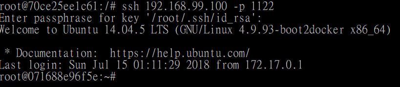

# SSH Service
---

## Create a container with SSH Service

### Update apt-get and install openssh-server

```
$ docker run -it --name ubuntuSSH ubuntu:14.04 /bin/bash
root@xxx:/# apt-get update
root@xxx:/# apt-get -y install openssh-server
root@xxx:/# apt-get -y install vim 
```

|        Parameter        | in short | Value | Description |
|:------------------------|:--------:|:-----:|:------------|
| --yes, --assume-yes | -y | | Automatic yes to prompts; assume "yes" as answer to all prompts and run non-interactively.<br /> If an undesirable situation, such as changing a held package, trying to install a unauthenticated package or removing an essential package occurs then apt-get will abort.<br /> Configuration Item: APT::Get::Assume-Yes. |


### Create directory /var/run/sshd and start SSH service

```
root@xxx:/# mkdir -p /var/run/sshd
root@xxx:/# /usr/sbin/sshd -D &
```

* Reference picture

  


See which port is listening, the default port for SSH is 22.

```
root@xxx:/# netstat -tunlp
```

|        Parameter        | in short | Value | Description |
|:------------------------|:--------:|:-----:|:------------|
| n | | | network |
| l | | | listening ports |
| p | | | process |
| t | | | tcp |
| u | | | udp |


* Reference picture

  


### Cancel PAM's login contraints

```
root@xxx:/# sed -ri 's/session required pam_loginuid.so/#session required pam_loginuid.so/g' /etc/pam.d/sshd
```

### SSH key

Create .ssh for root user and copy a RSA public key of local in order to login to `root/.ssh/authorized_keys`, see [How to generate a key](#how-to-generate-rsa-key).

```
root@xxx:/# mkdir root/.ssh
root@xxx:/# vim root/.ssh/authorized_keys
```


### Create a run.sh as a automatic-started service.

```
root@xxx:/# vim /run.sh
```

Which contains the following content.

> Press `i` to enter edit mode.
>
> Press `ESC` after edit, and `:wq` to save and quit (Or `q!` not to save and quit).


* run.sh

  ```
  #!/bin/bash
  /usr/sbin/sshd -D
  ```


And then set the permission as following.

```
root@xxx:/# chmod +x run.sh
```


## Commit as an image

> Command: <br />
> `$ docker commit <Container name/id> <Repository[:tag]>` 

```
$ docker commit ubuntuSSH ubuntu-sshd:0.01
```

* Result

  


## Use the image to create a container

```
$ docker run -d --restart=always -p 1122:22 --name my-sshd-ubuntu ubuntu-sshd:0.01 /run.sh 
```

> Use `echo $(docker-machine ip default)` to get the default IP.


## Connect to the remote server


In the local server, use the following command to connect it,

```
$ ssh 192.168.99.200 -p 1122 
```

* Reference picture

  


---

## Using Dockerfile to create the image with SSH service.

### Create working directory/files

```
$ mkdir sshd_ubuntu
$ cd sshd_ubuntu
$ touch Dockerfile run.sh authorized_keys
$ ls
```

Now lets write the content of `run.sh` and `authorized_keys`.


* run.sh

  ```
  #!/bin/bash
  /usr/sbin/sshd -D
  ```

* authorized_keys

  1. Create SSH keys on local by
     
     ```
     $ ssh-keygen -t rsa
     ```

  2. Copy the key from `~/.ssh/id_rsa.pub` to `authorized_keys`


### Dockerfile

Update the `Dockerfile` as following,
  
```
FROM ubuntu:14.04

MAINTAINER <docker_user> (docker_user@xxx.com)

# Start RUN commands

RUN apt-get update

# Install SSH
RUN apt-get install -y openssh-server
RUN mkdir -p /var/run/sshd
RUN mkdir -p /root/.ssh

# Cancel PAM constraints
RUN sed -ri 's/session required pam_loginuid.so/#session required pam_loginuid.so/g' /etc/pam.d/sshd  


# Copy files and set permission

ADD authorized_keys /root/.ssh/authorized_keys
ADD run.sh /run.sh
RUN chmod 755 /run.sh

# Default port is 22
EXPOSE 22

# Commands for starting the container
CMD ["/run.sh"]

```

### Create Image

Make sure you are currently in the root folder of `Dockerfile`, and use `docker build` to create the image. 

```
$ docker build -t <image name>:<tag> -f <path for dockerfile>
```

For example,

```
$ docker build -t ubuntu-sshd:0.02 .
```


Build successfully!


### Create a container by the image

```
$ docker run -d -p 1022:22 ubuntu-sshd:0.02
```

### Test the SSH service

```
$ ssh 192.168.99.200 -p 1122
```


# Reference

## How to generate RSA key

Generate a RSA public key in local to login to container.

```
$ ssh-keygen -t rsa
```

which will default generate a key to `/root/.ssh/id_rsa.pub`.

* Reference picture

  


* id_rsa.pub

  


> You can pass the key to remote server with [ssh-copy-id](https://www.ssh.com/ssh/copy-id) by the following command,
> ```
> $ ssh-copy-id -i /root/.ssh/id_rsa.pub <host name/ip>
> ```

