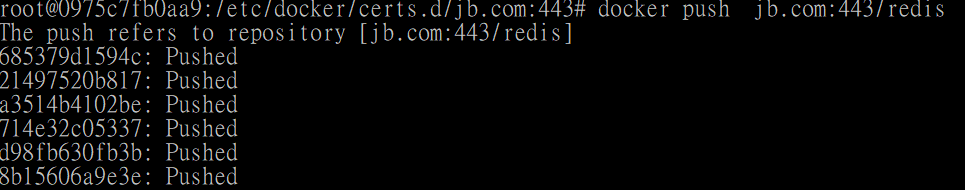
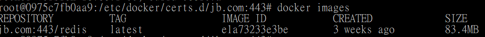
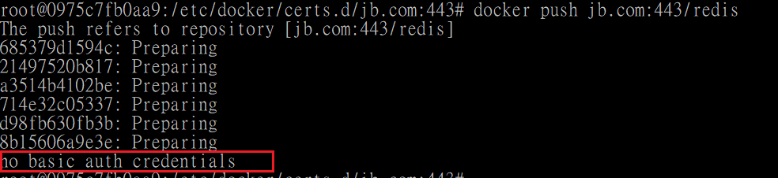
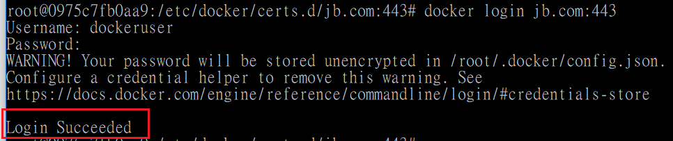
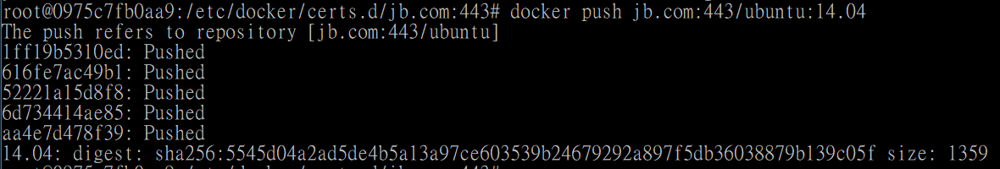
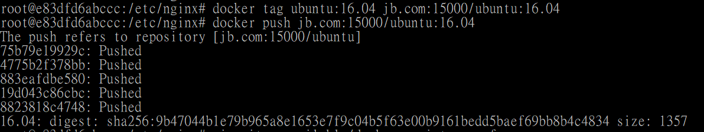

# Private Docker Registry
---

> The Registry is a stateless, highly scalable server side application that stores and lets you distribute Docker images. (See reference: [Docker Registry](https://docs.docker.com/registry/))

We are going to use the official Docker image: [registry](https://hub.docker.com/_/registry/) to create our private Docker Registry. 


## Install Docker Registry

The docker image can be found on [Docker Hub](https://hub.docker.com/_/registry/)

```
$ docker run -d -p 5000:5000 --restart=always --name <container name> registry[:<tag>]
```

For example, to put the private images in local directory:

```
docker run -d -p 5000:5000 \
              --restart=always \
              --name my-registry \
              -v /opt/data/registry:/var/lib/registry \
              registry
```


However the Registry is insecure with no HTTPS support, we will use self-signed certificates to secure the private Registry at next step.

For more information about how to pull/push images from/to an insecure Registry, see [03. Local registry]().


## Architecture for this tutorial

We will create 2 containers:
1. Private Registry
2. Docker on client side (=Docker in docker)

> You can skip 2. if you want to use the Docker on host.


## Modify hosts file

In this example, we will use `jb.com` as the domain name.
First add the host name and IP mapping to `hosts` file.

> `hosts` file location:
> - Linux: `/etc/hosts`
> - Windows: `C:\Windows\System32\drivers\etc\hosts`

For example,

```
192.168.99.123  jb.com 
```

## Make self-signed certificates

On local host server,

```
$ mkdir -p registry/certs
$ cd registry
$ openssl req -newkey rsa:4096 -nodes -sha256 -keyout certs/<domain>.key -x509 -days 365 -out certs/<domain>.crt
```


For example, the following command will create `jb.crt` and `jb.key`, 
```
$ openssl req -newkey rsa:4096 -nodes -sha256 -keyout certs/jb.key -x509 -days 365 -out certs/jb.crt
```

**Be sure to use the name `jb.com`(or you domain name) as a [CN(Common name)](https://support.dnsimple.com/articles/what-is-common-name/).**


## Create container: Private Registry

```
$ docker run -d -p 443:443 \
              --restart=always \
              --name my-registry \
              -v /registry:/var/lib/registry \
              -e REGISTRY_HTTP_ADDR=0.0.0.0:443 \
              -e REGISTRY_HTTP_TLS_CERTIFICATE=/var/lib/registry/certs/<domain>.crt \
              -e REGISTRY_HTTP_TLS_KEY=/var/lib/registry/certs/<domain>.key \
              registry
```


## Create container: Docker on docker

We will make a Dockerfile for installing Docker on Ubuntu:16.04 and copy the certificates to the container.

```
$ touch dockerfile
```


Current working directries is as following,
```
-registry
 |-certs
   |-jb.crt
   |-jb.key
 |-Dockerfile  
```


- Dockerfile
```
FROM ubuntu:16.04

RUN apt-get update
RUN apt-get -y install \
    apt-transport-https \
    ca-certificates \
    curl \
    software-properties-common
RUN curl -fsSL https://download.docker.com/linux/ubuntu/gpg | apt-key add -
RUN apt-key fingerprint 0EBFCD88
RUN add-apt-repository \
   "deb [arch=amd64] https://download.docker.com/linux/ubuntu \
   $(lsb_release -cs) \
   stable"
RUN apt-get update
RUN apt-get -y install docker-ce

RUN mkdir -p /etc/docker/certs.d/jb.com:443/

COPY /certs/jb.crt /etc/docker/certs.d/jb.com:443/
WORKDIR /etc/docker/certs.d/jb.com:443/
```

> Notice:
> - Update `jb.com` to your domain name
> - You can also install [iputils-ping](), [telnet]() to test the connection in a quick way


Build the image for the Dockerfile,

```
$ docker build -t docker-client .
```


Create the Docker-on-docker container as a [privileged container](https://stackoverflow.com/a/41742508/7045253), 

```
$ docker run -it --privileged --name my-docker-client docker-client /bin/bash
# docker --version
Docker version 18.06.1-ce. build e68fc7a
```

Don't forget to modify `hosts` file in the container for your host name and IP mapping! Or simply add the mapping when start the container:

```
$ docker exec my-docker-client /bin/sh -c "echo '192.168.99.123 jb.com' >> /etc/hosts"
```


You can also ping or telnet the connection of Private Registry server by 

```
# vim /etc/hosts
# ping jb.com
64 bytes from jb.com(192.168.99.123):  icmp_seq=1 ttl=64 time=0.148 ms

# telnet jb.com 443
Trying 192.168.99.100...
Connected to jb.com.
Escape character is '^]'.

```


### Pull/Push images

Now we can test pulling/pushing from/to the secure Private Registry as following,

```
# docker tag redis:latest jb.com:443/redis
# docker push jb.com:443/redis
```


And the image is shown in local host's mapping data volume direcory: `/registry/docker/registry/v2/repositories`


```
# docker images jb.com:443/redis
```



```
# docker pull jb.com:443/redis
```


## Add Native basic auth

Now we are going to add [Native basic auth]() on the Private Registry to enable access restriction by username/password.


### Create password file 

In local host server, create a password file like this,

```
$ docker run \
         --entrypoint htpasswd \
        registry[:<tag>] -Bbn <username> <password> > auth/htpasswd	

```

For example, create a password file for the user `dockeruser`, with password `dockerpwd`:
```
$ mkdir auth
$ docker run \
         --entrypoint htpasswd \
         registry:2 -Bbn dockeruser dockerpwd > auth/htpasswd	

```

Current working directries is as following,

```
-registry
 |-auth
   |-htpasswd
 |-certs
   |-jb.crt
   |-jb.key  
 |-Dockerfile  
```

### Create container: Private Registry with basic auth

```
$ docker run -d -p 443:443 \
              --restart=always \
              --name my-registry \
              -v /registry:/var/lib/registry \
			  -e "REGISTRY_AUTH=htpasswd" \
              -e "REGISTRY_AUTH_HTPASSWD_REALM=Registry Realm" \
              -e REGISTRY_AUTH_HTPASSWD_PATH=/var/lib/registry/auth/htpasswd \
              -e REGISTRY_HTTP_ADDR=0.0.0.0:443 \
              -e REGISTRY_HTTP_TLS_CERTIFICATE=/var/lib/registry/certs/jb.crt \
              -e REGISTRY_HTTP_TLS_KEY=/var/lib/registry/certs/jb.key \
              registry
```

### Login to the Private Registry

Now run the other container: `my-docker-client` (Docker on docker) to push the image and you will get a fail message: `no basic auth credentials`! 

```
$ docker exec -it my-docker-client /bin/bash
# docker push jb.com:443/redis
```


> Notice that if you get a error which shows `The docker daemon is not running`, start the docker by `service docker start`.


Use [docker login](https://docs.docker.com/engine/reference/commandline/login/) to login to the Private Registry with the username:`dockeruser` and password:`dockerpwd`,

```
$ docker login <registry hostname>:<port>
```

For example,
```
docker login jb.com:443
```



### Push/Pull images

```
$ docker tag ubuntu:14.04 jb.com:443/ubuntu:14.04
$ docker push jb.com:443/ubuntu:14.04 
```




```
$ docker pull jb.com:443/ubuntu:14.04 
```


## Nginx proxy

We will install Nginx to create the proxy from external port to internal port in host server, such as port 15000(external) => 443(internal).

### Install Nginx

```
$ apt-get -y install nginx
```


### Configuration

In `/etc/nginx/sites-available/`, add new website config: `docker-registry.conf`

```
$ cd /etc/nginx/sites-available/
$ touch docker-registry.conf
```

- docker-registry.conf

> Reference: [convox/registry/nginx.conf](https://github.com/convox/registry/blob/master/nginx.conf)


```
# Internal docker registry port
upstream docker-registry {
  server jb.com:443;
}

# Proxy server listens on port 15000
server {
  listen 15000;
  server_name jb.com;
  add_header 'Docker-Distribution-Api-Version' 'registry/2.0' always;
  error_log /var/log/nginx/nginx.vhost.error.log;

  # SSL on
  ssl on;
  ssl_certificate /etc/docker/certs.d/jb.com:443/jb.crt;
  ssl_certificate_key /etc/docker/certs.d/jb.com:443/jb.key;

  proxy_set_header    Host                $http_host;    # required for docker client's sake
  proxy_set_header    X-Real-IP           $remote_addr;  # pass on real client's IP
  proxy_set_header    X-Forwarded-For     $proxy_add_x_forwarded_for;
  proxy_set_header    X-Forwarded-Proto   $scheme;
  proxy_read_timeout                      700;

  # Disable size limit and avoid HTTP 413 for large image uploading
  client_max_body_size 0;

  # Required to avoid HTTP 411 on issue 1486 (https://github.com/docker/docker/issues/1486)
  # chunked_transfer_encoding on;

  location /v2/ {
    # Pass the request
    proxy_pass https://docker-registry;
  }
}
```

Now create symlink and reload configuration and restart Nginx

```
$ ln -s /etc/nginx/sites-available/docker-registry.conf  /etc/nginx/sites-enabled/docker-registry.conf
$ service nginx restart 
```


#### Update Dockerfile (Optional)

We can update the previous Dockerfile as following to make a Docker Client with Nginx:

- Dockerfile
```
FROM ubuntu:16.04

RUN apt-get update
RUN apt-get -y install \
    apt-transport-https \
    ca-certificates \
    curl \
    software-properties-common
RUN curl -fsSL https://download.docker.com/linux/ubuntu/gpg | apt-key add -
RUN apt-key fingerprint 0EBFCD88
RUN add-apt-repository \
   "deb [arch=amd64] https://download.docker.com/linux/ubuntu \
   $(lsb_release -cs) \
   stable"
RUN apt-get update
RUN apt-get -y install docker-ce
RUN apt-get update
RUN apt-get -y install nginx
RUN mkdir -p /etc/docker/certs.d/jb.com:443/ \
    mkdir -p /etc/docker/certs.d/jb.com:443/keys/

COPY /certs/jb.crt /etc/docker/certs.d/jb.com:443/
COPY /certs/jb.key /etc/docker/certs.d/jb.com:443/keys/
COPY /nginx/docker-registry.conf /etc/nginx/sites-available/

RUN ln -s /etc/nginx/sites-available/docker-registry.conf  /etc/nginx/sites-enabled/docker-registry.conf

WORKDIR /etc/docker/certs.d/jb.com:443/
```


### Push/Pull images

Now we can use jb.com:15000 to push/pull images from the Private Registry.

```
$ docker login jb.com:15000
$ docker push jb.com:15000/ubuntu:16.04
```





### User authentication

Modify the `location` settings in  `/etc/nginx/sites-available/docker-registry.conf` 

- docker-registry.conf

```
# ....


location / {
  # Set auth_basic file
  auth_basic "Enter Username/Password";
  auth_basic_user_file docker-registry-htpasswd;

  proxy_pass http://docker-registrys;
}
```

Notice that the `docker-registry-htpasswd` file shall be put under `/etc/nginx/`.


- docker-registry-htpasswd

The content's format is as following,

```
<username1>:<password1>
<username2>:<password2>
```


Notice that the password must be encrypted by `crypt`.
We can encrypt the password by `htpasswd` toolk,

```
$ aptitude install apache2-utils -y
```

and set the username/password like this,

```
$ hypasswd -c /etc/nginx/docker-registry-htpasswd <username> 
New password: *******
Re-type password: ********
Adding password for <username>
```

> Ignore `-c` parameter when the file exists


Restart Nginx

```
$ service nginx restart
```


Now we can test it thru browser, open `hyyps://jb.com:15000/v2/`, it will shows dialog to enter the username and password.
However, test it with curl:
```
$ curl <username>:<password>@jb.com:433/v2/
```


### Compose file

```
registry:
  restart: always
  image: registry:2.6.2
  ports:
    - 443:443
  environment:
    REGISTRY_HTTP_ADDR=0.0.0.0:443
    REGISTRY_HTTP_TLS_CERTIFICATE=/var/lib/registry/certs/jb.crt
    REGISTRY_HTTP_TLS_KEY=/var/lib/registry/certs/jb.key
    REGISTRY_AUTH_HTPASSWD_PATH=/auth/docker-registry-htpasswd
    REGISTRY_AUTH_HTPASSWD_REALM=basic
  volumes:
    - /registry:/var/lib/registry
    - /registry/certs:/var/lib/registry/certs
    - /registry/auth:/var/lib/registry/auth                

```

 


## Reference

- [docker.github.io](https://github.com/docker/docker.github.io/blob/master/registry/deploying.md)
- [Running your own Docker Registry](https://www.admintome.com/blog/running-your-own-docker-registry/)
- [How To Create a Self-Signed SSL Certificate for Nginx in Ubuntu 18.04](https://www.digitalocean.com/community/tutorials/how-to-create-a-self-signed-ssl-certificate-for-nginx-in-ubuntu-18-04)
- [How to check if port is in use on Linux or Unix](https://www.cyberciti.biz/faq/unix-linux-check-if-port-is-in-use-command/)