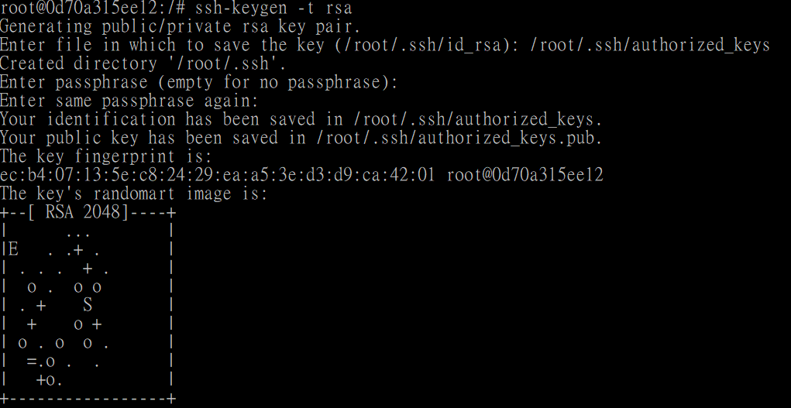
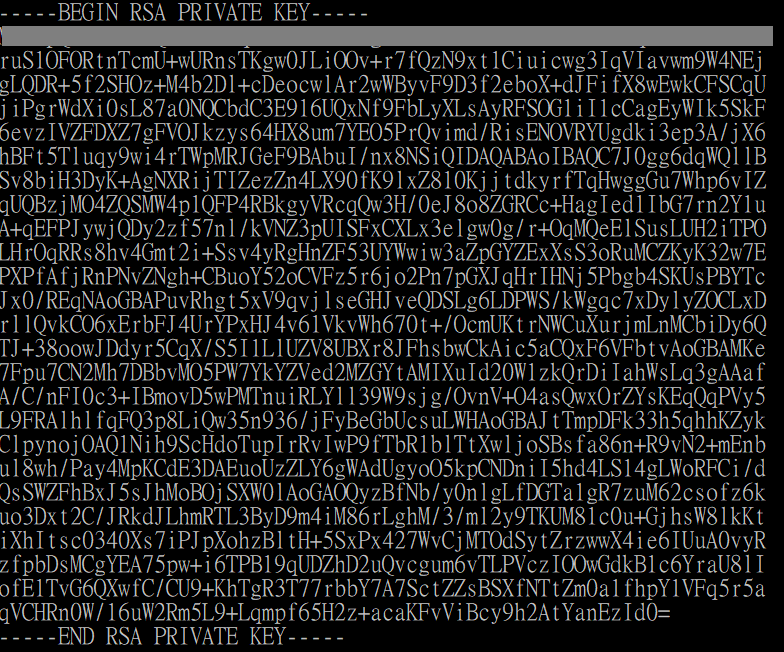
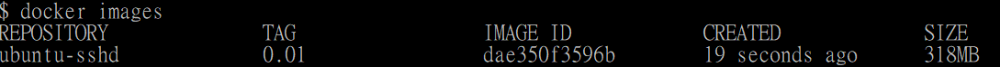

# SSH Service

## Create SSH Service

```
$ docker run -it --name ubuntuSSH ubuntu:14.04 /bin/bash
root@xxx:/# apt-get update
root@xxx:/# apt-get -y install openssh-server
root@xxx:/# apt-get -y install vim 
```

|        Parameter        | in short | Value | Description |
|:------------------------|:--------:|:-----:|:------------|
| --yes, --assume-yes | -y | | Automatic yes to prompts; assume "yes" as answer to all prompts and run non-interactively.<br /> If an undesirable situation, such as changing a held package, trying to install a unauthenticated package or removing an essential package occurs then apt-get will abort.<br /> Configuration Item: APT::Get::Assume-Yes. |


Create directory /var/run/sshd and start SSH service

```
root@xxx:/# mkdir -p /var/run/sshd
root@xxx:/# /usr/sbin/sshd -D &
```


See which port is listening, the default port for SSH is 22.

```
root@xxx:/# netstat -tunlp
```

|        Parameter        | in short | Value | Description |
|:------------------------|:--------:|:-----:|:------------|
| n | | | network |
| l | | | listening ports |
| p | | | process |
| t | | | tcp |
| u | | | udp |


Cancel PAM's login contraints

```
root@xxx:/# sed -ri 's/session required pam_loginuid.so/#session required pam_loginuid.so/g' /etc/pam.d/sshd
```


Create .ssh for root user and generate a RSA public key for login to `root/.ssh/authorized_keys` 

```
root@xxx:/# mkdir root/.ssh
root@xxx:/# ssh-keygen -t rsa
```




You can copy the key from `.ssh/id_rsa.pub` to it as well.

```
root@xxx:/# vim root/.ssh/authorized_keys
```




Create a run.sh as a automatic-started service.

```
root@xxx:/# vim /run.sh
```

Which contains the following content.

> Press `i` to enter edit mode.
>
> Press `ESC` after edit, and `:wq` to save and quit (Or `q!` not to save and quit).


* run.sh
  ```
  #!/bin/bash
  /usr/sbin/sshd -D
  ```


And then set the permission as following.

```
root@xxx:/# chmod +x run.sh
```


## Commit to a image

> Command: <br />
> `$ docker commit <Container name/id> <Repository[:tag]>` 

```
$ docker commit ubuntuSSH ubuntu-sshd:0.01
```




## How to use the image

```
$ docker run -d -p 9922:22 --name my-sshd-ubuntu ubuntu-sshd:0.01 
```


