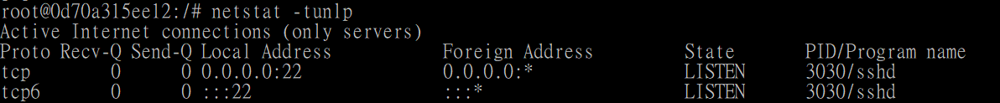

# SSH Service


```
$ docker run -it --name ubuntuSSH ubuntu:14.04 /bin/bash
root@xxx:/# apt-get update & apt-get -y install openssh-server
```

|        Parameter        | in short | Value | Description |
|:------------------------|:--------:|:-----:|:------------|
| --yes, --assume-yes | -y | | Automatic yes to prompts; assume "yes" as answer to all prompts and run non-interactively.<br /> If an undesirable situation, such as changing a held package, trying to install a unauthenticated package or removing an essential package occurs then apt-get will abort.<br /> Configuration Item: APT::Get::Assume-Yes. |


Create directory /var/run/sshd and start SSH service

```
root@xxx:/# mkdir -p /var/run/sshd
root@xxx:/# /usr/sbin/sshd -D &
```


See which port is listening,

```
root@xxx:/# netstat -tunlp
```

|        Parameter        | in short | Value | Description |
|:------------------------|:--------:|:-----:|:------------|
| n | | | network |
| l | | | listening ports |
| p | | | process |
| t | | | tcp |
| u | | | udp |





Cancel PAM's login contraints

```
root@xxx:/# sed -ri 's/session required pam_loginuid.so/#session required pam_loginuid.so/g' /etc/pam.d/sshd
```


Create .ssh for root user

```
root@xxx:/# mkdir root/.ssh
root@xxx:/# vi root/.ssh/authorized_keys
```


```
root@xxx:/# vi /run.sh
root@xxx:/# chmod +x run.sh
```

