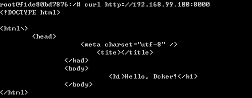

# Web Server

We are going to create a container as a [Apache](https://httpd.apache.org/) web server.  

## Create Dockerfile

```
$ mkdir -p web-server/public-html
$ cd web-server
$ touch Dockerfile public-html/index.html
```

* Dockerfile

  ```
  FROM httpd:2.4
  COPY ./public-html/ /usr/local/apache2/htdocs/
  ```

* index.html

  ```
  <!DOCTYPE html>
  <html\>
    <head>
        <meta charset="utf-8" />
        <title></title>
    </head>
    <body>
        <h1>Hello, Docker!</h1>
    </body> 
  </html>
  ```

## Build Dockerfile

```
$ docker build -t apache2-webserver:0.01 .
```

## Run the container

```
$ docker run -dit --name my-apache -p 8000:80 apache2-webserver:0.01
```

Now connect to `http://$(docker-machine ip default):8000`

```
$ curl http://192.168.99.200:8080
```

which will get the following result,

