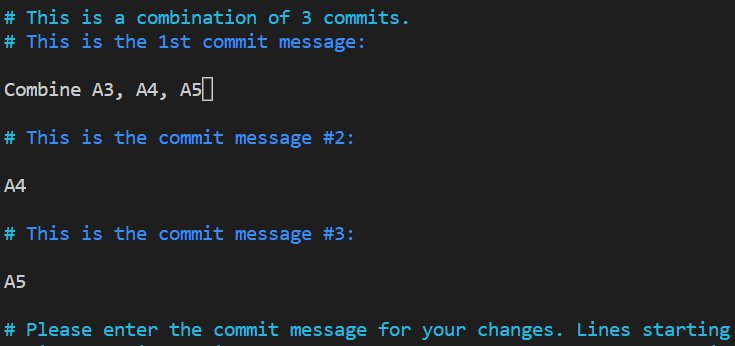

**Squash** is one of the following options in Git Rebase interactive mode.

| Option | Description|
|:------:|:-----------|
| pick | Use commit | 
| reword | Use commit, but edit the commit message while rebasing (Can only change commit's message) |
| edit | Use commit, but stop for amending while rebasing. (Can change both commit's content and message) |
| squash | Use commit, but meld into previous commit. The previous commit's message can be changed |
| fixup | like "squash", but discard this commit's message and use the previous commit's message |
| exec | run command (the rest of the line) using shell |
| drop | Remove commit |

We will focus on **Squash** here.

## Start Rebase interactive mode

```
$ git rebase --interactive|-i <the_oldest_excluded_commit>
```

For example, we have five commits,
A1->A2->A3->A4->A5(HEAD) 


and we are going to rewrite the history from A2 to HEAD (4 commits):

```
$ git rebase -i HEAD~4
```

or 

```
$ git rebase -i A1
```


Which will shows the commits from oldest to latest:

```
pick 5bfe791 A2
pick 9b0669d A3
pick 65673a2 A4
pick 5ee03e9 A5

# Rebase a345d33..5ee03e9 onto a345d33 (4 commands)
# ...
```

If we would like to **squash A5, A4 and A3 into one commit**, update the script as:

```
pick 5bfe791 A2
pick 9b0669d A3
squash 65673a2 A4
squash 5ee03e9 A5
```

That means we will merge the commits, A4 and A5 into A3.
Save the script, and then edit the new message for A3,




And the result for Rebase Squash is as following,


# Reference

[Git: Rewriting history](https://git-scm.com/book/zh-tw/v2/Git-Tools-Rewriting-History).

