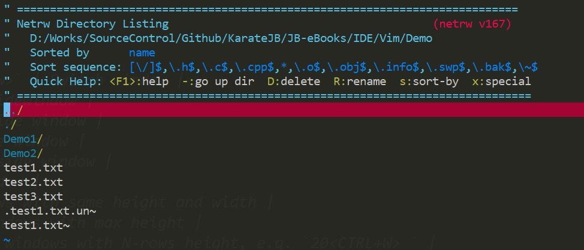
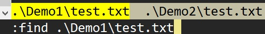

# Working Directory

## Document browser - netrw

```s
$ vim .
```

Now we can use `j`, `k` to move the cursor, `-` will go to up direcory.




We can open netrw in vim in these ways:

- `:e[dit] .`
- `E[xplore]


> netrw can read/write remote file, see `:h netrw-ref`.


## Set working directory

- `:pwd` Show working directory.
- `:cd %:p:h` Change the working directory to current file (for all windows).
  - `:cd %:p:h/..` Change the working directory to "/..".
- `:lcd %:p:h` Change the working directory to current file (for active window).

> `%`: The full path of current file.
> `:h`: Prune the file name. So `%:h` indicates the full path of current directory.

To automatically change current directory:

```s
set autochdir
```

> Reference: [Set working directory to the current file](https://vim.fandom.com/wiki/Set_working_directory_to_the_current_file)


After setting the working directory, we can open file by relative path.

For example, my files structure is as following,

```
├── Demo                    
|  ├── Demo1                
|  |  └── test.txt         
|  ├── Demo2                
|  |  └── test.txt          
|  ├── test1.txt            
|  ├── test2.txt            
|  └── test3.txt            
```

To open `/Demo/test1.txt` from working directory: `/Demo/Demo1`,

```s
:pwd
/Demo/Demo1
:e ../test3.txt
```

Or

```s
:e %:h<tab>
:e Demo/Demo1
:e Demo/Demo1/../test1.txt # or :e Demo/test1.txt
```

## Find

We can `:find` to open a file without to know the full path of any file.
However we must add the paths to find.

```s
:pwd
/Demo
:set path+=Demo1/**
:set path+=Demo2/**
:find test
```

Press `tab` after the last command, and we will see:




## Save a new file to non-exist directory

For example, I open a new buffer with path: `New\test.txt`, that the directory is not exist.

```
:e New\test.txt
:w
"New\test.txt" E212: Can't open file for writing
```

We can use `mkdir` command in vim to solve the problem,

```
:!mkdir -p %:h
:w
```


## Save a file without right permission

For example, we would like to edit `/etc/hosts`,

```s
$ ls -al /etc/ | grep hosts
-rw-r--r-- 1 root     root       174 Apr 29 03:47 hosts

$ su jb
$ whoami
jb
$ vim /etc/hosts
```

We will get the error when we want to save it.

```
:w
E45: 'readonly' option is set (add ! to override)
:w!
E212: Can't open file for writing
```

We have to use `root`'s permission to save the file:

```
:w !sudo tee % > /dev/null
[sudo] password for jb:
xxxxxxxx

W12: Warning: File "hosts" has changed and the buffer was changed in Vim as well.
[O]k, (L)oad File: L
```

> The file will be modified by the outside program, so vim will ask us to reload it or not.


## Go to file

- `gf` Goto file, often used with `:set suffixesadd+={file extension}`, see `:h gf` for more details.

