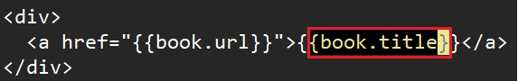
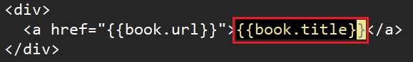

# Motion

> For more details: `:h motion.txt`


## (i)nside and (a)round

The following samples are started with the below text that the cursor is at the `.`of `book.title`.

```html
<div>
  <a href="{{book.url}}">{{book.title}}</a>
</div>
```

- `vi{`

  

- `v2i{` or `va{`

  

- `vit`

  

- `v2it`

  


### Selection mapping

| Select for | Keys (around) | Keys (inside) |
|:-----------|:-------------:|:-------------:|
| (...) parentheses      | `a)` or `ab` | `i)` or `ib` |
| {...} braces           | `a}` or `aB` | `i}` or `iB` |
| [...] brackets         | `a]`         | `i]` |
| <...> angle brackets   | `a>`         | `i>` |
| '...' single quotes    | `a'`         | `i'` |
| "..." double quotest   | `a"`         | `i"` |
| `...` backticks        | `a``         | `i`` |
| <xxx>...</xxx> XML tag | `at`         | `it` |
| Sentence(句子)         | `as`         | `is` |
| Paragraphs(段落)       | `as`         | `is` |
| Jump to the matched item (`([{}])`) after or under the cursor in this line | `%` |
