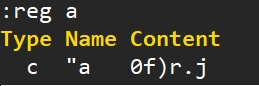
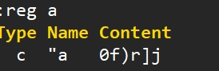
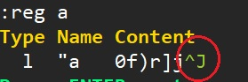
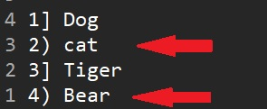

# Recording keys for repeated jobs

## Recording

- `q{register:[0-9a-zA-Z]}`/`q` start/stop recording to a register. When using uppercase register, it will be append-mode.
- `:reg {register}` Show the keys recorded.
- `@{register}` Excute the contents recored in register.
- `@@` Repeat the previous @.


For example, if we want turn

```js
name = 'JB'
from = 'Tainan'
gender = 'Male'
tel = '09123XXXX'
```

into 

```js
var name = 'JB';
var from = 'Tainan';
var gender = 'Male';
var tel = '09123XXX';
```

First move to the first line and follow the steps.


### Method 1. Execute the @ in each line

| Input keys | Note |
|:-----------|:-----|
| `qa` | Start recording to register `a`. |
| `Ivar<CTRL-o>A;<ESC>` | This will make the first line, `name = 'JB'`, to `var name = 'JB';` |
| `q` | Stop recording. |
| `j` | Go to line 2. |
| `@a` | Repeat the content recorded in register `a` on line 2. |
| `j` | Go to line 3. |
| `@@` | Repeat the previous @ on line 3. |
| `j@@` | Repeat the previous @ on line 4. |


### Method 2. Execute the @ several times

We can reuse the recording by `{times}@{register}`:

| Input keys | Note |
|:-----------|:-----|
| `qa` | Start recording to register `a`. |
| `Ivar<CTRL-o>A;<ESC>j` | This will make the first line, `name = 'JB'`, to `var name = 'JB';`, and then move to next line. |
| `q` | Stop recording. |
| `3@a` | Execute `@` 3 times on line 2 to 4. |


### Method 3. Execute the @ in command mode

| Input keys | Note |
|:-----------|:-----|
| `qa` | Start recording to register `a`. |
| `Ivar<CTRL-o>A;<ESC>` | This will make the first line, `name = 'JB'`, to `var name = 'JB';` |
| `jv2j` | Select the other 3 lines. |
| `:'<,'>normal @a` | Execute the `@` on selected lines. |


## Advanced Repeat

### Use . in @

For example, we want to turn

```js
var crews = ['JB']
var animals = ['Dog','Cat','Tiger','Bear'];
```

into

```js
var crews = ["JB"]
var animals = ["Dog","Cat","Tiger","Bear"];
```

| Input keys | Note |
|:-----------|:-----|
| `0f'r"` | Replace the first `'` to `"` on line 1. |
| `qa` | Start recording to register `a`. |
| `f'.` | Replace the second `'` to `"` by repeat last change (`.`). |
| `q` | Stop recording. |
| `j` | Move to line 2. |
| `22@a` | Execute `@` for 22 times. Although there are not so many `'` to be replaced, the `@` will stops when it cannot do more `f'`. |


### Skip the non-working part for @

When the keys executed in a @ fails, it will stop.

This is a case that we want to turn

```
1) Dog
2) cat
3. Tiger
4) Bear
```

into

```js
1. Dog
2. Cat
3. Tiger
4. Bear
```

If we use the following steps, the @ will stop on line 3 cause it cannot find `)` in that line. So line 4 will not be update as we expected.

| Input keys | Note |
|:-----------|:-----|
| `qa` | Go to line 1 and start recording to register `a`. |
| `0f)r.j` | Find `)` and replace it with `.`, then go to next line. |
| `q` | Stop recording. |
| `22@a` | Repeat @ 22 times. |


In this case, if we would like to ignore the bail on line 3. We have to use @ in this way.

| Input keys | Note |
|:-----------|:-----|
| `qa` | Go to line 1 and start recording to register `a`. |
| `0f)r.` | Find `)` and replace it with `.`. |
| `jv2j` | Select the other 3 lines. |
| `:'<,'>normal @a` | Repeat the @ on the other lines. This will result in skipping line 3 and others are updated as expected. |


### Use variable to increasing number in @

We would like to turn 

```
Dog
Cat
Rabbit
Hippo
```

to

```
1) Dog
2) Cat
3) Rabbit
4) Hippo
```


| Input keys | Note |
|:-----------|:-----|
| `let i=1` | Declare a variable `i` and initialize it with 1. |
| `qa` | Start recording to register `a`. |
| `I<CTRL-r>=i<ENTER>) <ESC>` | Insert the value of variable `i`. |
| `:let i += 1<ENTER>` | Increase the value of `i` by 1. |
| `q` | Stop recording. |
| `jv2j` | Select the other lines. |
| `'<,'>normal @a` | Apply @ to the selected lines. |


## Append new keys to register

For example, use `qA` to append new key(s) to register `a`.

| Input keys | Note |
|:-----------|:-----|
| `qa` | Start recording. |
| `f)r.` | Replace `)` with `.`. |
| `q` | Stop recording. |


However, if we would like to make the repeated keys from `f)r.` to `f)r.j`...


| Input keys | Note |
|:-----------|:-----|
| `qA` | Start recording in append-mode. |
| `j` | Append key `j` to `a`. |
| `q` | Stop recording. |

Lets see the keys in register `a` now

```
:reg a
```




## Edit Keys in Register

Paste and copy back the content in a register in order to add/edit keys in a register for more complex scenario.
Followed by the previous example, we have register `a` with keys: `0f)r.j`, and we want to update it to `0f)r]j`.

### 1. Paster the content to document

```
:put a
```

or

```
"ap
```

Now edit the keys to `0f)r]j` and save it to register `a` by 

```
0"ay$
```

Which will result in,




DO NOT use `"add` cus it will also save the "new line" symbols to register and result in unexpected result.






