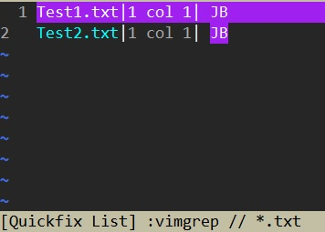

# Substitute

## Command

```
:[range]s/{pattern}/{string}/[flags]
```

Here are some useful flags, see `:h s_flags` for more details.

| Flag | Description |
|:----:|:------------|
| `c` | Confirm each substitute. When doing substitute, type <br />`y`: yes<br />`n`: no<br />`l`:substitute current one then quit<br />`a`:substitute current and remaining matches<br />`q`:quit |
| `g` | Replace all matched texts in the line, not just the first one. |
| `i` | Force ignoring case for the pattern. The "ignorecase" and "smartcase" options will be skipped. |
| `I` | Force case-sensitive for the pattern. The "ignorecase" and "smartcase" options will be skipped. |
| `e` | Do not issue an error message when the search pattern fails. |
| `&` | Keep the flags from the previous substitute. Must be put before other flag. |


## Special chars(symbols) in substitute

See more details by `:h sub-replace-special`.
Here are some common ones.

| Special symbols | Description |
|:---------------:|:------------|
| `\r`(*nix)/`\n`(windows) | "new-line" symbol. |
| `\t` | "Tab" |
| `\\` | "\" |
| `\0` | Replaced with the whole matched pattern. |
| `\1` | Replaced with the matched pattern in the first pair of (). |
| `\2` | Replaced with the matched pattern in the second pair of (). Same usage from `\3` to `\9`. |
| `&`  | Replaced with the whole matched pattern. |
| `~`  | Replaced with the {string} of the previous substitute. |
| `\={Vim script} | Replaced the {string} by the result of Vim script. |


## Basic samples


We have a document like this,

```
AAA, AAA.
AAA, AAA.
```

### "%s" and "/g"

Assume that the cursor is on line 1.

#### Substitute the first match on current line

`:s/AAA/XXX` results in

```
XXX, AAA.
AAA, AAA.
```

#### Substitute all the matches on current line

`:s/AAA/XXX/g` results in

```
XXX, XXX.
AAA, AAA.
```

#### Substitute all matches in doc

`:%s/AAA/XXX/g` results in

```
XXX, XXX.
XXX, XXX.
```

### Substitute after search

We can do substitute by using the search pattern like this:

| Input keys | Note |
|:-----------|:-----|
| `/AAA` | |
| `:%s//XXX/g` | We can skip {pattern}. |

or

| Input keys | Note |
|:-----------|:-----|
| `/AAA` | |
| `:%s/<CTRL-r>//XXX/g` | The `<CTRL-r>/` will convert to "AAA" in the command line. |


### Use register in substitute

| Input keys | Note |
|:-----------|:-----|
| `yaw` | Yank "AAA". |
| `:%s/<CTRL-r>"/XXX/g` | The `<CTRL-r>"` will paste the yanked text to the command line. |


## Repeat substitute

### Repeat globally

- `g&` to repeat last substitute globally with same flags.
  - It equals `:%s//~/&` or `:%&&`.


### Reapeat in a new range

| Input keys | Note |
|:-----------|:-----|
| `:s/AAA/XXX/g` | Substitute "XXX" for "AAA" in a line. |
| `'<,'>&&` | Repeat the previous substitute and same flags on the selected range. |

> The first "&" means `:&` for repeating the previous substitute. <br />
> The second "&" means using the same flags as the previous substitute.


### Using (pair) in substitute

Take a example with a document like this,

```
1,2,3
11,22,33
111,222,333
```

And we would like to update it like this,

```
3,2,1
33,22,11
333,222,111
```

| Input keys | Note |
|:-----------|:-----|
| `/\v^([^,]*),([^,]*),([^,]*)$` | First search the pattern. |
| `:%s//\3,\2,\1` | |


### Using calculation in substitute

For example, we want to turn

```
(2) Dog
(3) Cat
(4) Rabbit
```

into

```
(1) Dog
(2) Cat
(3) Rabbit
```

We can use the following command:

```
:'<,'>s/\v([0-9]+)/\=submatch(0)-1/g
```

> The `\=submatch(0)-1` means the first matched value to decrease by 1.


## Substitude in multiple files

We can use "vimgrep" to catch the search results on multiple files and then do substitution on them. Lets see an example here.

### 1.Search

```
/v<JB>\C
```

### 2.vimgrep

Grep all search results from *.txt into quickfix list.

```
:vimgrep // *.txt
```

We can use `:copen` to check the quickfix list.




### 3.Enable hidden option

Enable "hidden" to ignore warning when switching buffer.

```
:set hidden
```


### 4.cfdo substitution on quickfix list

```
:cfdo %s//Jon Bon Jovi/gc
```

Notice that the flag `c` will pop a confirmtion on each matched text.


### 5.Update the files

Lets save the updated files by,

```
:cfdo update
```

> We can combine the last two commands to one: <br />
> `cfdo %s//Jon Bon Jovi/g | update`


