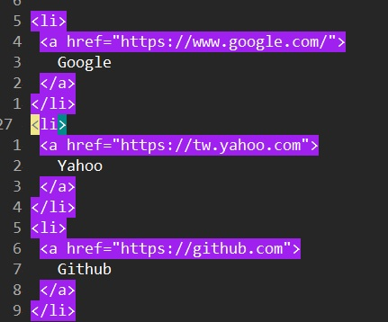
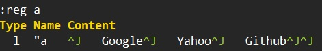

# Global

## Command

```
:[range] g[lobal][!]/{pattern}/[cmd]
```

```
:[range] g[lobal][!] /{pattern}/[range_for_cmd] [cmd]
```

| Command | Description |
|:-------:|:------------|
| range | Unlike `:delete`, `:substitute`, `:normal` work at current line (.) in default. `global` will work on the whole document in default. We can set the range to restrict its working scope. Notice we can set range at Ex command (`cmd`) as well. |
| `g[lobal][!]` | `:g` for global execution. `:g!` or `:vglobal` or `:v` for "reverse global", that means to execute the Ex command (cmd) within [range] where {pattern} does NOT match.
| {pattern} | The pattern to match. We can skip this by using the last search pattern. |
| cmd | Ex command to be executed within the range. The `print` command will be used as default if there is no Ex command specified.  |
| range_for_cmd | Select the range by each matched pattern for executing Ex command. |


## global and vglobal

Here is a sample document:

```
<li>
 <a href="https://www.google.com/">
   Google
 </a>
</li>
<li>
 <a href="https://tw.yahoo.com">
   Yahoo
 </a>
</li>
<li>
 <a href="https://github.com">
   Github
 </a>
</li>
```


### Use global to remove HTML tags

First search for HTML pattern:

```
/\v\<\/?.*\>
```



Use "global" to delete each line.

```
:g//d
```

Which results in...

```
   Google
   Yahoo
   Github
```

We can print it before deleting HTML tags:

```
:vg//
```

### Use vglobal to keep only HTML tags

Follow the previous search pattern, we can do a "reverse global" to only keey the HTML tags:

```
/\v\<\/?.*\>
:vg//d
```

Which results in...

```
<li>
 <a href="https://www.google.com/">
 </a>
</li>
<li>
 <a href="https://tw.yahoo.com">
 </a>
</li>
<li>
 <a href="https://github.com">
 </a>
</li>
```

### Use global/vglobal with range

If want to keep the last item's HTML tags, we can bypass it by specifying range:

```
:'<,'>g//\v\<\/?.*\>/d
```


### Use global/vglobal to yank/copy

#### Yank titles

```
/\v\<\/?.*\>
:v//yank A
```

Which results in...




#### Copy titles

```
:v//t$
```

Which will copy the titles to the end of current doc.


## Advanced range for Ex command

Here is a CSS file.

```css
html {
  margin: 0;
  padding: 0;
  font-size: 12px;
  vertical-align: baseline;
}
body {
  color: black;
  background: yellow;
}
```

If we wanna sort the CSS settings, we can select a range and sort them by,

```
f{
vi{
:'<,'>sort
```

So the orginal settings (take "html" part for example):

```css
html {
  margin: 0;
  padding: 0;
  font-size: 12px;
  vertical-align: baseline;
}
```

will be sorted to

```css
html {
  font-size: 12px;
  margin: 0;
  padding: 0;
  vertical-align: baseline;
}
```

Now we are going to sort all CSS settings in the file.

```
:g/{/.+1,/}/-1 sort
```

Lets take a deep look at the global command:

| Command | Description |
|:--------|:------------|
| `g` | Indicate it's a global command. |
| `/{` | The search pattern that will look for "{". |
| `/.+1,/}/-1` | The range, from `.+1` to `/}/-1`, to execute Ex command. `.+1` means the found pattern's next line, `/}/-1` means to find the next matched pattern by `/}/` and stop at its previous line. |
| ` sort` | The Ex command, that will sort the specified range: `.+1,/}/-1`. |


The final result will be,

```css
html {
  font-size: 12px;
  margin: 0;
  padding: 0;
  vertical-align: baseline;
}
body {
  background: yellow;
  color: black;
}
```

