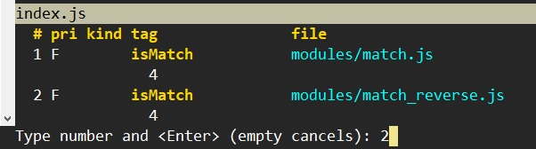

# Ctags

## Install Exuberant Ctags

### Ubuntu

```s
$ sudo apt-get install exuberant-ctags
# Or
# sudo apt-get install ctags
$ ctags --version
Exuberant Ctags 5.9~svn20110310, Copyright (C) 1996-2009 Darren Hiebert
  Addresses: <dhiebert@users.sourceforge.net>, http://ctags.sourceforge.net
```


We can install the maintained impementation of ctags: [Unerversal Ctags](https://github.com/universal-ctags/ctags).


### Windows 

We can use [chocolatey](https://community.chocolatey.org/) to install [Exuberant Ctags](https://community.chocolatey.org/packages/ctags) or [Universal Ctags](https://community.chocolatey.org/packages/universal-ctags).

We will take Universal Ctags for example,

```s
$ choco install universal-ctags
```


Set the path to environment variable:

```s
$ setx path "%PATH%; C:\ProgramData\chocolatey\lib\universal-ctags\tools" /m
$ ctags --version
Universal Ctags 5.9.0(c436bca6), Copyright (C) 2015 Universal Ctags Team
Universal Ctags is derived from Exuberant Ctags.
```


> We can use [GNU Emacs etags](https://www.emacswiki.org/emacs/EmacsTags) to generate the tag file as well. Notice that the command arguments are not the same. <br />
> Install [Emacs](https://community.chocolatey.org/packages/emacs) by <br />
> `choco install emacs`


## Use Ctags to build index of codes

### Command

```s
$ ctags [options] <source file(s)>
```

See more details about the options and usage [here](https://docs.ctags.io/en/latest/man/ctags.1.html). I listed a few of the them.


| Option | Default value | Description | Example |
|:------:|:-------------:|:------------|:--------|
| `o`, `-f` | ./tags | Specify the path and file name of the tag file. | `ctag -f tag/tags` |
| `-a[=(yes/mo)]`, `--append[=(yes/no)]` | no | This option used to append the tags to an existing tag file. | |
| `-R[=(yes/no)]`, `--recurse[=(yes/no)]` | Current directory: . | Recurse into directories encountered in the list of supplied files. | |
| `--sort=(yes/no/foldcase)` | yes | Indicates whether the tag file should be sorted on the tag name. The foldcase value specifies case insensitive (or case-folded) sorting. | |
| `-u` | | This option is Equivalent to –sort=no (i.e. “unsorted”). | |


### Build the tag file

I put a JS sample codes in "14.Ctags/sample".

```
├── index.js<br />
├── modules<br />
|  ├── match.js<br />
|  └── match_reverse.js<br />
└── package.json
```

We can build tag file for the code by the following commands,  

- `ctags index.js`: single file
- `ctags *.js`: multiple files
- `ctages -R .`: recuresivly for the directory


## Use Ctags in Vim

> See `:h 'tags'`.


To find out Vim's tag file names:

```
:set tags?
```

And the default value of tag file names is "tags=./tags,tags".
Notice that Vim will stop looking for more matchs if it finds the first match in a tag file.


Now we can use Ctags in Vim like this,

```
:cd %:p:h
:!ctags *.js modules/*.js
```

> Notice that the command will be executed in "pwd" path!


### Auto buld tag file when saving doc

We can set Vim's autocommand to create a callback on saving doc.

```
:autocmd BufWritePost * call system("ctags -R")
```


## Jump to definition

When the cursor is on a class or function, we can jump to it's definition.

- `<CTRL-]>` Jump to the definition.
- `g<CTRL-]>` Show all the matched definitions and choose one to jump to.


For example, since we have the function: "isMatch()" in both "modules/match.js" and "modules/match_reverse.js". When we want to jump to it, we can use `g<CTRL-]>` to pick the right one.



If unluckly, we find that we jump to the incorrect definition no matter by `<CTRL-]` or `g<CTRL-]`, we can fix it by,

- `:tselect`: show the match list and pick the right one.
- `:tnext`: go to next match.
- `:tpre[vious]`: go to previous match.
- `:tfirst`: go to first match.
- `:tlast`: go to last match.


However, you can always use `<CTRL-o>` to jump back.


## Ex command to jump without moving cursor on it

We can just use Ex command to find a definition by keyword.

- `:tag {keyword}`: similar to `<CTRL-]`.
- `:tjump {keyword}`: similiar to `g<CTRL-]`.


## Jump to the entry in tag stack

- `:[count]po[p][!]` jumps to [count] older entry in the tag stack. The [count] is 1 in default.
- `:[count]ta[g][!]` jumps to [count] newer entry in the tag stack. The [count] is 1 in default.
