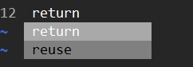
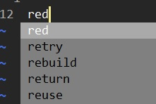
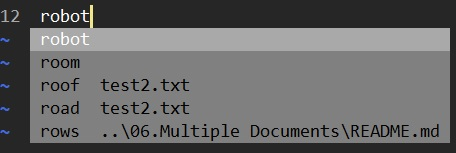
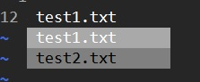
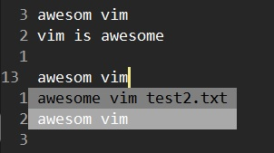
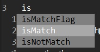
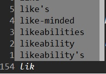
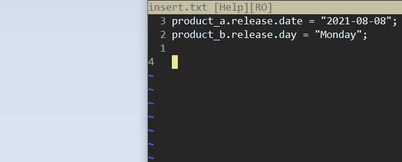
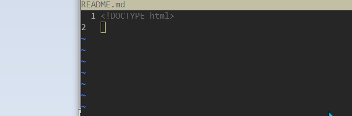

# Autocomplete

When in Insert Mode, use the following hotkeys to autocomplete what we type.

> See `:h ins-completion` for more details.


| Input keys | Description |
|:-----------|:------------|
| `<CTRL-n>` | Show autocompletion list and stay in the first one. |
| `<CTRL-p>` | Show autocompletion list and stay in the last one. |
| `<CTRL-x><CTRL-n>` | Show keywords in current buffer. |
| `<CTRL-x><CTRL-i>` | Show keywords in the current buffer and included files. Use `:set include?` to see the pattern for finding an include command. | 
| `<CTRL-x><CTRL-f>` | Show file names. |
| `<CTRL-x><CTRL-l>` | Show whole lines with matched keywords. |
| `<CTRL-x><CTRL-]` | Show tags that are in the tag file. |
| `<CTRL-x><CTRL-k>` | Show keywords in dictionary. |
| `<CTRL-x><CTRL-o>` | Omni completion. |


Notice that we can use "<Up>" and "<Down>" to navigate the autocomplete list. But it is suggested to use `<CTRL-n>`/`<CTRL-p>` to navigate because it will fill the selected item to the buffer without pressing `<ENTER>` or `<CTRL-y>` and you can press any key to continue your typing.


Here are how to use the autocompetion list:

- `<CTRL-n>`/`<CTRL-p>` navigate next/previous item.
- `<CTRL-y>` confirms the selected item. i.e. "yes".
- `<CTRL-e>` exit the autocompletion list. i.e. "exit".


> I put 2 files at `./sample/test1.txt` and `./sample/test2.txt` that be used to practice the following examples. <br />
> Also you can use the `./sample/dictionary/*.txt` to practice the example of using "dictionary".


## Autocomplete by keywords

- `<CTRL-n>`/`<CTRL-p>` shows the autocompletion list that can be chosen.

Notice that in default, the autocompletion list contains

* buffer list
* included files
* tags

If you want to include/exclude the type of file to be in the normal completion list, set the "complete" option. (See `:h 'complete'`)

```
:set complete?
complete=.,w,b,u,t,i
:set complete-=t
:set complete+=t
```

The flags list can be found in `:h 'complete'`. I listed the ones of default settings.

| Flag | Description |
|:----:|:------------|
| . | scan the current buffer ('wrapscan' is ignored). |
| w | scan buffers from other windows. |
| b | scan other loaded buffers that are in the buffer list. |
| u | scan the unloaded buffers that are in the buffer list. |
| i | scan current and included files. |
| t | tag completion. same as "]". |


### When ":set noignorecase":




### When ":set ignorecase":


However, since we typed "re" and it's useless to autocomplete with "Red", "Retry" or "Rebuild". So we have to enable "ignorecase" and "infercase" options in the same time.

```
:set inf[ercase]
```




For more details, see `:h 'infercase'`.


### Only show the keywords in current buffer

When using `<CTRL-n>`, autocomplete will show every matched keywords in buffer lists as below,



If we want to show keywords ONLY in current buffer:

- `<CTRL-x><CTRL-n>` 


## Autocomplete file name

- `<CTRL-x><CTRL-f>` shows the file names.




## Autocomplete a line

- `<CTRL-x><CTRL-l>` shows the match lines that STARTS WITH what you typed.




## Show keywords in tag file

Take the sample codes in "14.Ctags/sample" for example.
We can create the tag file by `:!ctags -R` and then we can find the keywords within the tag file:

- `<CTRL-x><CTRL-]>` shows the tags.




## Show keywords in dictionary

- `<CTRL-x><CTRL-k>` show keywords in dictionary.

There are several ways to enable the available dictionary.

### Enable spell checking option

```
:set spell
```

By enable spell-checking, we can show keywords in the spell list with `<CTRL-x><CTRL-k>`:




### Set file(s) as dictionary source(s)

If we dont want to enable "spell" option, we can load the keywords from specific file(s).

```
:set dictionary=dictionary/starwars.txt,dictionary/avengers.txt
:set dictionary?
dictionary/starwars.txt,dictionary/avengers.txt
```

Now we can get the keywords from the dictionary file(s) by `<CTRL-x><CTRL-k>`.


## Complete words that follow the previous completion

With insert mode's `<CTRL-x><CTRL-p>` after `<CTRL-p>` or `<CTRL-n>`, we can complete words that follow the previous completion.

This trick is very useful when you want to complete a "pattern"(a few words) but not just a "word" or a whole "line".

For example, we have a document like this,

```
product_a.release.date = "2021-08-08";
product_b.release.day = "Monday";
```

And we want to change the value of `product_a.release.date` and `product_b.release.day` in new lines like the following result.

```
product_a.release.date = "2021-08-08";
product_b.release.day = "Monday";

product_a.release.date = "2021-09-09";
product_b.release.day = "Tueday";
```

Here is the trick:




The steps:

| Input keys | Result | Note |
|:-----------|:-------|:-----|
| `iproduct<CTRL-n>` | product_a | Insert 'product' and complete it as "product_a". |
| `<CTRL-x><CTRL-p>` | product_a.release | Complete '.release' which are followed by previous completion. |
| `<CTRL-x><CTRL-p>` | product_a.release.date | Complete '.date' which are followed by previous completion. |
| `<CTRL-x><CTRL-p>` | product_a.release.date = "2021 | Complete ' = "2021' which are followed by previous completion. |
| `-09-09";` | product_a.release.date = "2021-09-09"; | |


## Omin(全能) completion

- `<CTRL-x><CTRL-o>` omni completion.

Omni completion provides smart autocompletion for programs.
Check the default support file types by `:h compl-omni-filetypes` or install new plugins.

To enable using Omin completion, edit the "vimrc" with...

```
set nocompatibe
filetype plugin on
```

Here is an example of HTML file.




