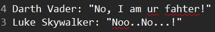
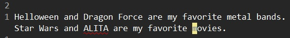

# Spell

## Enable spell checking

```
:set spell
```




## How to use spell

- `]s` / `[s` navigate next/previous typo.
- `z=` show the suggestion when cursor is on a typo.
  - `{sn}z=` will use the {sn} suggestion to replace the typo.
- `zg` Add the word under the cursor as a good word to the first name in "spellfile". 
- `zw` marks the word as a wrong (bad) word. If the word already appears in "spellfile", it is turned into a comment line.
  - `:runtime spell/cleanadd.vim` To clean up the comment lines in "spellfile". (See `:h spellfile-cleanup`)
- `zug` undo `zg` or `zw`.

## Spell file


### Sample

For example, there are some words are marked as typo in the following document.

```
Helloween and Drogon Force are my favorite metal bands.
Star Wars and ALITA are my favorite moveis.
```

We will correct them like this:

- "Helloween": add it as good word because it's a famous speed metal band.
- "Drogon": correct it to "Dragon".
- "ALITA": add it as good word, but think twice, it should be "Alita". So we cancel it.
- "moveis": correct it to "movies".

Here are the steps:

| Input keys | Description |
|:-----------|:------------|
| `]szg` | Move to "Helloween" and add it as good word to the word list file. |
| `]s1=z` | Move to "Drogon" and correct it to "Dragon". |
| `]szg` | Move to "ALITA" and add it as good word to word list file. |
| `zug` | Cancel "ALITA" as a good word from the word list file. |
| `]s1=z` | Move to "moveis" and correct it to "movies". |

The final result:




We can open the word list file, `~/vimfiles/spell/en.uft-8.add` to see whaz inside.

> For Windows user, the word list file is located at `C:\Users\<user>\vimfiles\spell\`.

```
Helloween
#LITA
```

And if you try to add "Helloween" as bad word by `zw`, the word list file will be updated as:

```
#elloween
#LITA
Helloween/!
```

We can clear the commented line by `:runtime spell/cleanadd.vim`.
