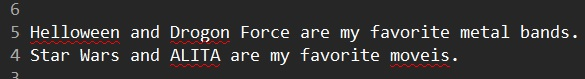
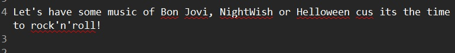
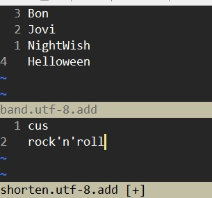
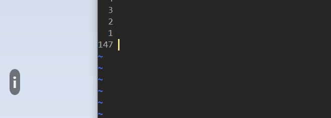

# Spell

## Enable spell checking

```
:set spell
```


## How to use spell

- `]s` / `[s` navigate next/previous typo.
- `z=` show the suggestion when cursor is on a typo.
  - `{sn}z=` will use the {sn} suggestion to replace the typo.
- `zg` Add the word under the cursor as a good word to the first name in "spellfile". 
  - `{count}zg` will add the word to the {count} file name in "spellfile".
- `zw` marks the word as a wrong (bad) word. If the word already appears in "spellfile", it is turned into a comment line.
  - `:runtime spell/cleanadd.vim` To clean up the comment lines in "spellfile". (See `:h spellfile-cleanup`)
- `zug` undo `zg` or `zw`.

## Spell file

### Sample

For example, there are some words are marked as typo in the following document.





We will correct them like this:

- "Helloween": add it as good word because it's a famous speed metal band.
- "Drogon": correct it to "Dragon".
- "ALITA": add it as good word, but think twice, it should be "Alita". So we cancel it.
- "moveis": correct it to "movies".

Here are the steps:

| Input keys | Note |
|:-----------|:------------|
| `]szg` | Move to "Helloween" and add it as good word to the word list file. |
| `]s1=z` | Move to "Drogon" and correct it to "Dragon". |
| `]szg` | Move to "ALITA" and add it as good word to word list file. |
| `zug` | Cancel "ALITA" as a good word from the word list file. |
| `]s1=z` | Move to "moveis" and correct it to "movies". |

The final result:


We can open the word list file, `~/vimfiles/spell/en.uft-8.add` to see whaz inside.

> For Windows user, the word list file is located at `C:\Users\<user>\vimfiles\spell\`.

```
Helloween
#LITA
```

And if you try to add "Helloween" as bad word by `zw`, the word list file will be updated as:

```
#elloween
#LITA
Helloween/!
```

We can clear the commented line by `:runtime spell/cleanadd.vim`.


## Include custom spell file

We can include custom spell file by (the file name must end in `.{encoding}.add`),

```
:setlocal spellfile+={file_name}.{encoding}.add
```


Helloween and Drogon Force are my favorite metal bands.
Star Wars and ALITA are my favorite moveis.

Here is an example,




| Input keys | Note |
|:-----------|:-----|
| `:setlocal spellfile+=spell\band.utf-8.add,spell\shorten.utf-8.add` | Set custom spell file locations. |
| `qa` | Start recording to register "a". |
| `]s` then `1zg` | Jump to "Bon" and add it to the first custom word list file: `spell\band.utf-8.add`. |
| `q` | Stop recording. |
| `3@a` | Repeat adding "Jovi", "NightWish", "Helloween" to `spell/band.utf-8.add`. |
| `qb` | Start recording to register "b". |
| `]s` then `2zg` | Jump to "cus" and add it to the second custom word list file: `spell\shorten.utf-8.add`. |
| `q@b` | Stop recording and repeat once on "rock'n'roll". |

Now the contents of the 2 spell files:




And we can reuse the spell files in the future.


## Spell language

The default spell language is "en". We can change it by `:set spelllang` with a comma separated list. Notice this setting is ONLY for local buffer but not globally.

For example, the below settings means US English and medical words can be recognized.

```
:set spelllang=en_us,medical
```

> See `:h 'spelllang'` for more details.<br />
> See `:h spell-remarks` to get the remarks (of regions) on spell checking.


We can make Vim to install the missing spell file for certain language.
The feature is powered by "spellfile.vim". See `:h spellfile.vim` for more information. To enable it, we have to update "vimrc" with...

```
set nocompatible
plugin on
```


## Autocomplete with spell

- `<CTRL-x>s` complete with spell.

It will be useful if there are more than 1 typos in a line. See the following sample.




