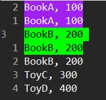

# Find Duplicated lines

We have a document like this:

```
BookA, 100
BookB, 200
ToyC, 300
BookB, 200
ToyD, 400
BookA, 100
BookB, 200
```

The "BookA, 100" and "BookB, 200" have duplicated lines inside.
Now we want to find out which of them are duplicated.


## Use sort and regex

1. First sort the lines

```
:'<,'>sort
```

2. Highlight the duplicated lines

```
:g/^\(.*\)$\n\1$/p
```

or

```
/\v^(.*)$\n\1$
```

> "\1" means that the nth marked subexpression matched.

The result will be:




## Reference

- [How can I mark/highlight duplicate lines in VI editor?](https://stackoverflow.com/a/28690847/7045253)


