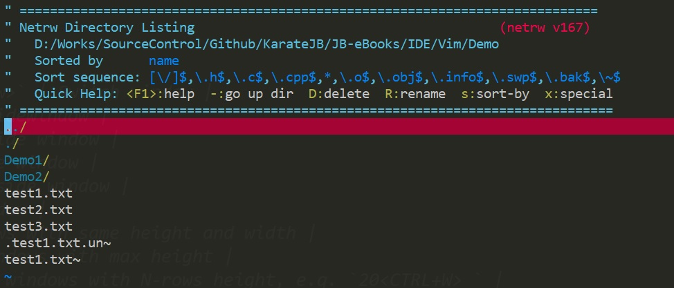

# Vim

> <CTRL-r> means press `CTRL` and `r` keys in the same time. 


## Setup

- `:set rnu` or `:set relativenumber`: Set relative number
- `:history`


*** Help

- `:help text-object` Text object selection


***
# Normal Mode


## Moving

- `<number>h` Go {number} chars leftside.
- `<number>j` Go {number} lines downward.
- `<number>k` Go {number} lines upward.
- `<number>l` Go {number} chars right.
- `<number>G` Go with line number.

- `gj` Display line downward.
- `gk` Display line upward.

- `0` To the first char of current line.
- `g0` To the first char of current display line.
- `$` To the last char of current line.
- `g$` To the last char of current display line.
- `^` To the first non-blank char of current line.   
- `g^` To the first non-blank char of current display line.   

- `zz` Centerize active line.
- `zt` Put active line to the top of window.
- `zb` Put active line to the bottom of window.
- `<CTRL+u>` Moving viewport up.
- `<CTRL+d>` Moving viewport down.


> See the definitions of **word** and **WORD** by `:h word` or `:h WORD`.
 
- `{number}w` {number} words forward, exclusive motion.
- `{number}W` {number} WORDS forward, exclusive motion.
- `{number}b` {number} words backward, exclusive motion.
- `{number}B` {number} WORDS backward, exclusive motion.
- `e` Forward to the end of {number} words inclusive.
- `E` Forward to the end of {number} WORDS inclusive.
- `ge` Backward to the end of {number} words inclusive.
- `gE` Backward to the end of {number} WORDS inclusive.

E.q. 

| Input keys | Result text |
|:-----------|:-----|
| `0` | **W**e're |
| `cwYou` | You're |

| Input keys | Result text |
|:-----------|:-----|
| `0` | **W**e're |
| `cWIt's` | It's |


## Delete, Copy, Paste

- `s` Delete current char, equals to `cl`
- `S` Delete line, equals to `cc`, `^C`
- `dd` Delete line
- `yy` Copy line

- `dw` Delete any chars from current cursor and stops at next word.
- `diw` Delete a word (exclude blank), often used on removing a word.
- `daw` Delete a word (include blank), ofter used on removing and insert a new word.
- `dd` Delete row and move up the next row

- `"0p` 貼上前一個複製的內容 
- `"+y` 複製vim yanked到系統剪貼簿
- `"+p` 從系統剪貼簿貼上複製的內容到vim
- `<CTRL-r>"` 在Command mode貼上yanked  

- `"_` Prefix for black hole, such as `"_d`, `"_c`


## To Edit

- `i` insert
- `a` append
- `J` Join lines
- `I` Go to the start of a line and start edit
- `A` Go to the end of a line and start edit

- `cs"'` 換成對符號

- `gu` Convert to lowercase. For example...
   - `gul` Convert current selected char to lowercase.
   - `guaw` Convert current word to lowercase.
   - `guu` convert current line to lowercase.
- `gU` Convert to uppercase, it's usage is the same as above.

- `gc` Comment out.
   - `gcc` Comment out current line.
   - `gcap` Comment out current block.


## To Indent

- `>` or `<` Select the line to shift
- `>>` or `<<` Shift line right or left


## To Search

- 單行搜尋字元  `f`/`F` 字元，再按 `;` 或 `,` 重複往後/前找
- 單行搜尋字元到前一個字元  `t`/`T`字元，再按 `;` 或 `,` 重複往後/前找
-  `o`/`O` 往下/上插一行 

- `/` Search next in document, `?` Search previous in document.
- `*` Search current word.


### Advanced combination with Searching

| Input keys | Result text |
|:-----------|:------------|
| `0` | Advanced combination with Searching. |
| `dtS` | Searching. |
| `u0` | Advanced combination with Searching. |
| `c3f Keep `| Keep Searching. |
| `u0/com` | Advanced combination with Searching. |
| `d/Sea` | Advanced Searching. |


## To Replace

- `r` replace a character.
- `R` replace multiple characters.
- `gR` virtual replace mode. See the difference here: [R and gR difference in Vim](https://superuser.com/a/705074/1140629). 


### Replace in command mode

- `:%s/<search_word>/<replace_as_word>/g` Replace all
- `:%s/<search_word>/<replace_as_word>/gc` Replace all with confirmation
- `:%s/<search_word>/<replace_as_word>/gi` Replace all without case sensitive
- `:s/<search_word>/<replace_as_word>/g` Replace only at current line


## Repeat

- `.` Repeat the last change.
- `@:` Repeat the last command(which comes from command mode).

## Show file information

- `<CTRL+g>`: file information.


***
# Insert Mode

## Back to Normal Mode

- `<CTRL-[>`   or `<ESC>`. 
- `<CTRL-o>`: Switch to Insert-Normal mode. When you back to Normal mode by this way, it will be back to Insert Mode after you execute an action on Normal Mode. This will reduce the times of switching modes. 

   E.q. When inserting something and you want to centerize the current line, use `<CTRL-o>zz`. 


- `<CTRL-h>` Delete previous character, equals to backspace.
- `<CTRL-w>` Delete from the cursor to the beginning of the previous word.
- `<CTRL-u>` Delete everything to the left of the cursor on that line.

## Insert

- `<CTRL-r>=` Insert the computed result, e.q. `<CTRL-r>=11*2<Enter>` will insert 22.

- `<CTRL-v>{code}` Insert a character by Unicode decimal(十進位)  or hexadecimal(十六進位).
   - Decimal code: `<CTRL-v>065` will output `A`.
   - Hex code: `<CTRL-v>u0042` will output `B`.
   - To see the Decimal & Hex code of a char, use `ga` on the char in Normal Mode. 
     E.q. an `A` will show `<A> 65, Hex 41, Octal 101`. 
   - See [List of Unicode characters](https://en.wikipedia.org/wiki/List_of_Unicode_characters).


- `<CTRL-k>{char1}{char2}` to enter a digraph, which is a method of entering a more extensive range of Unicode characters using pairs of keystrokes. 1
  e.q. `<CTRL-k>cr` will output `^M`.

  - Use command: `:h digraph-table` or `:digraphs` to see the list of digraph.


## Paste Register

- `<CTRL-r>{register}`  Paste a register.
- `<CTRL-r><CTRL-p>{register}` Paster a register without shift-block format.


***
# Visual Mode

## Selection Mode

> In Selection Mode, any input key will immediatly overwrite current selected block.

- `<CTRL-g>` Switch between Visual Mode and Selection Mode.


## Basic

- `v` Start Visual Mode (by character).
- `V` Start Visual line (by line).
- `<CTRL-v>` Start Visual Mode blockwise. (Use `A` to append and `I` to insert).
- `o` The selection cursor will be put to other end of highlighted text. It is useful to change the beginning position. 
- `gv` In Normal Mode, highlight exactly the same area of the last time in Visual Mode.


## Select

- `vaw` Select a word, including blank.
- `viw` Select a word, excluding blank.
- `ve` Select from current position to end of a word.
- `vb` Select back.
- `viB` Select block.
- `vat` Select tag block.
- `vit` Select inner tag block.


> We can combine the last command, such as `vawaw`, `vebbbb`...


## Tips

### To indent(縮排) 2 times for 3 lines

- `v3j` -> `>` -> `.` for 2 times, or
- `v3j` -> `3>`


### Use blockwist to append at the last position of multiple lines

We wanna to put "!" at the last postion of the three sentences.

```
▍
Hello world
Hi, kid
Vim is awesome
```

To become

```

Hello world!
Hi, kid!
Vim is awesome!
```

Use `j` -> `<CTRL-v>jj$` -> `A` -> `!`.


### Visual Model blockwist sample 

Assume cursor is on line 1, to make

```
Key  ▍ Value
xxx       111
yyy       222
```

To

```
Key   Value
-----------
xxx     111
yyy     222
``
```

Use `<CTRL-v>2j` -> `x..` -> `yyP` -> `Vr-`.


***
# Command Mode

## Common Ex command

- `q[uit]` Quit.
  - `qa[ll]!` Discard all changes on buffers and quit. 
- `:e[dit] {file_path}` Open file to edit.
- `:e[dit]!` Reload file and ignore change. 
- `:w[rite]` Save file, the command will change the timestamp of the file even if the buffer was not be modified.
  - `:wa[ll]` Save all buffers to files.
- `:update` or `up` Save file, the command will only change the timestamp of the file if the buffer was modified. 
- `:sav[eas] {file_path}`
- `:tabnew` Create a new tab.
- `:split`, `vsplit` Split current buffer to another window.
- `:bprev`/`bnext` Go to previous/next buffer in the buffer list.

For more Ex cmd, see `:h ex-cmd-index`.


## Range/Line Ex command

- `:[range]d` Delete range.
- `:[range]y` Yank range.
- `:[line #]put` Put yanked at the next line of line #.
- `:[range]copy {address}` Copy the range to the next line of {address}. Short as `t` (copy **T**o).
- `:[range]move {address}` Move the range to the next line of {address}. Short as `m`.
- `:[range]join` Join all the lines in the range.
- `:[range]normal {commands}` Execute normal-mode command on every line in the range.
  - e.q. `2,3normal A,` will append , to the end of lines on line 2 ~ 3.
  - e.q. `'<,'>normal .` will repeat the last edit on highlighted lines.
- `:[range]s/{pattern}/{string}/{flags}` Substitute what matchs {pattern} to {string} in the range.
- `:[range]global/{pattern}/{cmd}` Execute Ex command on each line that matchs {pattern}.
  - e.q. `:%g/AAA/move $` will move all the lines that contain AAA to the end of the file.


## Special Symbols

| Symbol | Address |
|:------:|:--------|
| 1 | The 1st line. |
| 0 | Virtual line number, which is located above the 1st line. e.q. When we want to move one line to the beginning of a document. |
| $ | The last line. |
| . | The line of current cursor. |
| % | The whole document (All lines). |
| 'm | The line with bookmark name: `m`. |
| '< | The beginning line of highlighted selected text. |  
| '> | The end line of highlighted selected text. |


## AutoCompleted in Command Mode

- `:<CTRL+d>` shows all autocompleted words list. e.q. `:cop<CTRL+d>` shows `copen copy`.
- Options (see `:h 'wildmode'`)
  - For bash user

    ```
    set wildmode=longest,list
    ```

  - For zsh
    
    ```
    set wildmenu
    set wildmode=list:full
    ```

## Copy current word to command

- `<CTRL-r><CTRL-w>` will copy current word to command.

For example, we would like to replace `Test` with `TestCase`, while the cursor is located at `Test1`.

```
My Test1
My Test2
My Test3
```

Use `*` to highlight all `Test` words, then `cwTestCase<ESC>`.

```
My Test1
My TestCase2
My Test3
```

Now we can use substitute like this: `:%s//<CTRL-r><CTRL-w>/g` (which will be `:%s//TestCase/g`) to replace other `Test` to `TestCase`.


***
# Mutiple documents

## List buffers

- `:ls` list all buffers from files.
  - `:h :ls` To show details of each indicators, e.q.
    - **%**: the buffer in the current window
    - **a**: active buffer
    - **h**: hidden buffer
    - **=**: readonly buffer


## Switch/Manage buffer

- `:bn[ext]` Switch to next buffer.
- `:bp[revious]` Switch to previous buffer.
- `:b[uffer] {buffer_sn}` Quick switch to certain buffer.
- `:bf[irst]` Switch to the first buffer.
- `:bl[ast]` Switch to the last buffer.
- `:bufdo {command}` Execute command on all buffers.
  e.q. `bufdo w` Save all buffers to files.
- `:bd[elete] {buffer_sn1} [{buffer_sn2}]` Delete buffer(s).


## Split Window

- `sp[lit]` or `<CTRL+w>s` Split horizontally. The current window will be split with a new vertical window.
  - `sp[lit] {file_path}`
- `vsp[lit]` or `<CTRL+w>v` Split vertically. The current window will be split with a new horizontal window.
  - `vsp[lit] {file_path}`
- `clo[se]` Close active window.
- `on[ly]` Close other windows(s) except active one.


### Hotkeys

| Hotkey | Description |
|:------:|:------------|
| `<CTRL+w>w` or `<CTRL+w><CTRL+w>` | Switch window |
| `<CTRL+w>h` | Switch to left-sidewindow |
| `<CTRL+w>j` | Switch to down-side window |
| `<CTRL+w>k` | Switch to up-side window |
| `<CTRL+w>l` | Switch to right-side window |
| `<CTRL+w>c` | Close active window |
| `<CTRL+w>=` | Resize all windows with same height and width |
| `<CTRL+w>_` | Resize active windows with max height |
| `{N}<CTRL+w>_` | Resize active windows with N-rows height, e.q. `20<CTRL+W>_` |
| `<CTRL+w>|` | Resize active windows with max width |
| `{N}<CTRL+w>|` | Resize active windows with N-columns width |


## Tab

> A Tab in Vim is like a virtual window. 

- `:tabs` List all tabs and its SN.
- `:tabnew` Create a new Tab without any file.
- `:tabe[dit] {file_path}` Create a new Tab with a file.
- `<CTRL+w>T` Send active window to a new Tab.
- `:tabc[lose]` Close current Tab and its window(s).
- `:tabo[nly]` Close other Tabs but keep active one.
- `:tabn[ext]` or `gt` Go to next Tab.
  - `:tabn[ext] {tab_sn}` or `{tab_sn}gt` Go to certain Tab. 
- `:tabp[revious]` or `gT` Go to previous Tab.
- `:tabf[irst]` Go to first Tab.
- `:tabl[ast]` Go to last Tab.
- `:tabm[ove] {N}` Move current Tab to index N. e.q.
  - `tabm 0` Move current Tab to the first position.
  - `tabm` Move current Tab to the last position.
  

# Working Directory

## Document browser - netrw

```s
$ vim .
```

Now we can use `j`, `k` to move the cursor, `-` will go to up direcory.




We can open netrw in vim in these ways:

- `:e[dit] .`
- `E[xplore]


> netrw can read/write remote file, see `:h netrw-ref`.


## Set working directory

- `:pwd` Show working directory.
- `:cd %:p:h` Change the working directory to current file (for all windows).
- `:lcd %:p:h` Change the working directory to current file (for active window).

> `%`: The full path of current file.
> `:h`: Prune the file name. So `%:h` indicates the full path of current directory.

To automatically change current directory:

```s
set autochdir
```

> Reference: [Set working directory to the current file](https://vim.fandom.com/wiki/Set_working_directory_to_the_current_file)


After setting the working directory, we can open file by relative path.

For example, my files structure is as following,

```
├── Demo                    
|  ├── Demo1                
|  |  └── test.txt         
|  ├── Demo2                
|  |  └── test.txt          
|  ├── test1.txt            
|  ├── test2.txt            
|  └── test3.txt            
```

To open `/Demo/test1.txt` from working directory: `/Demo/Demo1`,

```s
:pwd
/Demo/Demo1
:e ../test3.txt
```

Or

```s
:e %:h<tab>
:e Demo/Demo1
:e Demo/Demo1/../test1.txt # or :e Demo/test1.txt
```

## Find

We can `:find` to open a file without to know the full path of any file.
However we must add the paths to find.

```s
:pwd
/Demo
:set path+=Demo1/**
:set path+=Demo2/**
:find test
```

Press `tab` after the last command, and we will see:


## Save a new file to non-exist directory

For example, I open a new buffer with path: `New\test.txt`, that the directory is not exist.

```
:e New\test.txt
:w
"New\test.txt" E212: Can't open file for writing
```

We can use `mkdir` command in vim to solve the problem,

```
:!mkdir -p %:h
:w
```


## Save a file without right permission

For example, we would like to edit `/etc/hosts`,

```s
$ ls -al /etc/ | grep hosts
-rw-r--r-- 1 root     root       174 Apr 29 03:47 hosts

$ su jb
$ whoami
jb
$ vim /etc/hosts
```

We will get the error when we want to save it.

```
:w
E45: 'readonly' option is set (add ! to override)
:w!
E212: Can't open file for writing
```

We have to use `root`'s permission to save the file:

```
:w !sudo tee % > /dev/null
[sudo] password for jb:
xxxxxxxx

W12: Warning: File "hosts" has changed and the buffer was changed in Vim as well.
[O]k, (L)oad File: L
```

> The file will be modified by the outside program, so vim will ask us to reload it or not.


# Motion

> For more details: `:h motion.txt`


## (i)nside and (a)round

The following samples are started with the below text that the cursor is at the `.`of `book.title`.

```html
<div>
  <a href="{{book.url}}">{{book.title}}</a>
</div>
```

- `vi{`

  

- `v2i{` or `va{`

  

- `vit`

  

- `v2it`

  
