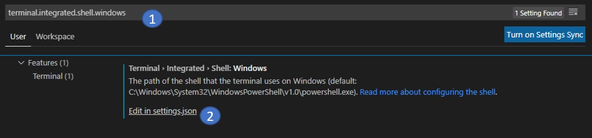
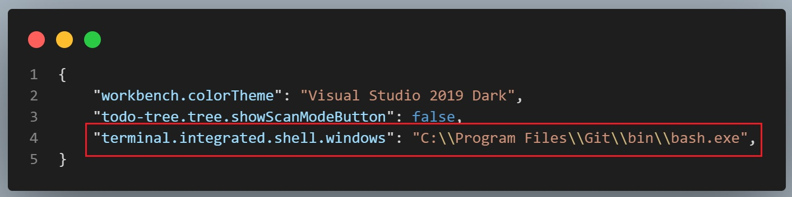

# Visual Studio Code

## Hotkeys

- Select mutiple matched: `CTRL + Shift + L`
- Collapse: `CTRL + Shift + ]`
- Select blockwise: `CTRL + SHIFT + up/down`
- Uncolllapse: `CTRL + Shift + [`
- Select one line: `CTRL + L`
- Search method in file: `CTRL + Shift + O`

## Set Git bash as default terminal

1. `CTRL+P` and type `> Terminal: Select Default Shell`.
2. Select Git Bash as the default terminal.

Or update settings manullay:

1. `CTRL+,` to open settings.
2. Search **terminal.integrated.shell.windows** (or ...osx, ...linux) and open `settings.json`.

   
   
3. Enter the path of bash, e.q.

   

