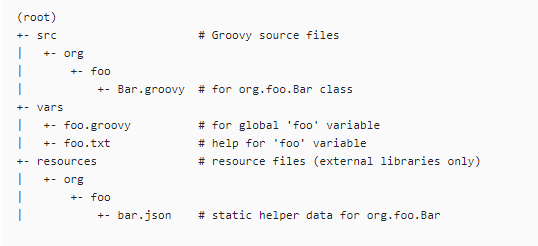
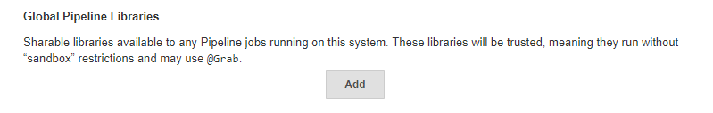

# Enable global library

Here are the steps for enabling global pipeline library(s).
So that we can use the global functions on the Jenkinsfile at any pipeline.

PS. The following example is on Jenkins and GitHub.


## Create a new repository for global library

The official recommend project structure is as follwoing,




Here is my sample code's structure in [GitHub](https://GitHub.com/KarateJB/JB.Jenkins.ShareLibrary),

| src
| vars
  |- notifyBuild.groovy  
| resources


- vars/notifyBuild.groovy

```groovy
def call(String extraMsg='') {
  echo "Notify by global function"
}
```

> Notice that the function must named: `call`.


## Set Global Pipline Libraries options

Go to **[Manage Jenkins]** -> **[Configure System]** on Jenkins.

At **[Global Pipline Libraries]**, press **Add**.




Then fill out 

1. **Library Name**: This name will be used in Jenkinsfile later. In this example, it is named: `ShareLibrary`
2. **Default version**: The target branch name
3. **Retrieval method**: choose "Modern SCM"
5. **Source Code Management**: choose "GitHub" and set `Credentials`, `Owner`, `Repository`


>　We can add one more Global Pipeline Libraries by pressing **Add** again.


## Update Jenkinsfile

At the last step, we will update our Jenkinsfile to use the Gloabal function from **ShareLibrary** in the target repository.

```jenkinsfile
@Library("ShareLibrary") _

pipeline {
    agent {
        label 'master'
    }
    stages {
        stage('Build') {
            steps {
               
            }
            post {
				always {
                    script {
                        notifyBuild()
					}
                }
			}
        }
    }
}
```

By importing the Global pipeline library: **ShareLibrary**, we can use global function: `notifyBuild()`.

For importing mutiple libraries, 

```jenkinsfile
@Library("ShareLibrary1")
@Library("ShareLibrary2")
@Library("ShareLibrary3") _
```


## Reference

- [Extending with Shared Libraries](https://jenkins.io/doc/book/pipeline/shared-libraries/)

