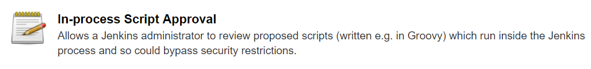
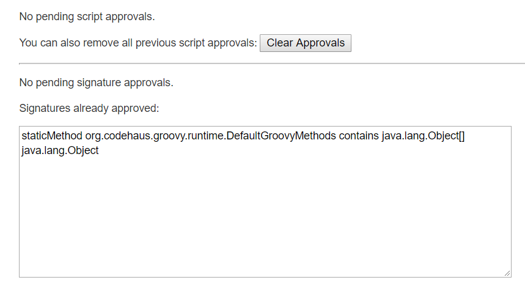

## Scripts not permitted to use staticMethod

### Error

[Groovy](http://groovy-lang.org/)'s static mehod is banned and shows:

```
Error when executing success post condition:
org.jenkinsci.plugins.scriptsecurity.sandbox.RejectedAccessException: Scripts not permitted to use staticMethod org.codehaus.groovy.runtime.DefaultGroovyMethods contains java.lang.Object[] java.lang.Object
	at org.jenkinsci.plugins.scriptsecurity.sandbox.whitelists.StaticWhitelist.rejectStaticMethod(StaticWhitelist.java:189)
	at org.jenkinsci.plugins.scriptsecurity.sandbox.groovy.SandboxInterceptor.onMethodCall(SandboxInterceptor.java:117)
```

### Solution

Make sure the plugin is installed, then go to 

**[Manage Jenkins]**->**[In-process Script Approval]**




to approve the signature into the whitelist.




> Reference
> - [Scripts not permitted to use staticMethod #38](https://github.com/jenkinsci/jenkinsfile-runner/issues/38#issuecomment-438543081)