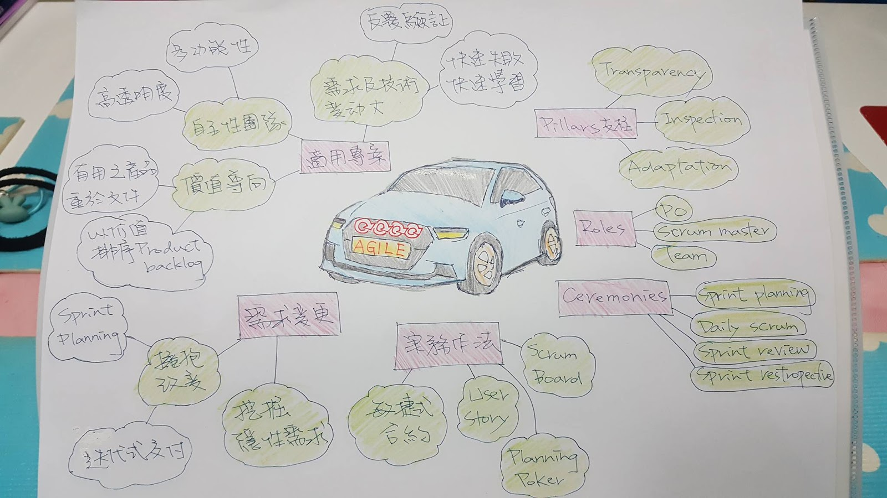
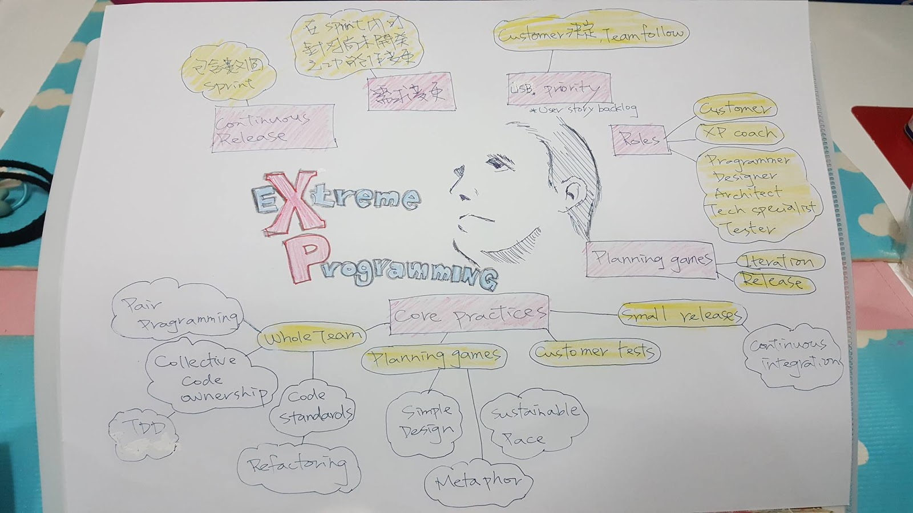

# Agile Manifesto

### Individuals and interactions over processes and tools

### Working software over comprehensive documentation

### Customer collaboration over contract negotiation

### Responding to change over following a plan

# Agile 12 Principles (In short)

1.  Produce value early and continuous
2.  Welcome to change
3.  Delivery frequently
4.  Work with business people
5.  Trust motivated team (信任受到激勵的團隊)
6.  Face to face communication
7.  Measure by software done
8.  Maintain sustainable pace
9.  Technical excellence and good design
10.  Keep it simple
11.  Self-organized team
12.  Reflect and adjust

# Methodologies and Frameworks

### Scrum
### Extreme Programming (XP)
### Lean Software Development (LSD)

# Scrum

Scrum framework includes: 3 pillars, practice, R&R(Roles and Responsibilities), Event, Artifacts, Rules.

## 3 Pillars

### Transparency

All relative aspects of the process must be visible to those responsible for the outcome.

### Inspection

Inspection of Artifacts and progress to identify and correct both customer’s  
explicit and implicit demands.

Inspection occurs on
1.  Sprint planning meeting
2.  Daily scrum
3.  Sprint review meeting
4.  Sprint retrospective meeting

### Adaption

After inspection, adjustment should be made to the process and artifacts in order to minimize further deviation(偏差).

## 3 Roles

### Product Owner

Own and prioritize the Product backlogs.

1.  Gather requirements
2.  Does not interfere during Sprint. (No scope creep)

### Scrum Master

Facilitates the Scrum process.

1.  Remove obstacles.
2.  Listen and watch carefully during Scrum meetings.

### The Team

Produce Increments of shippable product functionality.

1.  Estimate the effort.
2.  Select works for each Sprint.
3.  Commit to the work as a team.

## 3 Ceremonies

### Sprint Planning meeting

1.  PO reviews Vision, Roadmap, Release Plan.
2.  Team estimate each item on Product backlogs which are candidates for the Sprint backlog.
3.  Decide the Sprint backlogs.

### The Daily Scrum (Standup meeting)

1.  Host by the Team.
2.  Other may attend but NOT speak.
3.  Each member answer the following 3 questions:
n   What did you do yesterday
n   What are you doing today
n   What is in your way
4.  PO can stops (pulls) the valueless backlog ANY TIME.

### Sprint Review meeting

1.  Product demo, which is hosted by PO.
2.  Sprint Retrospective, which is hosted by Scrum master.
n   What worked?
n   What did not?
n   What adjustments can we make now?

PS. I would rather separate the Spring Retrospective meeting from Sprint Review meeting, cus the purposes of them are different and the participants are not the same as well.

## 3 Artifacts

1.  Product backlog
2.  Sprint backlog
3.  Increment

## 3 Best Practices

### User Story

As a
I Want
So that

Acceptance criteria
Assumptions (假設條件):
Limitations (限制條件):
Exclusion (排除事項):

Risk:
Deliverables:

### Planning Poker

### Use of the Scrum Board

| 
Sprint backlogs
 |  
TO DO
  | 
DOING
  | 
DONE
 |
|:--------------------------------:|:---------------------:|:-----------------------:|
| A G I | D F | C E | B H |

And **Burndown chart**.

## My Mind map

# Extreme programming (XP)

XP is a software development methodology which is for
1.  Improve software quality
2.  Responsiveness to requirement-changing
3.  Empowers the developers to confidently respond to changing customer requirement, even late in the life cycle.

## Core Practices

### Whole Team

The team
1.  MUST include a business representative, aka the Customer.

The customer provides requirements and sets the priority.
2.  MUST have Programmers
3.  MAY include Testers, who HELP the Customer define the acceptance tests.
4.  MAY include Analysts, who HELP the Customer define the requirements.
5.  Commonly have a Coach, who helps the team keep on track and facilitates the process.

### Planning Games

1.  Maximize value and minimize costs.
2.  The game is within an interval of ONE WEEK.
3.  Held in Release Planning and Iteration Planning.
4.  One or more releases in a project.
5.  One release consists of one or more iterations.

### Small Released

1.  Release MMF(Minimum Marketable Features).
2.  Every week or two.
3.  The Customer decides if release to production.

### Customer Tests

1.  Acceptance tests are created from user stories.
2.  The Customer specifies scenarios to test, one story can have one or more acceptance test.

### Collective Code Ownership

1.  ALL programmers are responsible for maintaining the code and the quality of the code.
2.  Everyone in the team can fix the code.

### Code Standards

### Sustainable Pace

1.  Find the team’s perfect Velocity.
2.  Working overtime sucks the spirit and motivation.

### Metaphor

Explain the technical things to the Customer in an easy-understanding way.

### Continuous Integration

1.  Developers commit the codes every few hours and system will do the auto integration test.
2.  Pay me now or pay me more later!

### TDD

Write a test before writing just enough production code to fulfill the test and refactoring.

### Refactoring

1.  Keep refactoring in the entire project life cycle.
2.  It will saves time and increase quality.

### Simple Design

1.  Testable
2.  Understandable
3.  Browsable
4.  Explainable

### Pair Programming

## My Mind map

## Differences between Scrum and XP

|                          |  
XP
  | 
Scrum
  |
|:-------------------------|:-----------------------------|:------------------------|
| Iteration length         | 1-2 weeks                                 | 2 weeks to 1 month      |
| Release Planning         | Yes                                       | No                      |
| Change rules during an iteration/sprint                           | Yes, as long as the team has not start working on the feature  | No               |
| Product backlog priority | The team follows the Customer’s priority. | PO prioritizes the product backlog, but team determines the development sequence. |
| Engineering practice     | * TDD * Continuous integration * Simple design * Refactoring * Pair programming  | No              |
| Roles                    | * Customer * XP Coach * Programmer/Designer/Architect/Technical specialist/Tester  | * Product owner * Scrum master * The team |
| Planning                 | * Release Planning game * Iteration Planning game | Sprint Planning meeting  |
| Requirement              | User Story backlog                         | 	Product backlog              |
| Acceptance               | Acceptance tests                           |  	Acceptance criteria   |

# Lean Software Development (LSD)

## 7 principles

### Eliminate waste

Includes

1.  Partially done work
2.  Extra processes
3.  Extra features
4.  Task switching
5.  Waiting
6.  Motion
7.  Defects
8.  Management activities

### Amplify learning (放大學習)

Both customer representatives and team learn more about the domain knowledge/problem, and figure out possible solutions.

### Decide as late as possible

1.  Delaying decision as much as possible, until they are based on FACTS and NOT on assumptions and predictions.
2.  COST much if something discovered after release!
3.  The team must improve their domain knowledge to identify task’s value and try to convince the customer. If the team is not good at the project’s domain, find a BA(Business analyst) to help.

### Deliver as fast as possible

1.  Get feedback asap, for adjusting and apply to next iteration.
2.  The shorter an iteration, the better for LEARNING and COMMUNICATION within the team.

### Empower the team

1.  Not the traditional way: C&C, aka Control and Command.
2.  The managers should listen to the developers, so that they can explain better what actions might be taken and gather suggestions for improvements.

### Build integrity in

1.  Refactoring
2.  Build and Test

In Scrum, it maps to the following principles:
1.  Technical excellence and good design
2.  Reflect and adjust

### See the whole

Implement all the Lean principles and create the common sense for the working environment.

## Portfolio Management

1.  Quick delivery with **MMF**(Minimum Marketable Features).
2.  Organize the teams for working efficiently.
3.  Minimize work-in-process.
4.  Fast and Flexible flow.
