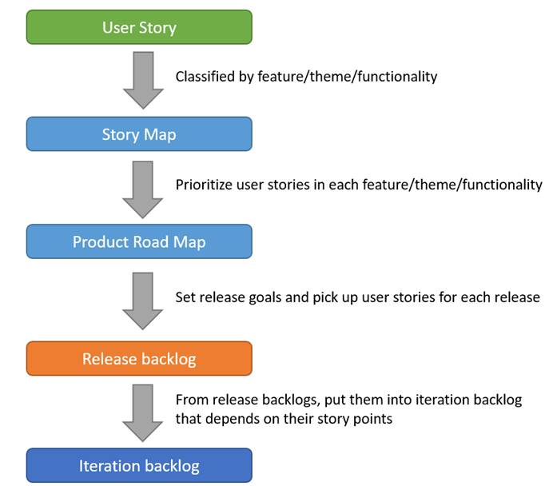
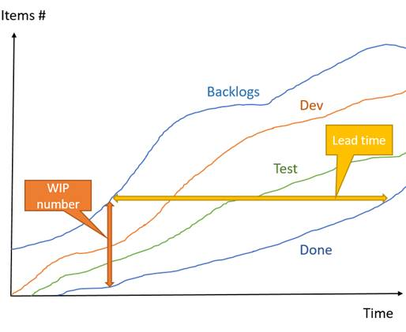

# Introduction

Producing high-value increments based on stakeholder’s priority.
Use the feedback from stakeholders to prioritize and improve the future increments.
The focus on delivery value drives much of the Agile activities and decision making.

## Value driven delivery definition

The projects are undertaken for generating

1. Business value
  * High ROI(Return on investment)
  * Increased Profit
  * Market sharing
  * Lower risk

2. Benefit

3. Improve a service

## Concept

1.  Working software over comprehensive documentation
2.  Working software is delivered frequently
3.  Working software is the principle measure of progress

## Value vs. Cost vs. Risk

1.  Must consider Value, Cost and Risk in the same time.
2.  Spike for risk at early iteration.

## Activities

### Planning

Prioritize the Product backlog by Customer Business value and refine them as Risk-adjusted backlog based on the risk.

**Impediment backlog(障礙清單)** is not belong to our product, and will not list on the Product backlog.

### Executing

### Control

# Assessment

When selecting a project, estimate

1. Early benefits realization
2. Anticipated benefits (預期收益)
3. ROI, IRR, NPV assumption
4. SWOT
5. PEST analysis
   * Political
   * Environment
   * Social
   * Technical

# Vision

### Vision Statement

### Product Vision Box

### Elevator statement

# Contract

## Waterfall vs. Agile

### Waterfall

Fixed on cost, time and scope.

### Agile

Fixed on cost and time, but not on scope. (Welcome to change)

Also we can use
1.  cost reimbursable contract (成本可償還合約)
2.  T&M (Time and Material) contract (工料計價合約)

## Key issues must be addressed

1.  PO is a representative of the Customer, so he/she is appointed by the Customer.
2.  PO must responds to questions from the team asap.

## Agile Contract types

### Money for nothing & Change for free contract

1.  Change for free, but cannot over time and cost.
2.  Customer can close the project (contract) whenever they get enough value from the project and only pay the 20% of the left payables.
3.  Customer get the value early. Although the vender doesn’t get the total payables, they can involve into another project early.

### Graduated fixed price contract

1.  If the vender complete the project before the deadline, they can get a HIGHER cost-of-unit-production-time.
2.  If the vender complete the project late, they get a LOWER cost-of-unit-production-time.
3.  For customer, it’s a matter of profit early or lately.

### Fixed price work packages contract

Fixed price for each work package. When the requirements are changed in a work package, we can re-estimate the cost of it.

### Time and Material contract

Fixed cost-of-unit-production-time on certain resource and total time of the resource, but not fixed on deliverables.

Also can define the project max cost and time.

### Agile iterations contract

1.  Customer must commit for not changing the content and order of backlogs in an iteration before the iteration ends.
2.  Vender must complete the Definition of done for backlogs in an iteration.

### Customized contract

Combine and customize the above contract types for running Agile project smoothly.

# Value Planning

## Agile Charter

1.  Vision statement
2.  Goal
3.  Purpose
4.  Deliverables
5.  Limitations
6.  Business constraints
7.  Special considerations

## User Story

1. Minimum formal structure for user requirement.

2. Collect the customer requirement by
   * User Story workshop
   * XP Customer Tests

3.  Hosted by PO, stakeholders and the team should partake.

### Persona

Inferred out (推論出) user requirement in virtual users’ shoes.

### Format

> As a (Who)
> I Want (What)
> So that (Why)

**Acceptance criteria**
Assumptions (假設條件):
Limitations (限制條件):
Exclusion (排除事項):

Risk:
Deliverables:

### Principles: INVEST

| 
Letter
 |  
Meaning
  |
|:-----------------------:|:---------------------------|
| I | Independent |
| N | Negotiable  |
| V | Valuable    |
| E | Estimatable |
| S | Small       |
| T | Testable    |

### Prototype

## Business-valued Prioritization

1.  The business value would be decided by the PO(Scrum)/Customer(XP) and the development team.
2.  Prioritize with business value, risk and defect.
3.  The team must provide possible risks and technical issues, and discuss with PO/Customer and then re-prioritize product backlogs.
4.  Product backlogs with **MMF(Minimum Marketable Feature)** have higher priority.

### R&R(Roles and Responsibility)

| 
Role
 |  
Responsibility
  |
|:---------------------:|:----------------------------------|
| PO/Customer | Define benefit and loss |
| Team        | Define cost and risk    |

### Prioritize methods => Product backlog

1. MoSCoW
2. Technology Risk Based
3. Kano Model
4. Validated Learning
5. Pareto analysis
6. Dot Voting
7. Monopoly Money

### Product backlog => Risk-adjusted backlog

Prioritize the product backlog again with risk. Notice that NEVER put Impediment backlog(障礙清單) into Product backlogs.

## Business-valued Prioritization in Big project

When we have lots of user stories and it’s difficult to know where we are and where we should go, Story Map (road map + backlog) can help us.　

 

# Value Executing

According to the plan, we deliver the small release (MMF) to customer with QUALITY  , which mean the MMF meets customer’s acceptance criteria.

## Value stream mapping

1. Create a flow/map of related work.
2. Find delays, waste and constraints.
3. Remove or reduce them.

## Lean: 7 wastes

1. Task switching
2. Extra features
3. Defects
4. Extra processing
5. Waiting
6. Partially done work
7. Motion (Moving)

## WIP limits

When WIP (Work in progress) number hit the limit, the team stops and works together to clear the bottleneck.

## Cumulative flow diagrams (CFD)

A tool for tracking and forecasting projects.

## Spike

1. A task focuses on answering a question or gather information within a timebox.
2. At iteration 0 or before an iteration.

# Value Control

Collect customer feedback thru

1.  Surveys
2.  Prototyping
3.  Reach out directly (直接詢問/溝通)
4.  Usability Test
5.  Demo

