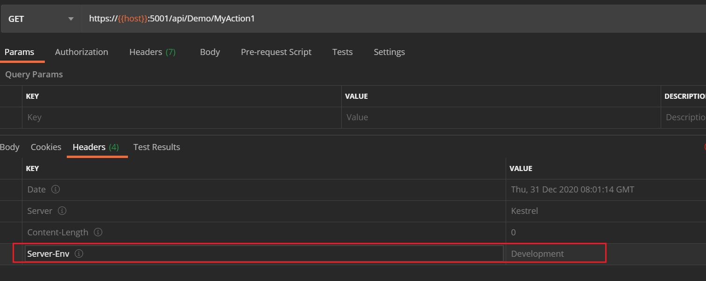
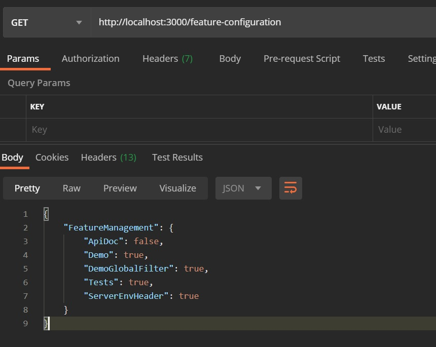

# Feature Toggle


## Introduction

While we have more and more features (APIs…) and environments (SIT, Staging…), we want to enable/disable certain features on specific environments by feature toggle.

This article shows how to do feature toggle by two ways

- Implement IAsyncResourceFilter
- Use official package: [Microsoft.FeatureManagement.AspNetCore](https://github.com/microsoft/FeatureManagement-Dotnet)


The full sample code is in my Github: [karatejb/AspNetCore.Filters.Sample](https://github.com/KarateJB/AspNetCore.Filters.Sample)


## Implement IAsyncResourceFilter

The following example shows how to disable APIs that depends on the environment value of ASPNETCORE_ENVIRONMENT.

**Resource filters** will be after Authorization filters and before Action filters and model binding, so we can implement [IAsynResourceFilter](https://docs.microsoft.com/zh-tw/dotnet/api/microsoft.aspnetcore.mvc.filters.iasyncresourcefilter) to intercept the request and return 404(Not found) immediately.


- DisableApiFilter.cs

```csharp
public class DisableApiFilter : Attribute, IAsyncResourceFilter
{
    private readonly string env = string.Empty;

    /// <summary>
    /// Constructor
    /// </summary>
    /// <param name="hostEnvironment">IWebHostEnvironment</param>
    /// <param name="options">IOptions</param>
    /// <param name="onEnv">Regex for checking ASPNETCORE_ENVIRONMENT</param>
    public DisableApiFilter(
        IWebHostEnvironment hostEnvironment,
        IOptions<AppSettings> options,
        string onEnv = "")
    {
        this.env = hostEnvironment.EnvironmentName;
        this.OnEnv = string.IsNullOrEmpty(onEnv) ? options.Value?.EnvForDisableApiFilter : onEnv;
    }

    /// <summary>
    /// Regression expression of ASPNETCORE_ENVIRONMENT for disabling API
    /// </summary>
    public string OnEnv { get; set; }

    /// <summary>
    /// OnResourceExecutionAsync
    /// </summary>
    /// <param name="context">ResourceExecutingContext</param>
    /// <param name="next">ResourceExecutionDelegate</param>
    public async Task OnResourceExecutionAsync(ResourceExecutingContext context, ResourceExecutionDelegate next)
    {
        if (string.IsNullOrEmpty(this.OnEnv))
        {
            await next();
        }
        else
        {
            var regex = new Regex(this.OnEnv);

            if (regex.IsMatch(this.env))
            {
                context.Result = new EmptyResult();
                context.HttpContext.Response.StatusCode = StatusCodes.Status404NotFound;
            }
            else
            {
                await next();
            }
        }
    }
}
```


### Use DisabelApiFilter by setting regex pattern


The variable: `OnEnv`, is the parameter of the filter that supports Regular Expression.
When environment variable: `ASPNETCORE_ENVIRONMENT` matches the `OnEnv`, the filter will force the API to return 404.

For example, the following API will response 404 when `ASPNETCORE_ENVIRONMENT`'s value contains `Production` or `production`.

```csharp
[TypeFilter(typeof(DisableApiFilter), Arguments = new object[] { "^(.*)[Pp]roduction(.*)$" })]
[HttpGet]
public async Task<IActionResult> Demo()
{}
```


### Use DisableApiFilter by default regex pattern


We can set a default regex pattern to be checked in `DisableApiFilter` when parameter `OnEnv` is not specified.

- appsettings.json

```json
{
  "EnvForDisableApiFilter": "^(.*)[Pp]roduction(.*)$",
}
```

And we can disable API on demand environment(s) like this,

```csharp
[TypeFilter(typeof(DisableApiFilter))]
[HttpGet]
public async Task<IActionResult> Demo()
{}
```


---
## Microsoft.FeatureManagement.AspNetCore


Github: [microsoft/FeatureManagement-Dotnet](https://github.com/microsoft/FeatureManagement-Dotnet)

> This official package supports Feature toggle dynamically.


### Install Nuget package

- [Microsoft.FeatureManagement.AspNetCore](https://www.nuget.org/packages/Microsoft.FeatureManagement.AspNetCore)


### Feature Management Configuration

Define the key **FeatureManagement** in `appsettings.json` like following,


- appsettings.json

```json
"FeatureManagement": {
    "ApiDoc": false,
    "Demo": true,
    "DemoGlobalFilter": true,
    "Tests": true,
    "ServerEnvHeader": false
}
```

We can create an enum for later usage.

- FeatureFlags

```csharp
public enum FeatureFlags
{
    ApiDoc = 1,
    Demo,
    DemoGlobalFilter,
    Tests,
    ServerEnvHeader
}
```


### Enable Feature Management

- Startup.cs

```csharp
public void ConfigureServices(IServiceCollection services)
{
    // Add feature mangement services 
    services .AddFeatureManagement();

    services .AddControllers() .AddNewtonsoftJson();
}
```


### Feature toggle by Attribute

Now we can set feature toggle on API (Controller or Action) with [FeatureGateAttribute](https://github.com/microsoft/FeatureManagement-Dotnet/blob/main/src/Microsoft.FeatureManagement.AspNetCore/FeatureGateAttribute.cs).

For example, the API will return 404 if we set `false` on the mapping feature flag on `appsettings.json`.

```csharp
[FeatureGate(FeatureFlags.Demo)]
[Route("api/[controller]")]
[ApiController]
public class DemoController : ControllerBase
{ }
```


### Feature toggle by checking flags from IFeatureManager

We can also use the injected `Microsoft.FeatureManagement.IFeatureManager` instance to get the value of feature flag.

```csharp
[ApiController]
public class DemoController : ControllerBase
{
    private readonly IFeatureManager featureManager = null;

    public DemoController(IFeatureManager featureManager)
    {
        this.featureManager = featureManager;
    }

    [HttpGet]
    public async Task<IActionResult> TestDisableApiFilter()
    {
        if (await featureManager.IsEnabledAsync(nameof(FeatureFlags.Tests)))
        {
            return this.Ok();
        }
        else 
        {
            return StatusCode(StatusCodes.Status404NotFound);
        }
    }

}
```


This is useful when we can control enabling certain features on startup of application.
For example, we can toggle API Document, like [Swagger](https://docs.microsoft.com/en-us/aspnet/core/tutorials/web-api-help-pages-using-swagger), with an extension method,


-  IApplicationBuilderExtensions.cs

```csharp
public static IApplicationBuilder UseToggleFeatures(this IApplicationBuilder app)
{
    var featureManager = app.ApplicationServices.GetService<Microsoft.FeatureManagement.IFeatureManager>();
    bool isEnableApiDoc = featureManager.IsEnabledAsync(nameof(FeatureFlags.ApiDoc)).Result;

    if (isEnableApiDoc)
    {
        // Enable something like Swagger, etc...
    }

    return app;
}
```

And apply it in `Startup.cs`,

- Startup.cs

```csharp
public class Startup
{
    public void Configure(IApplicationBuilder app)
    {
        // Use toggle features
        app.UseToggleFeatures();
    }
}
```


### Enable/Disable global filter

We can also control the global filter(s) by Feature Management.

For example, there is a custom filter that will put the environment information to every HTTP response header,


- CustomHeaderFilter.cs

```csharp
public class CustomHeaderFilter : Attribute, IAsyncActionFilter
{
    private readonly string env;

    /// <summary>
    /// Constructor
    /// </summary>
    /// <param name="hostEnvironment">IWebHostEnvironment</param>
    public CustomHeaderFilter(IWebHostEnvironment hostEnvironment)
    {
        this.env = hostEnvironment.EnvironmentName;
    }

    /// <summary>
    /// OnActionExecutionAsyn
    /// </summary>
    /// <param name="context">ActionExecutingContext</param>
    /// <param name="next">ActionExecutionDelegate</param>
    public async Task OnActionExecutionAsync(ActionExecutingContext context, ActionExecutionDelegate next)
    {
        await next();

        string header = "Server-Env";
        context.HttpContext.Response.Headers.Remove(header);
        context.HttpContext.Response.Headers.Add(header, this.env);
    }
}
```


We can enable/disable it as the global filter as following,

- Startup.cs

```csharp
public class Startup
{
    public void ConfigureServices(IServiceCollection services)
    {
        services.AddFeatureManagement();

        // Add the global IAsyncActionFilter by feature toggle
        services .AddControllers(o => o.Filters.AddForFeature<CustomHeaderFilter>(nameof(FeatureFlags.ServerEnvHeader)));
    }
}
```

When we turn on the feature flag, we will see the custom header on response.




---


### Feature Management Configuration from other service

We can implement [IFeatureDefinitionProvider](https://github.com/microsoft/FeatureManagement-Dotnet/blob/main/src/Microsoft.FeatureManagement/IFeatureDefinitionProvider.cs) to get the Feature Management Configuration from other service's API.

We will use [json-server](https://github.com/typicode/json-server) to have an API running on `http://localhost:3000/feature-configuration`, which will return the json configuration as below,




Now lets see how to load the configuration by implementing the custom `IFeatureDefinitionProvider`.


#### Implement IFeatureDefinitionProvider

We can take a look at the source code of [ConfigurationFeatureDefinitionProvider.cs](https://github.com/microsoft/FeatureManagement-Dotnet/blob/main/src/Microsoft.FeatureManagement/ConfigurationFeatureDefinitionProvider.cs) and try to create our custom one.

> The sample code also refer to the following article:
> [[料理佳餚] 實作 IFeatureDefinitionProvider 從外部的服務載入 ASP.NET Core Feature Flags（Feature Toggle）的設定](https://dotblogs.com.tw/supershowwei/2020/11/23/180548)


- RemoteFeatureDefinitionProvider.cs

The feature management definitions will be load from remote API and cache for a period of time in memory cache.

```csharp
public class RemoteFeatureDefinitionProvider : IFeatureDefinitionProvider
{
    private const string FEATURE_MANAGEMENT_SECTION = "FeatureManagement";
    private const string FFEATURE_FILTER_SECTION = "EnabledFor";
    private const int CACHE_TIME = 180; // Cache time in seconds
    private readonly ILogger<RemoteFeatureDefinitionProvider> logger;
    private readonly IHttpClientFactory httpClientFactory;
    private readonly IMemoryCache memoryCache;
    private ConcurrentDictionary<string, FeatureDefinition> definitions;
    private IConfiguration configuration;

    /// <summary>
    /// Custructor
    /// </summary>
    /// <param name="logger">Logger</param>
    /// <param name="httpClientFactory">HttpClientFactory</param>
    /// <param name="memoryCache">Memory cache</param>
    public RemoteFeatureDefinitionProvider(
        ILogger<RemoteFeatureDefinitionProvider> logger,
        IHttpClientFactory httpClientFactory,
        IMemoryCache memoryCache)
    {
        this.logger = logger;
        this.httpClientFactory = httpClientFactory;
        this.memoryCache = memoryCache;
        this.definitions = new ConcurrentDictionary<string, FeatureDefinition>();
    }

    /// <summary>
    /// Get all feature definitions
    /// </summary>
    /// <returns>Async enumerable of FeatrueDefinition</returns>
    public async IAsyncEnumerable<FeatureDefinition> GetAllFeatureDefinitionsAsync()
    {
        await this.reloadConfiguration();

        foreach (var featureSection in this.getFeatureDefinitionSections())
        {
            yield return this.definitions.GetOrAdd(featureSection.Key, _ => this.readFeatureDefinition(featureSection));
        }
    }

    /// <summary>
    /// Get single feature definition
    /// </summary>
    /// <param name="featureName">Feature name</param>
    /// <returns>FeatureDefinition</returns>
    public async Task<FeatureDefinition> GetFeatureDefinitionAsync(string featureName)
    {
        if (featureName == null)
        {
            throw new ArgumentNullException(nameof(featureName));
        }

        await this.reloadConfiguration();
        var definition = this.definitions.GetOrAdd(featureName, name => this.readFeatureDefinition(name));
        return definition;
    }

    private async Task reloadConfiguration()
    {
        string remoteApiUri = this.appSettings.FeatureManagementUri;
        if (!this.memoryCache.TryGetValue(CacheKeys.FeatureConfig, out IConfiguration featureConfig))
        {
            this.definitions.Clear();

            using var httpClient = this.httpClientFactory.CreateClient();
            var streamResponse = await httpClient.GetStreamAsync("http://localhost:3000/feature-management"); // Use json-server to run the json file at /AspNetCore.Filters.WebApi/Assets/feature_management.json
            this.configuration = new ConfigurationBuilder().AddJsonStream(streamResponse).Build();

            this.memoryCache.Set(CacheKeys.FeatureConfig, this.configuration, TimeSpan.FromSeconds(CACHE_TIME));
        }
        else
        {
            this.configuration = featureConfig;
        }
    }

    private FeatureDefinition readFeatureDefinition(string featureName)
    {
        var configurationSection = this.getFeatureDefinitionSections().FirstOrDefault(section => section.Key.Equals(featureName, StringComparison.OrdinalIgnoreCase));

        if (configurationSection == null)
        {
            return null;
        }

        return this.readFeatureDefinition(configurationSection);
    }

    private FeatureDefinition readFeatureDefinition(IConfigurationSection configurationSection)
    {
        var enabledFor = new List<FeatureFilterConfiguration>();

        var val = configurationSection.Value;

        if (string.IsNullOrEmpty(val))
        {
            val = configurationSection[FFEATURE_FILTER_SECTION];
        }

        if (!string.IsNullOrEmpty(val) && bool.TryParse(val, out bool result) && result)
        {
            enabledFor.Add(new FeatureFilterConfiguration { Name = "AlwaysOn" });
        }
        else
        {
            var filterSections = configurationSection.GetSection(FFEATURE_FILTER_SECTION).GetChildren();

            foreach (var filterSection in filterSections)
            {
                if (int.TryParse(filterSection.Key, out int i) && !string.IsNullOrEmpty(filterSection[nameof(FeatureFilterConfiguration.Name)]))
                {
                    enabledFor.Add(
                        new FeatureFilterConfiguration
                        {
                            Name = filterSection[nameof(FeatureFilterConfiguration.Name)],
                            Parameters = filterSection.GetSection(nameof(FeatureFilterConfiguration.Parameters))
                        });
                }
            }
        }

        return new FeatureDefinition { Name = configurationSection.Key, EnabledFor = enabledFor };
    }

    private IEnumerable<IConfigurationSection> getFeatureDefinitionSections()
    {
        bool isExist = this.configuration.GetChildren().Any(x => x.Key.Equals(FEATURE_MANAGEMENT_SECTION));
        if (isExist)
            return this.configuration.GetSection(FEATURE_MANAGEMENT_SECTION).GetChildren();
        else
            return this.configuration.GetChildren();
    }
}
```


#### Register the custom RemoteFeatureDefinitionProvider

Last step, we have to register the necessary services and `RemoteFeatureDefinitionProvider` on `Starup.cs`.

```csharp
public class Startup
{
    public void ConfigureServices(IServiceCollection services)
    {
        services.Configure<AppSettings>(this.Configuration);
        services.AddHttpClient();
        services.AddMemoryCache();

        // Add feature mangement services 
        services
            .AddSingleton<IFeatureDefinitionProvider, RemoteFeatureProvider>()
            .AddFeatureManagement();

        services.AddControllers().AddNewtonsoftJson();
    }
}
```

And don't forget to remove the `FeatureManagement` settings from `appsettings.json`!


