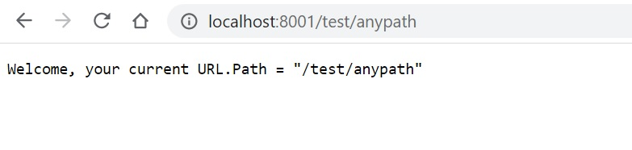
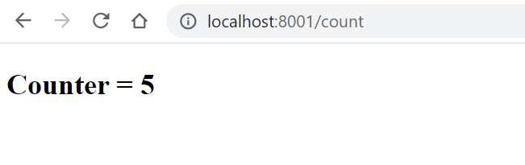

# Todo Website

In this tutorail, we will use [http package](https://golang.org/pkg/net/http/) to create a TODO list website that can

- List done and undone TODOs
- Create new TODO
- Remove a TODO


## Files Structure

The final files structure will be like this,

```s
├── go.mod
├── header.html
├── server.go # The main module 
├── todo-create.html
├── todo-list.html
└── types
   ├── go.mod
   └── types.go
```


## Get started with a simple website


### Serve specified URL path with a handler

Lets get started with simple example that can response current URL path.


- server.go

```go
package main

import (
    "fmt"
    "log"
	"net/http"
)

func main() {
	http.HandleFunc("/", handler) // The "/" matches anything not handled elsewhere.
	log.Fatal(http.ListenAndServe("localhost:8001", nil)) // Listen on localhost:8001
}

func handler(rw http.ResponseWriter, req *http.Request) {
	rw.WriteHeader(http.StatusOK)

	// Use http.ResponseWriter
	// rw.Write([]byte(`My website`))

	// Or use fmt.Fprintf
	fmt.Fprintf(rw, "Welcome, your current URL.Path = %q\n", req.URL.Path)
}
```

> Notice that `HandleFunc` registers the handler function for the given URL pattern.

Now run with

```s
$ go mod init server
$ go run server.go
```

And browse to any path of `http://localhost:8001`, such as `http://localhost:8001/test/anypath/`, we will get the response:




### Response HTML

Now we want to response HTML. The following sample code shows how to response HTML that display a counter for every request.

```go
package main

import (
	"fmt"
	"log"
	"net/http"
	"strconv"
)

var counter int

func main() {
	http.HandleFunc("/count", handlerCounter)  // "/count"
	http.HandleFunc("/count/", handlerCounter) // "/count/xxxx"
	log.Fatal(http.ListenAndServe("localhost:8001", nil))
}

func handlerCounter(rw http.ResponseWriter, req *http.Request) {
	counter++
	rw.WriteHeader(http.StatusOK)
	html := `<!DOCTYPE html>
			<html>
			<head><title>My counter</title></head>
			<body><h2>Counter = ` + strconv.Itoa(counter) + `</h2></body>
			</html>`
	rw.Write([]byte(html))
}
```




